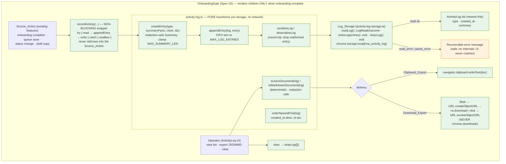

# Design Document — Spec 08-A: Compliance Activity Log & Export (Local, Append-Only, Extension-UI-Only)

## 1. Overview

The Activity_Log & Export is a **local, bounded, append-only, Extension-UI-only** compliance audit aid
inside the existing Chrome Manifest V3 popup. As the Operator performs compliance-relevant actions —
completing Spec 03 onboarding, saving a draft to the Spec 07 Review_Queue, setting a Review_Status, or
copying a draft for manual posting — the Extension **appends** a structured, redaction-safe
Activity_Entry to a log persisted in `chrome.storage.local`. The Operator can then **export** the
entire log as a JSON or Markdown document, delivered **only** via `navigator.clipboard.writeText` or an
in-page `Blob` object-URL anchor (`<a download>`) download.

Every operation — append, read, FIFO trim, list, clear, serialize, export — runs **entirely locally**
with **no network call**, **no AI provider**, and **no `chrome.downloads`**. The log logic is split
into **pure functions** (`activity-log.ts`) that never touch storage, and a thin **storage adapter**
(`activity-log-storage.ts`) that reads/writes `chrome.storage.local` using the same typed, fail-safe
pattern as Spec 03's `onboarding-storage.ts` and Spec 07's `review-queue-storage.ts`. One React panel
(`ActivityLog.tsx`) renders inside the existing Spec 03 `OnboardingGate`, as a section distinct from
the Spec 05 `IntentScanner`, the Spec 06 `DraftCoPilot`, and the Spec 07 `ReviewQueue`.

Crucially, logging is **best-effort and non-blocking**: a thin `recordActivity` helper wraps every
append in a guard that swallows failures, so a log write that throws can **never** block, delay,
reverse, or alter the original Review_Queue or Draft_Co_Pilot action that triggered it.

This design builds on **Spec 01** (MVP Foundation), **Spec 02** (Worker Auth & `authenticatedFetch`),
**Spec 03** (Compliance Onboarding Gate), **Spec 04** (`POST /v1/compare` Foundation), **Spec 05**
(Intent Scanner), **Spec 06** (Draft Co-Pilot), and **Spec 07** (Review Queue), **reusing all of them
without modification**. It addresses Requirements 1–12 of `requirements.md` and implements Correctness
Properties 1–14. There are **no** worker-api changes for the Spec 08-A MVP.

### A Note on Identifiers and Timestamps (per requirements)

An Activity_Entry records an **Operator action** at a moment in time, not a deterministic pure
computation. Generating a stable `id` and a `created_at` at the moment of an append is therefore
appropriate and does not introduce forbidden non-determinism. Determinism in this spec applies to the
**pure log transforms** (append-with-trim, FIFO bound, JSON serialize, Markdown render, serialize/
deserialize) operating over already-constructed entries — **not** to id/timestamp creation. To keep
the pure transforms test-deterministic, id and timestamp creation are **injected** (a small `id
factory` / `clock` passed in), so the transforms themselves contain no hidden inputs (Section 5.3).

### Key Design Decisions

| Decision | Rationale |
| --- | --- |
| Split **pure log logic** (`activity-log.ts`) from the **storage adapter** (`activity-log-storage.ts`) | The transforms (append, FIFO trim, ordering, summary-clamp, JSON/Markdown render, serialize/deserialize) are pure and directly property-testable; storage I/O is isolated behind a typed outcome. Mirrors the Spec 03 and Spec 07 storage splits. |
| **Inject** id + timestamp creation into the pure transforms | Determinism (Properties 2, 6, 8) and PBT are first-class. With an injected `id factory`/`clock`, `createEntry`/`appendEntry` are deterministic given inputs; real callers pass `crypto.randomUUID`/`new Date().toISOString()`. |
| A thin **`recordActivity` non-blocking wrapper** around every append | Req 3 / Property 5 — the helper performs the append in a guarded path (try/catch around the read-modify-write) and never rethrows into the Source_Action, so a log failure cannot block, delay, reverse, or alter the Review_Queue / Draft_Co_Pilot action. |
| **Append-only** data model — no entry-edit transform exists | Req 2.3, 2.4 / Property 4 — the module exposes append, FIFO trim, and full clear only; there is no in-place edit of `id`/`type`/`summary`/`created_at`. |
| **FIFO bound** at append time (`MAX_LOG_ENTRIES`) | Req 4.1, 4.2, 4.4 / Property 3 — appending past the cap drops the oldest entries first and preserves the relative order of the retained most-recent entries. |
| **Redaction-safe `Summary`** built from non-sensitive descriptors only | Req 1.6, 5.7 / Properties 1, 7 — summaries are composed from Action_Type labels, `ReviewStatus` values, and `QueueItem` ids, never full draft text, Notes, or credentials; a length clamp enforces `MAX_SUMMARY_LEN`. |
| Typed **`LogReadOutcome`** mirroring the `onboarding-storage`/`review-queue-storage` `read_error` pattern | Req 9 — a read returns either the parsed list or a safe failure state (`read_error`/`parse_error`); missing → empty; unparseable → do not overwrite; malformed individual entry dropped. Fail-safe, leak-free, never crashes the UI. |
| New `STORAGE_KEYS.ACTIVITY_LOG = 'rma_activity_log'`, existing entries unchanged | Req 8.1, 8.2 — single source of storage keys, `rma_` prefix convention preserved; no existing key modified. |
| Export via **`navigator.clipboard.writeText`** and/or an **in-page `Blob` anchor** only; **never** `chrome.downloads` | Req 6 / Property 11 — both delivery paths are browser-native and need no new permission; the object URL is revoked after the download is triggered. |
| Render inside `OnboardingGate`, as a section separate from the other feature panels | Compliance-first: the panel does not mount or run any log read/append/trim/clear until Compliance_Onboarding is complete and fails closed on `read_error` (Req 10). |

### Non-Goals (Explicitly Out of Scope — restating the boundaries)

The Activity_Log & Export **MUST NOT** introduce, imply, or depend on any of the following (Req 11,
Non-Goals):

- Any Reddit API access of any kind.
- Any `reddit.com` / `old.reddit.com` host permission, or any manifest permission expansion (the
  existing `permissions` and `host_permissions` arrays remain **byte-for-byte unchanged**) — including
  no `downloads`, `alarms`, `notifications`, `clipboardWrite`, or `tabs` permission.
- Any use of `chrome.downloads` for export (export is `navigator.clipboard.writeText` and/or an
  in-page `Blob` anchor download only).
- Any content script, DOM scraping, crawling, Firecrawl, or IP rotation.
- Any network request for any log or export operation (append, read, trim, list, clear, export are
  purely local).
- Any automated Reddit action: posting, commenting, upvoting, downvoting, direct messaging, joining,
  following, or form submission — and any auto-post / auto-submit / one-click-publish control.
- Any `chrome.alarms`, scheduled task, background automation, or `chrome.notifications`.
- Any OpenAI, LLM, generative-AI, or other AI-provider call.
- Any Cloudflare Worker change, new `/v1` route, or worker-side log/export storage (no worker-api
  changes).
- Any transmission of the Activity_Log, an Activity_Entry, or an Export_Document to the Worker_API or
  any external service.
- Any logging that blocks, delays, reverses, or alters the original action that triggered it.

## 2. Architecture

The entire flow is local and in-memory apart from the `chrome.storage.local` read/write at the edges
and the local clipboard / `Blob` anchor at the export edge. There is **no network node anywhere**.
Everything runs inside `OnboardingGate`.



- **Every** node is local, no-network (Req 8.5, 8.6, 11.4; Properties 10, 11). There is no network
  node anywhere — the Activity_Log has **no** network branch at all.
- The `recordActivity` wrapper is the **only** integration touch-point into existing features; it is
  best-effort and non-blocking (Req 3; Property 5).
- Nothing inside `GATE` mounts or runs while onboarding is incomplete or in `read_error` (Req 10.2;
  Property 14).

**Module placement** (all within the existing extension; no new directories, no new permissions):

| Module | Location | Kind |
| --- | --- | --- |
| Log transforms, createEntry, FIFO append, ordering, JSON/Markdown render, serialize/deserialize | `extension/src/lib/activity-log.ts` | pure functions (no storage) |
| `readLog` / `writeLog` / `clearLog` storage adapter | `extension/src/lib/activity-log-storage.ts` | `chrome.storage.local` I/O (no network) |
| `recordActivity` non-blocking append helper | `extension/src/lib/activity-recorder.ts` | best-effort side-effect wrapper (no rethrow) |
| Export delivery (clipboard / Blob anchor) | `extension/src/lib/activity-export.ts` | local browser-native delivery (no chrome.downloads) |
| Activity Log types & constants | `extension/src/types/index.ts` (new "Activity Log Types (Spec 08-A)" section) | shared type additions |
| `ActivityLog` | `extension/src/components/ActivityLog.tsx` | React panel rendered in `Popup` under `OnboardingGate` |

> All file paths above are **design illustration** of intended placement. This design phase creates
> only `design.md`; no source files are created or modified here.

## 3. Components and Interfaces

TypeScript signatures below are **design illustration**, following the codebase's existing
discriminated-union and categorized-result conventions (e.g. `GateResult`, `CompareOutcome`,
`QueueReadOutcome`, and the `onboarding-storage` read variant).

```ts
// extension/src/lib/activity-log.ts (design illustration) — PURE; never touches storage/network.

/** Injected non-determinism so the transforms stay pure & test-deterministic (Section 5.3). */
export interface LogClock { now(): string; }   // ISO 8601 string at the Operator action
export interface IdFactory { create(): string; } // stable unique Entry_Id

/** Build a redaction-safe Activity_Entry (Req 1.5, 1.6, 2.1, 2.2, 4.3). */
export function createEntry(
  type: ActionType, summaryParts: SummaryParts, clock: LogClock, ids: IdFactory
): ActivityEntry;

/** Append with FIFO trim to MAX_LOG_ENTRIES; pure, returns a NEW log (Req 4.1, 4.2, 4.4). */
export function appendEntry(log: ActivityLog, entry: ActivityEntry): ActivityLog;

/** Stable newest-first display order: created_at desc, then id asc (Req 7.1). */
export function orderNewestFirst(log: ActivityLog): ActivityEntry[];

/** Deterministic, redaction-safe export rendering (Req 5.1–5.7; Properties 6, 7). */
export function toJsonDocument(log: ActivityLog): string;
export function toMarkdownDocument(log: ActivityLog): string;

/** chrome.storage.local (de)serialization round-trip; drops malformed entries (Req 8.4, 9.6). */
export function serializeLog(log: ActivityLog): unknown;
export function deserializeLog(raw: unknown): ActivityEntry[];

/** Clamp a Summary to MAX_SUMMARY_LEN as part of createEntry (Req 4.3). */
export function clampSummary(text: string): string;
```

```ts
// extension/src/lib/activity-log-storage.ts (design illustration) — chrome.storage.local only; NO network.

/** Custom error for log write failures (parallels OnboardingStorageError / ReviewQueueStorageError). */
export class ActivityLogStorageError extends Error {}

/**
 * Read the Activity_Log. Mirrors the typed read_error pattern (Req 9):
 *  - missing key             → { ok: true, entries: [] }
 *  - read throws             → { ok: false, error: 'read_error', message }  (safe, no internals)
 *  - present but unparseable → { ok: false, error: 'parse_error', message } (does NOT overwrite)
 *  - malformed individual entry → dropped; well-formed entries retained
 */
export function readLog(): Promise<LogReadOutcome>;

/** Persist the log under STORAGE_KEYS.ACTIVITY_LOG. @throws ActivityLogStorageError on failure. */
export function writeLog(entries: ActivityEntry[]): Promise<void>;

/** Clear the entire log (persists an empty array). @throws ActivityLogStorageError on failure. */
export function clearLog(): Promise<void>;
```

```ts
// extension/src/lib/activity-recorder.ts (design illustration) — BEST-EFFORT, NON-BLOCKING.

/**
 * Append an Activity_Entry as a best-effort side effect (Req 3; Property 5).
 * Reads the current log, appends via the pure transform, and writes it back — all inside a guard
 * that SWALLOWS any error. It NEVER rethrows, so the Source_Action that called it is never blocked,
 * delayed, reversed, or altered. Returns void and is safe to call without `await`.
 */
export function recordActivity(type: ActionType, summaryParts: SummaryParts): void;
```

```ts
// extension/src/lib/activity-export.ts (design illustration) — LOCAL delivery only; NO chrome.downloads.

/** Copy the Export_Document text to the clipboard (Req 6.1). */
export function clipboardExport(doc: string): Promise<void>;     // navigator.clipboard.writeText

/** Trigger an in-page Blob anchor download and revoke the object URL afterward (Req 6.1, 6.3). */
export function downloadExport(doc: string, filename: string, mime: string): void;
```

The `ActivityLog` panel loads the log via `readLog` on mount, renders it newest-first, and offers
export and clear controls. It never calls `fetch`/`authenticatedFetch` and never references
`chrome.downloads`.

## 4. Data Models

A new **"Activity Log Types (Spec 08-A)"** section is added to `extension/src/types/index.ts`. It
**reuses** the existing Spec 07 `ReviewStatus` and `QueueItem` id concepts for summary descriptors and
adds the new log types and bound constants. (Design illustration — not implemented in this phase.)

```ts
// --- Activity Log Types (Spec 08-A) ---

/** The enumerated compliance-relevant actions an entry records (Req 1.1–1.5). */
export type ActionType =
  | 'onboarding_completed'
  | 'draft_saved'
  | 'status_changed'
  | 'draft_copied';

/** Non-sensitive descriptors used to build a redaction-safe Summary (Req 1.6, 5.7). */
export interface SummaryParts {
  itemId?: string;            // a QueueItem id reference (non-sensitive)
  status?: ReviewStatus;      // a Spec 07 Review_Status value
  detail?: string;            // a short non-sensitive label, clamped to MAX_SUMMARY_LEN
}

/** A single append-only record of one compliance-relevant Operator action (Req 1, 2). */
export interface ActivityEntry {
  id: string;            // stable Entry_Id, unique within the log (Req 2.1)
  type: ActionType;      // one of the enumerated Action_Types (Req 1.5)
  created_at: string;    // ISO 8601, set at append time, immutable (Req 2.2, 2.3)
  summary: string;       // redaction-safe, ≤ MAX_SUMMARY_LEN chars (Req 1.6, 4.3, 5.7)
}

/** The Activity_Log is the ordered, bounded, append-only collection of entries (Req 4). */
export type ActivityLog = ActivityEntry[];

/** The export format selector (Req 5). */
export type ExportFormat = 'json' | 'markdown';

/**
 * Typed outcome of reading the Activity_Log from chrome.storage.local (Req 9.1).
 * The failure `message` is a fixed, safe string — never a stack trace, file path,
 * secret, environment value, or internal implementation detail (Req 9.5).
 */
export type LogReadOutcome =
  | { ok: true; entries: ActivityEntry[] }
  | { ok: false; error: 'read_error' | 'parse_error'; message: string };

/** Storage / size bounds (Req 4). Single-sourced so transforms, the UI, and tests share them. */
export const MAX_LOG_ENTRIES = 500;   // total retained Activity_Entries (Req 4.1, 4.2)
export const MAX_SUMMARY_LEN = 280;   // Summary character length (Req 4.3)
```

`STORAGE_KEYS` gains exactly one new entry, leaving the existing entries unchanged (Req 8.1, 8.2):

```ts
export const STORAGE_KEYS = {
  WORKER_API_BASE_URL: 'rma_worker_api_base_url', // Spec 01 (unchanged)
  ONBOARDING: 'rma_onboarding_acknowledgement',   // Spec 03 (unchanged)
  REVIEW_QUEUE: 'rma_review_queue',                // Spec 07 (unchanged)
  ACTIVITY_LOG: 'rma_activity_log',                // Spec 08-A (new) — `rma_` prefix convention
} as const;
```

> **Redaction by construction:** an `ActivityEntry` has **no** field for full draft text, Note text,
> or credentials. The `summary` is assembled only from `SummaryParts` (an `ActionType` label, a
> `ReviewStatus`, a `QueueItem` id, and a short non-sensitive `detail`) and clamped to
> `MAX_SUMMARY_LEN`. Because there is no sensitive field to begin with, every Export_Document is
> redaction-safe by construction (Req 5.7; Property 7).

## 5. Pure Log Logic (`activity-log.ts`)

`activity-log.ts` contains **pure functions** over an `ActivityLog` / `ActivityEntry`. They MUST NOT
call `chrome.storage`, `fetch`, `authenticatedFetch`, or any AI provider, and (apart from the
**injected** `clock`/`ids`) MUST NOT read `Date.now()`, `Math.random()`, or any global mutable state.
Each transform returns a **new** log/entry value and never mutates its argument.

### 5.1 Entry creation & redaction (Req 1, 2, 4.3)

- **`createEntry(type, summaryParts, clock, ids)`** builds an `ActivityEntry` with
  `id = ids.create()`, `type` (one of the four enumerated `ActionType` values), `created_at =
  clock.now()`, and `summary = clampSummary(renderSummary(type, summaryParts))`. The summary is
  assembled from non-sensitive descriptors only and clamped to `MAX_SUMMARY_LEN` (Req 1.6, 4.3, 5.7).
- **`clampSummary(text)`** returns `text` unchanged when it is within `MAX_SUMMARY_LEN`, otherwise a
  truncated value no longer than `MAX_SUMMARY_LEN` (Req 4.3).

### 5.2 Append & FIFO bound (Req 4)

- **`appendEntry(log, entry)`** returns a new log equal to `log` with `entry` added at the end; if the
  resulting length would exceed `MAX_LOG_ENTRIES`, it removes the **oldest** entries first (FIFO) so
  the result holds exactly `MAX_LOG_ENTRIES` of the most recent entries, preserving their relative
  order (Req 4.1, 4.2, 4.4; Property 3). It never mutates the input log (Property 2).
- There is **no** transform that edits an existing entry's `id`, `type`, `summary`, or `created_at`;
  the only removals are FIFO trim and full clear (Req 2.3, 2.4; Property 4).

### 5.3 Determinism via injected id/clock

The transforms are **pure given their inputs**. The only non-determinism — the new `id` and
`created_at` produced on an append — is **injected** via the `LogClock` and `IdFactory` parameters.
Tests pass deterministic stubs (e.g. a counter `IdFactory` and a fixed `clock`), so `createEntry`,
`appendEntry`, the export renderers, and serialize/deserialize are fully reproducible (Properties 2, 6,
8). Production callers in the recorder/UI layer pass `crypto.randomUUID()`-style ids and
`new Date().toISOString()`.

### 5.4 Ordering & export rendering (Req 5, 7)

- **`orderNewestFirst(log)`** returns a stable, deterministic order — **`created_at` descending, then
  `id` ascending** as a total-order tiebreak — so listing and Markdown rendering are reproducible
  (Req 7.1; Property 6).
- **`toJsonDocument(log)`** returns a deterministic JSON string including every retained entry's `id`,
  `type`, `created_at`, and `summary` (e.g. a stable key order and fixed indentation), valid for an
  empty log (Req 5.1, 5.3, 5.5, 5.6).
- **`toMarkdownDocument(log)`** returns a deterministic, human-readable Markdown document rendering
  every retained entry's `type`, `created_at`, and `summary` (e.g. a title plus one section/row per
  entry in newest-first order), valid for an empty log (Req 5.2, 5.4, 5.5, 5.6).
- Both renderers operate only over the redaction-safe `ActivityEntry` fields, so neither can emit a
  credential, token, full draft text, or full Note text (Req 5.7; Property 7).

### 5.5 Serialize / deserialize round-trip (Req 8.4, 9.6)

- **`serializeLog`** maps the log to a plain JSON-safe structure for `chrome.storage.local`.
- **`deserializeLog(raw)`** validates each entry with a runtime shape guard (in the spirit of
  `isAcknowledgementRecord`), **drops** any malformed individual entry, and retains the well-formed
  entries (Req 9.6). For a valid `ActivityEntry`, `deserializeLog(serializeLog([x]))[0]` deep-equals
  `x` across `id`, `type`, `created_at`, and `summary` (Req 8.4; Property 8).

## 6. Storage Adapter (`activity-log-storage.ts`) and Recorder (`activity-recorder.ts`)

### 6.1 Storage adapter

`activity-log-storage.ts` is the only module that touches `chrome.storage.local` for the log. It
performs **no network request** (Req 8.5, 11.4). It mirrors `onboarding-storage.ts` /
`review-queue-storage.ts`'s typed, fail-safe read pattern.

**`readLog(): Promise<LogReadOutcome>`** (Req 9):

1. `await chrome.storage.local.get(STORAGE_KEYS.ACTIVITY_LOG)` inside `try/catch`.
2. **Read throws** → `{ ok: false, error: 'read_error', message }` with a fixed safe message; the UI
   shows a recoverable error (Req 9.2, 9.5).
3. **Key missing / `undefined`** → `{ ok: true, entries: [] }` — an absent log is zero entries
   (Req 9.3).
4. **Present but not a valid array / unparseable** → `{ ok: false, error: 'parse_error', message }`
   and the stored value is **not overwritten** (Req 9.4).
5. **Present and array-shaped** → `deserializeLog` runs: malformed individual entries are dropped,
   well-formed entries returned as `{ ok: true, entries }` (Req 9.6).

**`writeLog(entries)`** persists `serializeLog(entries)` under `STORAGE_KEYS.ACTIVITY_LOG`; on failure
it throws `ActivityLogStorageError`. **`clearLog()`** writes an empty array (Req 7.4, 7.5). No
read/parse failure ever overwrites the stored value implicitly.

### 6.2 Best-effort, non-blocking recorder (Req 3; Property 5)

`recordActivity(type, summaryParts)` is the **only** integration touch-point into existing features.
It performs the read-modify-write **inside a guard** that swallows every error:

```ts
// design illustration
export function recordActivity(type: ActionType, summaryParts: SummaryParts): void {
  void (async () => {
    try {
      const outcome = await readLog();
      const current = outcome.ok ? outcome.entries : [];   // a read failure degrades to "skip logging"
      const entry = createEntry(type, summaryParts, realClock, realIds);
      await writeLog(appendEntry(current, entry));
    } catch {
      /* best-effort: swallow — never block, delay, reverse, or alter the Source_Action (Req 3) */
    }
  })();
}
```

Existing features call `recordActivity(...)` **after** their own action has already succeeded, and do
**not** `await` it, so logging is a fire-and-forget side effect. The success of a Spec 07 queue save,
a Review_Status change, a draft copy, or Spec 03 onboarding completion is **never** contingent on the
append succeeding (Req 3.4; Property 5). On a `read_error`, the recorder simply skips the append rather
than overwriting the corrupt stored value.

## 7. Export Delivery (`activity-export.ts`)

Export delivery is **local browser-native only** and **never** uses `chrome.downloads` (Req 6;
Properties 10, 11):

- **`clipboardExport(doc)`** calls `navigator.clipboard.writeText(doc)` (Clipboard_Export) — Req 6.1.
- **`downloadExport(doc, filename, mime)`** (Download_Export) — Req 6.1, 6.3:
  1. `const blob = new Blob([doc], { type: mime })`.
  2. `const url = URL.createObjectURL(blob)`.
  3. bind `url` to an in-page `<a download={filename} href={url}>` element and trigger a click.
  4. `URL.revokeObjectURL(url)` afterward to release the object URL.

Neither path makes a network request, and neither transmits the Export_Document anywhere off the
device (Req 6.4). No new manifest permission is needed for either path (Req 6.5, 11.1).

## 8. Failure-State Handling

The `LogReadOutcome` failure variants carry a **fixed, safe `message`** drawn from a small set of
constants — never a stack trace, file path, secret, environment value, or internal implementation
detail (Req 9.5; Property 9). The `ActivityLog` panel renders a **recoverable** error state (with a
Retry affordance) on `read_error`/`parse_error` and **never crashes**; it continues to render the rest
of the popup.

| Condition | Handling | Requirement |
| --- | --- | --- |
| Stored log missing | `{ ok: true, entries: [] }`; render empty-state indicator | Req 9.3, 7.3 |
| `chrome.storage.local` read throws | `{ ok: false, error: 'read_error', message }`; recoverable error UI | Req 9.2, 9.5 |
| Stored value present but unparseable | `{ ok: false, error: 'parse_error', message }`; do **not** overwrite | Req 9.4, 9.5 |
| One stored entry malformed (rest valid) | drop that entry; return the well-formed entries | Req 9.6 |
| Append (read-modify-write) fails | `recordActivity` swallows the error; Source_Action unaffected | Req 3.2, 3.3 |
| Write fails on an explicit clear | `ActivityLogStorageError` → recoverable error UI; no crash | Req 7.5, 9.x |
| Clipboard or Blob export fails | surface a recoverable, leak-free message; never crash; no fallback to `chrome.downloads` | Req 6.1, 6.2 |
| Onboarding incomplete / `read_error` | `OnboardingGate` renders onboarding/error UI; `ActivityLog` not mounted | Req 10.2 |

## 9. Activity Log UI Component (`ActivityLog.tsx`)

The panel lives inside the existing popup (`w-80`, Tailwind), within `OnboardingGate`, as a section
**distinct** from `IntentScanner`, `DraftCoPilot`, and `ReviewQueue` (Req 10.1, 10.4). It loads the log
via `readLog` on mount and holds the entries + export/UI state in local React state.

- **List + empty state (Req 7.1–7.3):** renders all retained entries in `orderNewestFirst` order, each
  row showing the Action_Type, the `created_at`, and the Summary; when the log is empty it shows an
  empty-state indicator stating no activity has been recorded.
- **Export controls (Req 5, 6):** an Export-as-JSON and an Export-as-Markdown affordance, each offering
  **Copy to clipboard** (`clipboardExport`) and **Download** (`downloadExport`). The download uses an
  in-page `Blob` anchor and revokes the object URL afterward; **no** `chrome.downloads` is used.
- **Clear control (Req 7.4, 7.5):** clears the entire log via `clearLog` and re-renders the empty
  state.
- **Recoverable storage error (Req 9):** on a `read_error`/`parse_error` `LogReadOutcome` or a thrown
  `ActivityLogStorageError`, render a recoverable error state (with Retry) showing only the fixed safe
  message and never crashing.
- **Passive only (Req 11.7, 11.8):** the panel renders **no** post/submit/comment/vote/publish/
  auto-post control of any kind; every row is a passive record of an action the Operator already
  performed.
- **Deterministic ordering:** the list order is the pure `orderNewestFirst` rule, so the same log
  always renders in the same order (Req 7.1).
- **Accessibility:** validation and error messages use `role="alert"`/`aria-live`, consistent with
  `OnboardingGate`, `ConnectionBadge`, `IntentScanner`, `DraftCoPilot`, and `ReviewQueue`.

### Source_Action integration (Req 1, 3, 12)

The four Source_Actions call the non-blocking `recordActivity(...)` helper **after** their own action
has already completed, without `await`:

- **Spec 03 onboarding complete** → `recordActivity('onboarding_completed', {...})` after the
  Acknowledgement_Record is persisted.
- **Spec 07 queue save** → `recordActivity('draft_saved', { itemId })` after `writeQueue` succeeds.
- **Spec 07 status change** → `recordActivity('status_changed', { itemId, status })` after the status
  write succeeds.
- **Draft copy (Spec 06 / Spec 07)** → `recordActivity('draft_copied', { itemId })` after the
  clipboard copy completes.

Each integration is **additive** and **best-effort**: it changes none of the existing behavior, and a
log failure never blocks or alters the original action (Req 3, 12.3, 12.5; Property 5).

### Popup integration & gate behavior (Req 10)

`ActivityLog` is added to `Popup.tsx` inside the existing `<OnboardingGate>`, **below** the existing
`<IntentScanner />`, `<DraftCoPilot />`, and `<ReviewQueue />`, as a separate section. Because
`OnboardingGate` renders `children` **only** when `status === 'complete'` (Spec 03, fail-closed on
`read_error`), the Activity_Log:

- does **not** mount, render any list/export/clear control, or run any log read, append, trim, or clear
  logic while onboarding is incomplete or in `read_error` (Req 10.2; Property 14) — in particular
  `readLog` is **not invoked** before completion;
- mounts and renders its list, export controls, and clear control only when onboarding is complete
  (Req 10.3);
- preserves the existing `IntentScanner`, `DraftCoPilot`, `ReviewQueue`, and connection-status
  rendering/behavior unchanged (Req 10.5, 12.5).

## 10. Security & Compliance Boundaries

The existing `extension/src/security-boundary.test.ts` is **extended** with a Spec 08-A block,
following the Spec 05 / Spec 06 / Spec 07 patterns already in that file:

- **No manifest expansion (Req 11.1, 12.6; Property 12):** assert `manifest.permissions === ['storage']`,
  `host_permissions` equals the three approved entries (`https://*.workers.dev/*`, `http://localhost/*`,
  `http://127.0.0.1/*`) **byte-for-byte unchanged**, and `manifest.content_scripts` remains
  `undefined`. In particular, assert there is **no** `downloads`, `alarms`, `notifications`,
  `clipboardWrite`, or `tabs` permission.
- **No network in log/export modules (Req 8.5, 11.4; Property 10):** scan the log logic + storage +
  recorder + export + component files (`activity-log.ts`, `activity-log-storage.ts`,
  `activity-recorder.ts`, `activity-export.ts`, `ActivityLog.tsx`) for the **call form** `fetch(` /
  `authenticatedfetch(` / `xmlhttprequest` and assert none appear. A property test additionally spies
  on `globalThis.fetch` and asserts **0** calls across random log/export operations.
- **No `chrome.downloads` (Req 6.2, 11.5; Property 11):** assert the Spec 08-A source files contain no
  `chrome.downloads` reference; assert the export path uses `navigator.clipboard.writeText` and/or
  `URL.createObjectURL` + an anchor only.
- **Forbidden-scope token scan (Req 11.2, 11.3, 11.5, 11.6; Property 13):** assert the Spec 08-A source
  files and the manifest contain none of `reddit.com`, `old.reddit.com`, `chrome.alarms`,
  `chrome.notifications`, `chrome.downloads`, `content_scripts`, `firecrawl`, `scraping`,
  `ip rotation`, and `/v1/` (matched case-insensitively; the log is storage-only and references no
  `/v1` endpoint). As in the Spec 06/07 blocks, bare `openai` / `llm` are not scanned to avoid
  false-positives on compliance doc comments; the no-AI guarantee is enforced positively by the
  no-network scan.
- **No posting/automation control (Req 11.7, 11.8; Property 13):** assert `ActivityLog.tsx` contains
  none of the posting/automation tokens (`upvote`, `downvote`, `/api/submit`, `/api/comment`,
  `/api/vote`, `submitform`, `autopost`, `auto-post`, `auto_submit`).

## 11. Testing Strategy

Tests use the existing **Vitest + React Testing Library** stack and **fast-check** (already an
extension devDependency — no dependency change needed) for property tests, each running a **minimum of
100 iterations** and tagged `// Feature: activity-log-export, Property {n}: {property text}`.

| Property | Where | Approach |
| --- | --- | --- |
| 1 — Well-formed, bounded-type entry | `activity-log.test.ts` | for any `ActionType` + `SummaryParts`, assert created entry has unique non-empty id, enumerated type, ISO `created_at`, summary ≤ `MAX_SUMMARY_LEN` and free of sensitive content |
| 2 — Append is pure + injected identity | `activity-log.test.ts` | assert `appendEntry` returns a new log, does not mutate input, adds exactly one entry (subject to trim) |
| 3 — FIFO bound | `activity-log.test.ts` | for any append sequence, assert length ≤ `MAX_LOG_ENTRIES`, oldest dropped first, retained order preserved |
| 4 — Append-only | `activity-log.test.ts` | assert no transform edits an existing entry's id/type/summary/created_at |
| 5 — Logging never blocks/alters | `activity-recorder.test.ts` | mock `writeLog`/`readLog` to throw; assert `recordActivity` does not throw and the caller's action proceeds |
| 6 — Export deterministic + complete | `activity-log.test.ts` | assert JSON/Markdown include every entry's fields and are byte-identical across repeated exports |
| 7 — Export redaction-safe | `activity-log.test.ts` | for any log, assert export contains none of a forbidden sensitive-token set |
| 8 — Serialize/deserialize round-trip | `activity-log.test.ts` | for any valid entry, assert round-trip deep-equality across all fields |
| 9 — Safe failure state | `activity-log-storage.test.ts` | mock storage to throw / return junk; assert typed `read_error`/`parse_error`, leak-free message, no overwrite, malformed-entry drop |
| 10 — No network | `activity-log-storage.test.ts` / `activity-export.test.ts` | spy on `globalThis.fetch`; assert 0 calls across random operations |
| 11 — Local-only export, no chrome.downloads | `activity-export.test.ts` | assert clipboard / Blob-anchor paths used; assert `chrome.downloads` never referenced; assert `revokeObjectURL` called |
| 12 — Permission containment | `security-boundary.test.ts` | manifest assertions |
| 13 — Passive-scope containment | `security-boundary.test.ts` | forbidden-token + no-posting-control scans |
| 14 — Gate containment | `Popup.test.tsx` | assert `ActivityLog` not mounted and `readLog` not invoked while onboarding incomplete / `read_error` |

Component tests in `ActivityLog.test.tsx` drive the panel with React Testing Library: list rendering in
newest-first order, empty state, JSON/Markdown export via clipboard and Blob-anchor download, clear,
the recoverable storage-error state with a leak-free message, and the absence of any posting control.

> This design phase creates only `design.md`. No source files are created or modified here; all
> TypeScript above is design illustration of the intended implementation.
