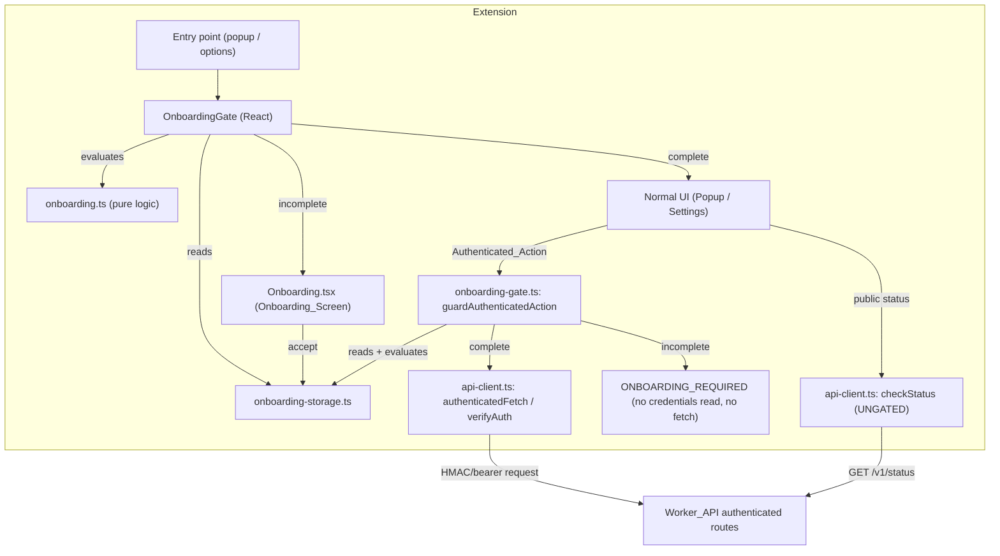

# Design Document

## Overview

Spec 03 adds a **Compliance Onboarding Gate** to the Reddit Marketing Agent Chrome Extension. Before the Extension performs any `Authenticated_Action` (any call to an authenticated Worker_API route using `Install_Credentials`), the Operator must review the compliance rules and affirmatively acknowledge each one. The acknowledgement is recorded locally as a timestamped, versioned `Acknowledgement_Record` in `chrome.storage.local`. Until onboarding is complete, every `Authenticated_Action` is blocked with an `ONBOARDING_REQUIRED` error, while the public `GET /v1/status` connectivity check stays available.

This feature is **entirely extension-side**. No Worker_API changes are required: `GET /v1/status` and the Spec 02 authenticated routes are untouched. The design integrates with the existing modules (`storage.ts`, `credential-storage.ts`, `api-client.ts`, `semver.ts`) by mirroring their established conventions:

- **`rma_` storage-key prefix** for all `chrome.storage.local` keys.
- **Discriminated-union result types** (as used by `StatusResult`, `ValidationResult`, `ConnectionState`).
- **Fail-closed reads** — read failures resolve to a safe "incomplete / not configured" value rather than throwing.
- **Pure, dependency-free logic modules** that are trivially unit- and property-testable (as `semver.ts` and `url-validator.ts` are today).
- **Strict TypeScript** with no secrets in extension code.

### Goals

- Persist a local-only `Acknowledgement_Record` keyed by `rma_onboarding_acknowledgement`.
- Present an `Onboarding_Screen` with all required disclosures and six required acknowledgement checkboxes.
- Provide pure, version-aware logic (`isOnboardingComplete`, `validateAcknowledgement`) to evaluate completion.
- Gate every `Authenticated_Action` behind `Onboarding_Complete`, returning `ONBOARDING_REQUIRED` when incomplete and never attaching `Install_Credentials`.
- Keep the public status check ungated and preserve all Spec 01 / Spec 02 behavior.

### Design Principles

1. **Fail closed.** Any ambiguity — missing record, unreadable storage, malformed data, stale version — resolves to "onboarding incomplete," which blocks authenticated actions.
2. **Gate at the boundary.** The gate check happens *before* credentials are read or any authenticated request is dispatched, so an incomplete state cannot leak credentials onto the wire.
3. **Local only.** The `Acknowledgement_Record` never leaves the device; no code path transmits it (or any item) to the Worker_API.
4. **Defense in depth.** The UI disables/redirects authenticated controls while incomplete *and* the request-layer guard independently re-checks completion at call time, so stale UI state cannot bypass the gate.

## Architecture



### Key Flows

**Onboarding completion flow**
1. Operator opens the Extension while onboarding is incomplete → `OnboardingGate` renders the `Onboarding_Screen`.
2. The screen shows all disclosures, the current `Acknowledgement_Version`, and six checkboxes (all unchecked by default).
3. The accept control is disabled until all six checkboxes are checked.
4. On accept, the Extension builds an `Acknowledgement_Record` (`acknowledged: true`, current `version`, ISO 8601 `acknowledged_at`, all six item ids in `items`) and writes it via `onboarding-storage.ts`.
5. On write success the gate re-evaluates and renders the normal UI. On write failure it shows an error and remains incomplete.

**Authenticated action gating flow**
1. A caller invokes an authenticated operation through `guardAuthenticatedAction()` / `guardedAuthenticatedFetch()`.
2. The guard reads the `Acknowledgement_Record` and evaluates `isOnboardingComplete(record, ACKNOWLEDGEMENT_VERSION)`.
3. If incomplete → return a blocked result carrying `ONBOARDING_REQUIRED`; **no credentials are read and no request is sent**.
4. If complete → delegate to the existing `authenticatedFetch` / `verifyAuth`, which attach `Install_Credentials` and call the Worker_API.

**Public status flow (unchanged, ungated)**
- `checkStatus(baseUrl)` continues to call `GET /v1/status` directly with no gate and no credentials, exactly as in Spec 01.

### Module / File Plan

| File | Status | Responsibility |
| --- | --- | --- |
| `extension/src/lib/onboarding.ts` | **new** | Pure logic + constants: `ACKNOWLEDGEMENT_VERSION`, required item set, `validateAcknowledgement`, `isOnboardingComplete`. |
| `extension/src/lib/onboarding-storage.ts` | **new** | Read/write `Acknowledgement_Record` under `rma_onboarding_acknowledgement` (fail-closed). |
| `extension/src/lib/onboarding-gate.ts` | **new** | `guardAuthenticatedAction()` and `guardedAuthenticatedFetch()` / `guardedVerifyAuth()` wrappers. |
| `extension/src/components/Onboarding.tsx` | **new** | The `Onboarding_Screen` UI. |
| `extension/src/components/OnboardingGate.tsx` | **new** | App-root wrapper that renders `Onboarding` (incomplete) or children (complete). |
| `extension/src/types/index.ts` | **modify** | Add record/item/error/result types; add `ONBOARDING` to `STORAGE_KEYS`. |
| `extension/src/popup/Popup.tsx` | **modify** | Wrap root in `OnboardingGate`; gate/disable any authenticated control. |
| `extension/src/settings/Settings.tsx` | **modify** | Surface onboarding status; gate/disable any authenticated control. Public URL config + status test remain ungated. |
| `extension/src/lib/onboarding.test.ts` | **new** | Unit + property tests for pure logic. |
| `extension/src/lib/onboarding-storage.test.ts` | **new** | Round-trip + fail-closed tests (mocked `chrome.storage.local`). |
| `extension/src/lib/onboarding-gate.test.ts` | **new** | Gating behavior + public-status-availability tests. |
| `extension/package.json` | **modify** | Add `fast-check` to `devDependencies`. |

No Worker_API files are modified. No Spec 01 / Spec 02 logic is altered except where Spec 01/02 entry points now mount the gate and existing/future authenticated controls are routed through it.

## Components and Interfaces

### 1. `onboarding.ts` — Pure Logic & Constants

This module holds zero-I/O, deterministic logic so it is directly unit- and property-testable, mirroring `semver.ts` / `url-validator.ts`.

```ts
import { compareSemver } from './semver';
import type {
  AcknowledgementRecord,
  AcknowledgementItem,
  AcknowledgementItemId,
  AcknowledgementValidation,
} from '../types';

/** Current compliance ruleset version (semantic version string). Req 4.4 */
export const ACKNOWLEDGEMENT_VERSION = '1.0.0';

/** Canonical ordered list of required Acknowledgement_Items (Req 3.1, items a–f). */
export const REQUIRED_ACKNOWLEDGEMENT_ITEMS: readonly AcknowledgementItem[] = [
  { id: 'manual_assistant_not_bot',
    label: 'I understand this Extension is a manual research and drafting assistant, not a Reddit bot.' },
  { id: 'no_automation',
    label: 'I will not automate Reddit posting, voting, messaging, joining, following, or form submission.' },
  { id: 'manual_review_submit',
    label: 'I will review, edit, and manually submit all Reddit content myself.' },
  { id: 'follow_subreddit_rules',
    label: 'I will follow subreddit rules and Reddit policies.' },
  { id: 'disclose_affiliation',
    label: 'I will disclose affiliation when content is promotional or coupon-related.' },
  { id: 'no_abuse',
    label: 'I will not use the Extension for spam, vote manipulation, impersonation, or ban evasion.' },
] as const;

/** The required identifier set, derived from the canonical list. */
export const REQUIRED_ACKNOWLEDGEMENT_ITEM_IDS: readonly AcknowledgementItemId[] =
  REQUIRED_ACKNOWLEDGEMENT_ITEMS.map((i) => i.id);

/**
 * Validates a candidate acknowledgement's accepted item set.
 * Valid only when EVERY required item id is present (order/duplicates ignored).
 * Req 3.6.
 */
export function validateAcknowledgement(
  candidate: { items: readonly string[] } | null | undefined
): AcknowledgementValidation {
  const accepted = new Set(candidate?.items ?? []);
  const missing = REQUIRED_ACKNOWLEDGEMENT_ITEM_IDS.filter((id) => !accepted.has(id));
  return missing.length === 0 ? { valid: true } : { valid: false, missing };
}

/**
 * Evaluates Onboarding_Complete for a stored record against the current version.
 * Complete IFF: record exists AND acknowledged === true AND every required item
 * is present AND the stored version is not lower than `currentVersion`.
 * A stored version lower than current => incomplete (re-acknowledgement). Req 4.5.
 */
export function isOnboardingComplete(
  record: AcknowledgementRecord | null,
  currentVersion: string = ACKNOWLEDGEMENT_VERSION
): boolean {
  if (record === null || record.acknowledged !== true) return false;
  if (typeof record.version !== 'string' || record.version.length === 0) return false;
  if (compareSemver(record.version, currentVersion) < 0) return false; // stale version
  return validateAcknowledgement(record).valid;
}
```

**Design notes**
- `validateAcknowledgement` is set-membership based, so duplicate or out-of-order items do not matter — only that all required ids are present. Extra/unknown ids do not make a record invalid (forward compatibility), but every required id must be present.
- `isOnboardingComplete` reuses `compareSemver` from `semver.ts` rather than re-implementing version logic. A stored version *equal to or newer* than current is accepted; a *lower* version is treated as incomplete (Req 4.5 / Property 5).

### 2. `onboarding-storage.ts` — Local Persistence (fail-closed)

Mirrors `storage.ts` / `credential-storage.ts`: a dedicated key-constant, a custom error class for writes, and `null`-on-failure reads.

```ts
import { STORAGE_KEYS } from '../types';
import type { AcknowledgementRecord } from '../types';

/** Custom error for onboarding write failures (parallels StorageError). */
export class OnboardingStorageError extends Error {
  constructor(message: string) { super(message); this.name = 'OnboardingStorageError'; }
}

/**
 * Reads the Acknowledgement_Record from chrome.storage.local.
 * Fail-closed: returns null on missing key, malformed shape, or read error. Req 1.3, 1.4, 1.7, 1.8.
 * A read error returns null REGARDLESS of whether a record might exist — onboarding
 * is never treated as complete based on an unverified/partially read record (Req 1.7).
 */
export async function getAcknowledgement(): Promise<AcknowledgementRecord | null> {
  try {
    const result = await chrome.storage.local.get(STORAGE_KEYS.ONBOARDING);
    const raw = result[STORAGE_KEYS.ONBOARDING];
    return isAcknowledgementRecord(raw) ? raw : null;
  } catch {
    return null; // fail closed
  }
}

/**
 * Optional read-result variant used ONLY so the UI can distinguish a read error
 * (to show a recoverable storage error + Retry) from a legitimately absent record.
 * The safe default is unchanged: either outcome is treated as onboarding-incomplete.
 * `isOnboardingComplete` is NOT given a "maybe complete" path — a thrown read still
 * maps to incomplete. Req 1.7, 1.8.
 */
export async function readAcknowledgement(): Promise<
  | { kind: 'ok'; record: AcknowledgementRecord | null } // null === no/invalid record
  | { kind: 'read_error'; message: string }              // storage read threw
> {
  try {
    const result = await chrome.storage.local.get(STORAGE_KEYS.ONBOARDING);
    const raw = result[STORAGE_KEYS.ONBOARDING];
    return { kind: 'ok', record: isAcknowledgementRecord(raw) ? raw : null };
  } catch (err) {
    return { kind: 'read_error', message: err instanceof Error ? err.message : 'Unknown error' };
  }
}

/**
 * Persists the Acknowledgement_Record. Req 1.1.
 * @throws {OnboardingStorageError} when the write fails (Req 4.6).
 */
export async function setAcknowledgement(record: AcknowledgementRecord): Promise<void> {
  try {
    await chrome.storage.local.set({ [STORAGE_KEYS.ONBOARDING]: record });
  } catch (err) {
    throw new OnboardingStorageError(
      `Failed to write onboarding record: ${err instanceof Error ? err.message : 'Unknown error'}`
    );
  }
}

/** Runtime shape guard for a persisted record (defends against corruption / older shapes). */
export function isAcknowledgementRecord(value: unknown): value is AcknowledgementRecord {
  if (typeof value !== 'object' || value === null) return false;
  const r = value as Record<string, unknown>;
  return (
    typeof r.acknowledged === 'boolean' &&
    typeof r.version === 'string' &&
    typeof r.acknowledged_at === 'string' &&
    Array.isArray(r.items) &&
    r.items.every((i) => typeof i === 'string')
  );
}
```

**Design notes**
- The record is stored as a structured object (Chrome stores JSON-serializable values), not a string, matching how the rest of the codebase uses `chrome.storage.local`.
- `isAcknowledgementRecord` makes reads robust to corrupted/partial data: anything that does not match the shape is treated as "no record" → incomplete (fail closed).
- **Read-error vs. no-record.** `getAcknowledgement` stays fail-closed (`null` on any error), and the pure `isOnboardingComplete` logic is unchanged (`null`/invalid ⇒ incomplete). A read failure never yields "maybe complete" — even if a record might exist in storage, an unverified/partially read record is treated as incomplete (Req 1.7). The only purpose of distinguishing the error case (via the thrown read or the optional `readAcknowledgement` result) is so the gate can surface a *recoverable* storage error message with a Retry affordance to the Operator (Req 1.8). This is intentionally minimal — the storage module remaining `null`-on-error is sufficient and acceptable; `readAcknowledgement` is an optional convenience for the gate's messaging, not a required behavioral change.

### 3. `onboarding-gate.ts` — Authenticated Action Guard

The single choke point for authenticated calls. It evaluates onboarding completion **before** any credential read or network call.

```ts
import { getAcknowledgement } from './onboarding-storage';
import { isOnboardingComplete, ACKNOWLEDGEMENT_VERSION } from './onboarding';
import { authenticatedFetch, verifyAuth } from './api-client';
import { ONBOARDING_REQUIRED } from '../types';
import type { GateResult } from '../types';

/**
 * Evaluates the onboarding gate using the locally stored record. Req 5.1, 5.2, 5.6.
 * Returns { allowed: true } only when Onboarding_Complete; otherwise an
 * ONBOARDING_REQUIRED error. Performs NO credential read and NO network call.
 */
export async function guardAuthenticatedAction(): Promise<GateResult> {
  const record = await getAcknowledgement();
  if (isOnboardingComplete(record, ACKNOWLEDGEMENT_VERSION)) {
    return { allowed: true };
  }
  return {
    allowed: false,
    error: { code: ONBOARDING_REQUIRED, message: 'Compliance onboarding must be completed before this action.' },
  };
}

/**
 * Onboarding-gated wrapper around api-client.authenticatedFetch.
 * If the gate blocks, returns ONBOARDING_REQUIRED WITHOUT calling getCredentials
 * or fetch. If allowed, delegates unchanged. Req 5.1, 5.2, 5.3.
 */
export async function guardedAuthenticatedFetch(
  baseUrl: string,
  path: string,
  options?: RequestInit
): Promise<Response> {
  const gate = await guardAuthenticatedAction();
  if (!gate.allowed) {
    throw Object.assign(new Error(gate.error.message), { code: ONBOARDING_REQUIRED });
  }
  return authenticatedFetch(baseUrl, path, options);
}

/** Onboarding-gated wrapper around api-client.verifyAuth (result-typed variant). */
export async function guardedVerifyAuth(baseUrl: string) {
  const gate = await guardAuthenticatedAction();
  if (!gate.allowed) {
    return { success: false as const, error: { type: 'onboarding' as const, code: ONBOARDING_REQUIRED, message: gate.error.message } };
  }
  return verifyAuth(baseUrl);
}
```

**Design notes**
- `guardAuthenticatedAction` is the reusable primitive that future authenticated features call. It guarantees Property 1 (gate soundness) and Property 2 (fail-closed) at the request boundary, independent of UI.
- The guard never imports or touches `checkStatus`, so Property 6 (public status always available) holds structurally — the public path simply does not pass through this module.
- `authenticatedFetch` / `verifyAuth` from Spec 02 are **not modified**; the guard composes over them, satisfying the "do not alter Spec 02 behavior except for gating" constraint.

### 4. `Onboarding.tsx` — Onboarding_Screen Component

Renders the disclosures (Req 2), the six checkboxes (Req 3), the current version (Req 2.8), and the accept control. Uses Tailwind, consistent with `Settings.tsx` / `Popup.tsx`.

Responsibilities and behavior:
- Render all disclosure statements from Req 2.2–2.7 and the heading framing the tool as a manual assistant (Req 2.2).
- Render the six `REQUIRED_ACKNOWLEDGEMENT_ITEMS` as separate checkboxes, each defaulting to unchecked (Req 3.1).
- Track checkbox state in local React state (`Set<AcknowledgementItemId>` or a boolean map).
- Display `ACKNOWLEDGEMENT_VERSION` (Req 2.8).
- Keep the accept button **disabled** while any required item is unchecked; enable it only when all six are checked (Req 3.2, 3.3) — computed via `validateAcknowledgement({ items: [...checked] }).valid`.
- On accept: build the record and call `setAcknowledgement`:
  ```ts
  const record: AcknowledgementRecord = {
    acknowledged: true,
    version: ACKNOWLEDGEMENT_VERSION,
    acknowledged_at: new Date().toISOString(),
    items: [...REQUIRED_ACKNOWLEDGEMENT_ITEM_IDS],
  };
  ```
  (Req 3.4, 4.1, 4.2, 4.3.) On success, invoke an `onComplete` callback so the gate re-renders.
- On write failure (`OnboardingStorageError`): show an inline error message and remain on the screen; onboarding stays incomplete (Req 4.6).
- Defensive guard: if the accept handler is somehow invoked while incomplete, do not write and show the "every item must be accepted" message (Req 3.5).

Props:
```ts
interface OnboardingProps {
  onComplete?: () => void; // called after a successful write so the gate refreshes
}
```

### 5. `OnboardingGate.tsx` — App-Root Wrapper

A small wrapper mounted at the root of each entry point. It loads onboarding state once and decides what to render.

```ts
interface OnboardingGateProps {
  children: React.ReactNode; // the normal app UI rendered only when complete
}
```

Behavior:
- On mount, read the record and compute `isOnboardingComplete`.
- State machine (`OnboardingState`): `loading` → (`complete` | `incomplete`). The `incomplete` state carries a `reason`, including `read_error` for the storage-read-failure case.
- `loading` → render a minimal spinner/placeholder.
- `incomplete` → render `<Onboarding onComplete={refresh} />` (Req 2.1: show the Onboarding_Screen when the Operator opens the Extension).
- `complete` → render `children`.
- `refresh` re-reads storage and re-evaluates after a successful acknowledgement.

**Read-failure handling (Req 1.7, 1.8, Property 2).** When the initial read fails (storage read throws — surfaced either as the `null` from `getAcknowledgement` combined with a caught error, or as the `read_error` outcome of `readAcknowledgement`), the gate SHALL resolve to the `incomplete` state with `reason: 'read_error'` and render the Onboarding_Screen (the gate's incomplete UI). In this state:
- The normal app UI / `children` MUST NOT render — a read failure is never treated as completion, even if an Acknowledgement_Record might exist in storage (Req 1.7).
- Every gated `Authenticated_Action` remains unavailable: controls stay disabled/redirected (Req 5.5) and the independent `guardAuthenticatedAction` re-check at call time still returns `ONBOARDING_REQUIRED` because `getAcknowledgement` returns `null` on read error (Req 1.8, Property 1/2).
- The gate SHOULD surface a *recoverable* storage error message to the Operator with a **Retry** affordance — a "Retry" action that re-reads storage (re-invokes `getAcknowledgement` / `readAcknowledgement`) and re-evaluates onboarding state. If a subsequent read succeeds and yields a complete record, the gate transitions to `complete`; otherwise it remains `incomplete` (Req 1.8).

This keeps the gate fail-closed: the only effect of detecting the error case is the operator-facing recoverable message and retry; it never relaxes gating.

**Integration with entry points**
- `popup/Popup.tsx`: wrap its root with `<OnboardingGate>`. The current popup only performs the **public** status check, which stays ungated; when onboarding is incomplete the popup surface shows the Onboarding_Screen. Any authenticated control added to the popup must be disabled while incomplete and routed through `guardAuthenticatedAction` (Req 5.5).
- `settings/Settings.tsx`: URL configuration and the **public** "Save & Test Connection" (which uses `checkStatus`) remain available and ungated so the Operator can configure connectivity. Settings surfaces an onboarding-status indicator; any authenticated control here is disabled (or routes to the Onboarding_Screen) while onboarding is incomplete (Req 5.5).

## Data Models

All new types live in `extension/src/types/index.ts`, alongside the Spec 01 types, and the `STORAGE_KEYS` constant gains an `ONBOARDING` entry.

### Storage key (extends existing constant)

```ts
export const STORAGE_KEYS = {
  WORKER_API_BASE_URL: 'rma_worker_api_base_url', // Spec 01 (unchanged)
  ONBOARDING: 'rma_onboarding_acknowledgement',   // Spec 03 (new)
} as const;
```

The key is distinct from the Spec 02 credential keys (`rma_install_id`, `rma_install_token`) and the Spec 01 base-URL key (Req 1.5).

### Acknowledgement_Item identifiers

```ts
/** Stable identifiers for the six required acknowledgement items (Req 3.1 a–f). */
export type AcknowledgementItemId =
  | 'manual_assistant_not_bot'   // (a) manual assistant, not a bot
  | 'no_automation'              // (b) no automated posting/voting/messaging/joining/following/form submission
  | 'manual_review_submit'       // (c) review, edit, and manually submit all content
  | 'follow_subreddit_rules'     // (d) follow subreddit rules and Reddit policies
  | 'disclose_affiliation'       // (e) disclose affiliation for promotional/coupon content
  | 'no_abuse';                  // (f) no spam, vote manipulation, impersonation, or ban evasion

/** A single required compliance statement rendered as a checkbox. */
export interface AcknowledgementItem {
  id: AcknowledgementItemId;
  label: string;
}
```

### Acknowledgement_Record

```ts
/** Local record capturing onboarding completion (chrome.storage.local only). Req 1.2, 4.1–4.3. */
export interface AcknowledgementRecord {
  acknowledged: boolean;            // true when onboarding accepted (Req 4.3)
  version: string;                  // accepted Acknowledgement_Version, semver (Req 4.2)
  acknowledged_at: string;          // ISO 8601 acceptance timestamp (Req 4.1)
  items: AcknowledgementItemId[];   // accepted item identifiers (Req 1.2, 3.6)
}
```

### Result & error types (discriminated unions)

```ts
/** Onboarding-required error code constant. */
export const ONBOARDING_REQUIRED = 'ONBOARDING_REQUIRED' as const;
export type OnboardingErrorCode = typeof ONBOARDING_REQUIRED;

/** Error returned/raised when an Authenticated_Action is blocked by the gate. Req 5.2. */
export interface OnboardingGateError {
  code: OnboardingErrorCode;
  message: string;
}

/** Result of the gate check (mirrors the codebase's discriminated-union convention). */
export type GateResult =
  | { allowed: true }
  | { allowed: false; error: OnboardingGateError };

/** Result of acknowledgement validation. */
export type AcknowledgementValidation =
  | { valid: true }
  | { valid: false; missing: AcknowledgementItemId[] };

/** UI-facing onboarding state for the gate component. */
export type OnboardingState =
  | { status: 'loading' }
  | { status: 'incomplete'; reason: 'missing' | 'stale_version' | 'invalid' | 'read_error' }
  | { status: 'complete'; record: AcknowledgementRecord };
```

**Data model notes**
- `items` uses the narrow `AcknowledgementItemId` union so the type system enforces that only known identifiers are written. The runtime guard `isAcknowledgementRecord` accepts any string array (forward/back compatibility) and validation enforces required-id presence.
- `acknowledged_at` is stored as an ISO 8601 string (`new Date().toISOString()`), matching the `X-Timestamp` ISO convention already used by Spec 02's `authenticatedFetch`.


## Correctness Properties

*A property is a characteristic or behavior that should hold true across all valid executions of a system — essentially, a formal statement about what the system should do. Properties serve as the bridge between human-readable specifications and machine-verifiable correctness guarantees.*

The properties below were derived by classifying every acceptance criterion (prework analysis) and consolidating logically redundant criteria. Persistence criteria (1.1–1.3, 4.1–4.3) collapse into a single round-trip property; the checkbox/validation criteria (3.2, 3.3, 3.4, 3.6) collapse into a single completeness property; the gating criteria (5.1, 5.2, 5.3, 5.6) collapse into a single gate-soundness property; and the fail-closed criteria (1.4, 1.7, 1.8, 4.6, 5.1) collapse into a single fail-closed property. Static-fact criteria (1.5, 4.4, 2.2–2.8, 3.1, 3.5, 5.5) and infrastructure/config criteria (6.x) are covered by example, smoke, or existing tests as described in the Testing Strategy, not by properties.

### Property 1: Gate Soundness

*For any* invocation of an Authenticated_Action, the guard SHALL permit the action (delegating to the authenticated request path) **if and only if** `isOnboardingComplete` evaluates to `true` for the locally stored Acknowledgement_Record; when it evaluates to `false`, the guard SHALL return an `ONBOARDING_REQUIRED` error and SHALL NOT read `Install_Credentials` or dispatch any request.

**Validates: Requirements 5.1, 5.2, 5.3, 5.6**

### Property 2: Fail-Closed Gating

*For any* state in which the Acknowledgement_Record is missing, unreadable (storage read throws), or structurally invalid, `isOnboardingComplete` SHALL evaluate to `false` and the gate SHALL block Authenticated_Actions. In particular, a read failure SHALL NOT imply completion even if an Acknowledgement_Record may exist in storage — an unverified/partially read record is treated as incomplete and every gated Authenticated_Action remains unavailable.

**Validates: Requirements 1.4, 1.7, 1.8, 4.6, 5.1**

### Property 3: Acknowledgement Completeness

*For any* candidate acknowledgement (any set of accepted item identifiers), `validateAcknowledgement` SHALL report the candidate as valid **if and only if** every required Acknowledgement_Item identifier is present in the accepted set.

**Validates: Requirements 3.2, 3.3, 3.4, 3.6**

### Property 4: Acknowledgement Record Round-Trip

*For any* valid completed Acknowledgement_Record, writing it via `setAcknowledgement` and then reading it back via `getAcknowledgement` SHALL return a record whose `acknowledged`, `version`, `acknowledged_at`, and `items` fields equal the values that were written, stored under the `rma_onboarding_acknowledgement` key.

**Validates: Requirements 1.1, 1.2, 1.3, 4.1, 4.2, 4.3**

### Property 5: Version Re-Acknowledgement

*For any* stored Acknowledgement_Record whose `version` is lower (per semantic-version comparison) than the current `ACKNOWLEDGEMENT_VERSION`, `isOnboardingComplete` SHALL evaluate to `false` (so the Onboarding_Screen is shown again).

**Validates: Requirements 4.5**

### Property 6: Public Status Always Available

*For any* onboarding state (complete or incomplete), the public Status_Endpoint connectivity check (`checkStatus` → `GET /v1/status`) SHALL remain invokable and SHALL NOT pass through or be blocked by the onboarding gate.

**Validates: Requirements 5.4, 6.1**

### Property 7: Local-Only Acknowledgement

*For any* completion of Compliance_Onboarding, the Extension SHALL persist the Acknowledgement_Record only to `chrome.storage.local` and SHALL issue zero requests carrying the Acknowledgement_Record or any Acknowledgement_Item identifier to the Worker_API.

**Validates: Requirements 1.6**

### Property 8: Timestamp and Version Presence

*For any* Acknowledgement_Record produced at acceptance (`acknowledged === true`), the record SHALL contain a non-empty ISO 8601 `acknowledged_at` timestamp and a `version` equal to the `ACKNOWLEDGEMENT_VERSION` that was current at acceptance time.

**Validates: Requirements 4.1, 4.2, 4.3**

## Error Handling

The design is uniformly **fail-closed**: every error path resolves toward "onboarding incomplete / action blocked," never toward an unguarded authenticated request.

| Scenario | Detection | Behavior | Requirement |
| --- | --- | --- | --- |
| No record stored | `getAcknowledgement` returns `null` (key absent) | Onboarding treated incomplete; Onboarding_Screen shown; authenticated actions blocked | 1.4 |
| Storage read throws | `try/catch` in `getAcknowledgement` returns `null` (gate detects the error via the thrown read / `readAcknowledgement` `read_error`) | Onboarding treated **incomplete even if a record might exist** (unverified read is never trusted); Onboarding_Screen shown with `reason: 'read_error'`; gated Authenticated_Actions stay unavailable; gate surfaces a recoverable storage error message with a **Retry** affordance that re-reads and re-evaluates | 1.7, 1.8, Property 2 |
| Corrupted / partial record | `isAcknowledgementRecord` returns `false` → `null` | Treated as no record → incomplete | 1.4 (defensive) |
| Stored version lower than current | `compareSemver(record.version, ACKNOWLEDGEMENT_VERSION) < 0` | Incomplete → Onboarding_Screen shown for re-acknowledgement | 4.5, Property 5 |
| Storage write fails on accept | `setAcknowledgement` throws `OnboardingStorageError` | Onboarding_Screen shows an inline error; onboarding stays incomplete; no record persisted | 4.6, Property 2 |
| Accept activated while items unchecked | `validateAcknowledgement(...).valid === false` | No write; screen shows "every item must be accepted" message | 3.5 |
| Authenticated action while incomplete | `guardAuthenticatedAction` returns blocked | `ONBOARDING_REQUIRED` returned; no credential read; no fetch | 5.1, 5.2, Property 1 |

Error-message hygiene follows Spec 02: gate and storage error messages contain no tokens, install ids, or secrets.

## Testing Strategy

### Tooling

- **Test runner:** Vitest (existing config: `globals: false`, `environment: 'node'`; explicit imports from `vitest`). Run via `npm test` (`vitest --run`). Req 7.6.
- **Property-based testing:** add [`fast-check`](https://fast-check.dev/) to `extension/devDependencies` — the standard PBT library for TypeScript/JavaScript. Do **not** hand-roll a generator framework.
- **Chrome mocking:** mirror `storage.test.ts` / `credential-storage.test.ts` using `vi.stubGlobal('chrome', { storage: { local: { get, set, remove } } })`, including a `Map`-backed mock for true round-trip tests.

### Dual approach

- **Property tests** verify the universal correctness properties across generated inputs (minimum **100 iterations** each).
- **Unit / example tests** verify specific copy, structure, edge cases, and error messages that are not input-varying.

Each property test is tagged with a comment referencing the design property, using the format:
`// Feature: compliance-onboarding, Property {number}: {property_text}`

### Property test plan (one property-based test per property)

| Property | File | Generators | Assertion |
| --- | --- | --- | --- |
| 1. Gate Soundness | `onboarding-gate.test.ts` | Records that are complete vs incomplete (random version, subset of items, `acknowledged` flag) | `guardAuthenticatedAction().allowed === isOnboardingComplete(record)`; when blocked, `error.code === 'ONBOARDING_REQUIRED'` and mocked `getCredentials`/`fetch` are **not** called; when allowed, `authenticatedFetch` is invoked |
| 2. Fail-Closed Gating | `onboarding-gate.test.ts` | Arbitrary "absent/unreadable/invalid" states (null, read-reject, malformed objects) | Gate returns blocked; `fetch` never called — including the read-failure (storage read throws) case, which stays blocked even when a record might exist (Req 1.7, 1.8) |
| 3. Acknowledgement Completeness | `onboarding.test.ts` | Arbitrary subsets/supersets of `REQUIRED_ACKNOWLEDGEMENT_ITEM_IDS` plus noise ids | `validateAcknowledgement(c).valid === (every required id ∈ c.items)` |
| 4. Record Round-Trip | `onboarding-storage.test.ts` | Arbitrary valid `AcknowledgementRecord` values | `getAcknowledgement()` after `setAcknowledgement(r)` deep-equals `r`, stored under `rma_onboarding_acknowledgement` |
| 5. Version Re-Acknowledgement | `onboarding.test.ts` | Random `(stored, current)` semver pairs with `stored < current` | `isOnboardingComplete(record, current) === false` |
| 6. Public Status Always Available | `onboarding-gate.test.ts` | Random onboarding states | `checkStatus` resolves independent of state; it does not call the gate (verified by spying that the gate module is not on the status path) |
| 7. Local-Only Acknowledgement | `onboarding-storage.test.ts` | Arbitrary valid records | After accept/write, `fetch` is never called with a payload containing any item id or the record; only `chrome.storage.local.set` is used |
| 8. Timestamp & Version Presence | `onboarding.test.ts` | Repeated record construction at accept time | Constructed record has `acknowledged === true`, `version === ACKNOWLEDGEMENT_VERSION`, and a non-empty ISO 8601 `acknowledged_at` (parseable, round-trips through `Date`) |

### Unit / example & regression tests (mapping to required Req 7 tests)

- **Req 7.1** — round-trip read/write under the key with mocked `chrome.storage.local` (also covered by Property 4 test).
- **Req 7.2** — validation accepts only when all items present (also covered by Property 3 test); explicit examples for the empty set, a five-of-six set, and the full set.
- **Req 7.3** — authenticated action blocked with `ONBOARDING_REQUIRED` when incomplete and permitted when complete (also covered by Property 1 test); explicit examples for both branches.
- **Req 7.4** — explicit example: a stored record with `version` one minor below current is treated as incomplete.
- **Req 7.5** — explicit example: `checkStatus` succeeds (mocked 200) while onboarding is incomplete.
- **Key distinctness (1.5)** — assert `STORAGE_KEYS.ONBOARDING` differs from credential and base-url keys.
- **Version constant (4.4)** — assert `ACKNOWLEDGEMENT_VERSION` matches a `major.minor.patch` pattern.
- **Onboarding screen content (2.2–2.8, 3.1)** — render `Onboarding`; assert each disclosure statement, six unchecked checkboxes, the displayed version, and the disabled accept control are present.
- **Accept enable/disable (3.2, 3.3)** — render; accept disabled until all six checked, enabled when all checked.
- **Accept persistence & failure (3.4, 3.5, 4.6)** — accept with full set calls `setAcknowledgement` with `acknowledged: true` and all ids; defensive accept with a missing item performs no write and shows the message; write failure shows an inline error and stays incomplete.
- **Authenticated control gating (5.5)** — render an entry point with incomplete state; assert any authenticated control is disabled or routes to the Onboarding_Screen.
- **Read-failure gate behavior (1.7, 1.8, Property 2)** — render `OnboardingGate` with a mocked `chrome.storage.local.get` that rejects/throws; assert the gate (a) treats onboarding as incomplete and resolves to `reason: 'read_error'`, (b) does **not** render the normal app UI / `children`, (c) keeps gated Authenticated_Actions blocked (`guardAuthenticatedAction` returns `ONBOARDING_REQUIRED`; `fetch` not called), and (d) shows the recoverable storage error message with a **Retry** action; then verify that a successful re-read on Retry transitions the gate to `complete` when the re-read yields a complete record. This holds even when a record might exist (an unverified read is treated as incomplete).
- **Preserved behavior (6.x)** — the existing `security-boundary.test.ts` (manifest host permissions incl. `http://localhost/*` and `http://127.0.0.1/*`, storage-only permission, no-secrets scan), `url-validator` localhost acceptance, and Spec 02 `credential-storage`/`api-client` tests remain present and green; the `copy-static` build script is unchanged. The Worker `status.test.ts` continues to assert `GET /v1/status` returns 200 publicly.

## Non-Goals (Out of Scope)

This spec is strictly the compliance onboarding gate. It explicitly does **not** include:

- Reddit scanning, discovery, or any Reddit content retrieval.
- AI drafting or any OpenAI / model integration.
- CouponsRiver APIs or coupon/tool retrieval.
- Subreddit risk scoring, the health tracker, or promotional scoring.
- Automating any Reddit action of any kind (posting, voting, messaging, joining, following, form submission). Onboarding and gating add no such capability. (Req 6.7)
- Transmitting the Acknowledgement_Record or any item to the Worker_API — the acknowledgement is local-only. (Req 1.6, Property 7)
- Any Worker_API change. `GET /v1/status` and the Spec 02 authenticated routes/middleware are unchanged. (Req 6.1, 6.5)
- Any modification to Spec 01 / Spec 02 behavior other than mounting the onboarding gate at entry points and routing authenticated controls through `guardAuthenticatedAction`.
- Removing or weakening existing tests, credential/auth modules, or the manifest's localhost host permissions and `dist` asset copying. (Req 6.2, 6.3, 6.5, 6.6)
- Storing any secret in extension code. (Req 6.4)
