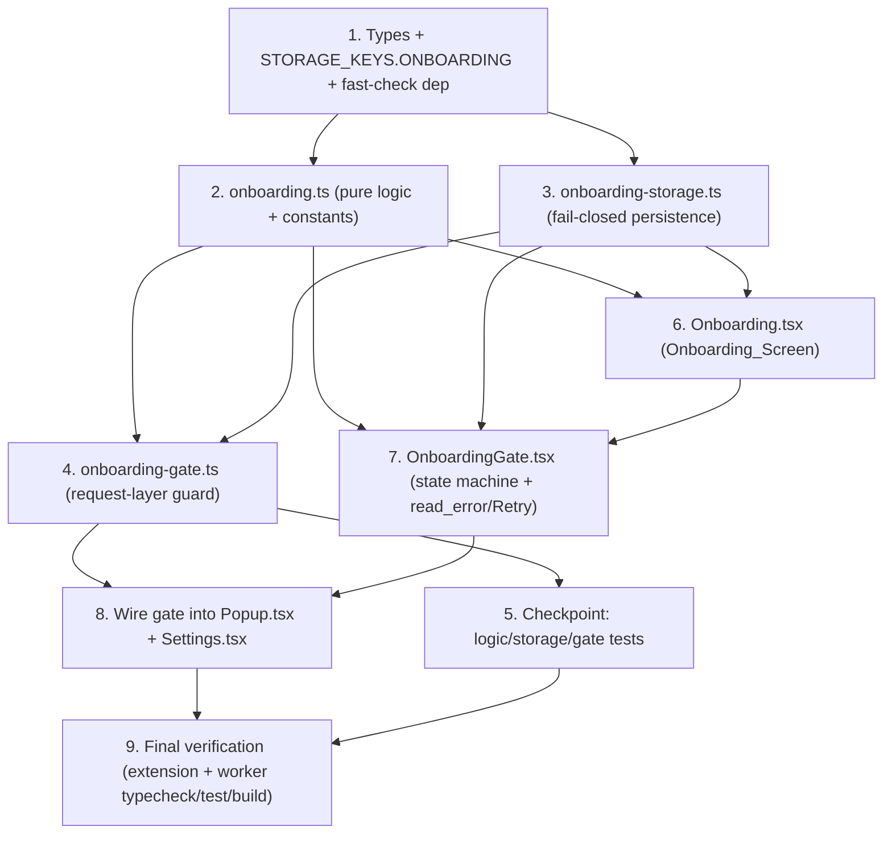

# Implementation Plan: Compliance Onboarding Gate (Spec 03)

## Overview

This plan implements the **Compliance Onboarding Gate** described in `design.md`, strictly within
the requirements in `requirements.md`. The work is **extension-only** (TypeScript, React 18, Vite,
Vitest) — **no Worker_API changes are planned**. The only Spec 01 / Spec 02 touch points are:

1. mounting `OnboardingGate` at the existing entry points (`Popup.tsx`, `Settings.tsx`), and
2. routing authenticated controls through the new `guardAuthenticatedAction` gate.

`GET /v1/status`, Worker auth/token behavior, the Spec 02 `credential-storage.ts` / `api-client.ts`
modules and their tests, the localhost URL validation + manifest host permissions, and the
`copy-static` build step that copies `manifest.json` + icons into `dist/` are all **preserved
unchanged**. The Acknowledgement_Record is **local-only** (never transmitted to the Worker_API).

Implementation language is **TypeScript** (the design specifies concrete TS/TSX — no pseudocode),
so no language-selection step is required. Because the design includes a **Correctness Properties**
section (Properties 1–8), property-based tests (fast-check, ≥100 iterations) are included as
optional sub-tasks alongside the required example/regression tests.

Tasks build incrementally: shared types → pure logic → storage → request-layer gate → UI screen →
gate wrapper → entry-point wiring → full verification. Each sub-task ends wired into a prior step;
there is no orphaned code.

## Task Dependency Graph

## Tasks

- [x] 1. Add onboarding types, storage key, and test dependency
  - [x] 1.1 Extend `extension/src/types/index.ts` with Spec 03 types (additive only; do not change Spec 01/02 types)
    - Add `AcknowledgementItemId` union for the six items a–f (`manual_assistant_not_bot`, `no_automation`, `manual_review_submit`, `follow_subreddit_rules`, `disclose_affiliation`, `no_abuse`) and the `AcknowledgementItem` interface.
    - Add the `AcknowledgementRecord` interface (`acknowledged: boolean`, `version: string`, `acknowledged_at: string`, `items: AcknowledgementItemId[]`).
    - Add `ONBOARDING_REQUIRED = 'ONBOARDING_REQUIRED' as const`, `OnboardingErrorCode`, `OnboardingGateError`, `GateResult`, `AcknowledgementValidation`, and `OnboardingState` discriminated unions (the `incomplete` variant includes `reason: 'missing' | 'stale_version' | 'invalid' | 'read_error'`).
    - Extend `STORAGE_KEYS` with `ONBOARDING: 'rma_onboarding_acknowledgement'`, leaving `WORKER_API_BASE_URL` untouched and the key distinct from `rma_install_id` / `rma_install_token`.
    - _Requirements: 1.2, 1.5, 4.4, 5.2_
  - [x] 1.2 Add `fast-check` to `extension/package.json` `devDependencies`
    - Add `fast-check` (latest stable) for property-based tests; do not change existing scripts or the `copy-static` step.
    - _Requirements: 7.6_

- [x] 2. Implement pure onboarding logic and constants (`extension/src/lib/onboarding.ts`)
  - [x] 2.1 Create constants: `ACKNOWLEDGEMENT_VERSION` semver string, `REQUIRED_ACKNOWLEDGEMENT_ITEMS` (six items a–f with disclosure labels), and derived `REQUIRED_ACKNOWLEDGEMENT_ITEM_IDS`
    - Labels phrase the disclosures from Req 2.2–2.7 / 3.1; `ACKNOWLEDGEMENT_VERSION` is a `major.minor.patch` constant in source.
    - _Requirements: 3.1, 4.4_
  - [x] 2.2 Implement `validateAcknowledgement(candidate)` returning `AcknowledgementValidation`
    - Valid iff every required id is present (set-membership; order, duplicates, and extra/unknown ids do not invalidate); on failure return the `missing` ids.
    - _Requirements: 3.6_
  - [x] 2.3 Implement `isOnboardingComplete(record, currentVersion = ACKNOWLEDGEMENT_VERSION)`
    - Return `false` when record is `null`, `acknowledged !== true`, or `version` is empty/non-string; use `compareSemver` so a stored version lower than current => incomplete; otherwise return `validateAcknowledgement(record).valid`.
    - _Requirements: 1.4, 3.6, 4.5_
  - [x] 2.4 Implement `buildAcknowledgementRecord()` factory used by the UI at accept time
    - Returns `{ acknowledged: true, version: ACKNOWLEDGEMENT_VERSION, acknowledged_at: new Date().toISOString(), items: [...REQUIRED_ACKNOWLEDGEMENT_ITEM_IDS] }` so the accept-time record is pure and testable.
    - _Requirements: 4.1, 4.2, 4.3_
  - [x]* 2.5 Write property test for acknowledgement completeness in `onboarding.test.ts`
    - **Property 3: Acknowledgement Completeness** — for any subset/superset of required ids plus noise, `validateAcknowledgement(c).valid` iff every required id ∈ `c.items`.
    - **Validates: Requirements 3.2, 3.3, 3.4, 3.6**
  - [x]* 2.6 Write property test for version re-acknowledgement in `onboarding.test.ts`
    - **Property 5: Version Re-Acknowledgement** — for random `(stored, current)` semver pairs with `stored < current`, `isOnboardingComplete(record, current) === false`.
    - **Validates: Requirements 4.5**
  - [x]* 2.7 Write property test for timestamp & version presence in `onboarding.test.ts`
    - **Property 8: Timestamp and Version Presence** — for repeated `buildAcknowledgementRecord()` calls, the record has `acknowledged === true`, `version === ACKNOWLEDGEMENT_VERSION`, and a non-empty ISO 8601 `acknowledged_at` that round-trips through `Date`.
    - **Validates: Requirements 4.1, 4.2, 4.3**
  - [x]* 2.8 Write unit/example tests for logic constants and validation edge cases
    - `ACKNOWLEDGEMENT_VERSION` matches a `major.minor.patch` pattern (4.4); validation examples for the empty set, a five-of-six set, and the full set (7.2); an example where a stored record one minor below current is incomplete (7.4).
    - _Requirements: 4.4, 7.2, 7.4_

- [x] 3. Implement local persistence module (`extension/src/lib/onboarding-storage.ts`)
  - [x] 3.1 Implement `isAcknowledgementRecord(value)` runtime shape guard and `getAcknowledgement()` fail-closed read
    - `getAcknowledgement` reads `STORAGE_KEYS.ONBOARDING`, returns the record only when the guard passes, and returns `null` on missing key, malformed shape, or any read error (try/catch).
    - _Requirements: 1.1, 1.3, 1.4, 1.7_
  - [x] 3.2 Implement `readAcknowledgement()` result variant for UI messaging
    - Returns `{ kind: 'ok'; record }` (record `null` when absent/invalid) or `{ kind: 'read_error'; message }` on a thrown read; this is messaging-only and does not relax the fail-closed default used by `getAcknowledgement` / `isOnboardingComplete`.
    - _Requirements: 1.7, 1.8_
  - [x] 3.3 Implement `setAcknowledgement(record)` and `clearAcknowledgement()`
    - `setAcknowledgement` writes under `STORAGE_KEYS.ONBOARDING` and throws `OnboardingStorageError` on write failure; `clearAcknowledgement` removes the key for dev/testing resets.
    - _Requirements: 1.1, 4.6_
  - [x]* 3.4 Write property test for record round-trip in `onboarding-storage.test.ts`
    - **Property 4: Acknowledgement Record Round-Trip** — for any valid record, `getAcknowledgement()` after `setAcknowledgement(r)` deep-equals `r`, stored under `rma_onboarding_acknowledgement` (Map-backed mocked `chrome.storage.local`).
    - **Validates: Requirements 1.1, 1.2, 1.3, 4.1, 4.2, 4.3** (also satisfies Req 7.1)
  - [x]* 3.5 Write property test for local-only persistence in `onboarding-storage.test.ts`
    - **Property 7: Local-Only Acknowledgement** — for any valid record, accept/write uses only `chrome.storage.local.set`; a stubbed global `fetch` is never called with the record or any item id.
    - **Validates: Requirements 1.6**
  - [x]* 3.6 Write unit/example tests for fail-closed reads and key distinctness
    - No record => `null` (incomplete); malformed record => `null`; mocked read rejection => `getAcknowledgement` returns `null` and `readAcknowledgement` returns `read_error` (Req 1.7, 1.8); assert `STORAGE_KEYS.ONBOARDING` differs from credential and base-url keys (1.5).
    - _Requirements: 1.4, 1.5, 1.7, 1.8, 7.1_

- [x] 4. Implement request-layer gating guard (`extension/src/lib/onboarding-gate.ts`)
  - [x] 4.1 Implement `guardAuthenticatedAction()`
    - Read the record via `getAcknowledgement`, evaluate `isOnboardingComplete`; return `{ allowed: true }` when complete, else `{ allowed: false, error: { code: ONBOARDING_REQUIRED, message } }`; perform **no credential read and no fetch** when blocked.
    - _Requirements: 5.1, 5.2, 5.6_
  - [x] 4.2 Implement `guardedAuthenticatedFetch()` and `guardedVerifyAuth()` wrappers over Spec 02 `api-client`
    - Compose over the existing `authenticatedFetch` / `verifyAuth` without modifying `api-client.ts`; when blocked, return/throw `ONBOARDING_REQUIRED` before delegating; never route `checkStatus` through the gate.
    - _Requirements: 5.1, 5.2, 5.3, 5.4_
  - [x]* 4.3 Write property test for gate soundness in `onboarding-gate.test.ts`
    - **Property 1: Gate Soundness** — for random complete/incomplete records, `guardAuthenticatedAction().allowed === isOnboardingComplete(record)`; when blocked, `error.code === 'ONBOARDING_REQUIRED'` and mocked `getCredentials`/`fetch` are not called; when allowed, `authenticatedFetch` is invoked.
    - **Validates: Requirements 5.1, 5.2, 5.3, 5.6** (also satisfies Req 7.3)
  - [x]* 4.4 Write property test for fail-closed gating in `onboarding-gate.test.ts`
    - **Property 2: Fail-Closed Gating** — for arbitrary absent/unreadable (read throws)/invalid states, the gate returns blocked and `fetch` is never called; a read failure stays blocked even when a record may exist.
    - **Validates: Requirements 1.4, 1.7, 1.8, 4.6, 5.1**
  - [x]* 4.5 Write property test for public status availability in `onboarding-gate.test.ts`
    - **Property 6: Public Status Always Available** — for any onboarding state, `checkStatus` resolves independent of state and does not pass through the gate module.
    - **Validates: Requirements 5.4, 6.1** (also satisfies Req 7.5)
  - [x]* 4.6 Write unit/example tests for gating branches
    - Authenticated action blocked with `ONBOARDING_REQUIRED` while incomplete and permitted once complete (7.3); `checkStatus` succeeds (mocked 200) while onboarding is incomplete (7.5).
    - _Requirements: 7.3, 7.5_

- [x] 5. Checkpoint - ensure logic, storage, and gate tests pass
  - Ensure all tests pass, ask the user if questions arise.

- [x] 6. Build the Onboarding_Screen component (`extension/src/components/Onboarding.tsx`)
  - [x] 6.1 Implement disclosures, checkboxes, version display, and accept flow
    - Render the manual-assistant/not-a-bot framing and all disclosure statements (Req 2.2–2.7); render the six `REQUIRED_ACKNOWLEDGEMENT_ITEMS` as separate checkboxes defaulting to unchecked (Req 3.1); display `ACKNOWLEDGEMENT_VERSION` (Req 2.8).
    - Keep the accept control disabled until all six are checked (computed via `validateAcknowledgement`); on accept build the record with `buildAcknowledgementRecord()` and persist via `setAcknowledgement`, then invoke an `onComplete` callback (Req 3.2, 3.3, 3.4, 4.1–4.3).
    - On `OnboardingStorageError` write failure show an inline error and remain incomplete (Req 4.6); defensive guard: if accept is invoked while any item is unchecked, perform no write and show the "every item must be accepted" message (Req 3.5).
    - _Requirements: 2.2, 2.3, 2.4, 2.5, 2.6, 2.7, 2.8, 3.1, 3.2, 3.3, 3.4, 3.5, 4.1, 4.2, 4.3, 4.6_
  - [x] 6.2 Render a completed-state summary
    - When onboarding is complete, render a summary (acknowledged version + timestamp) instead of the checkbox form.
    - _Requirements: 4.1, 4.2_
  - [x]* 6.3 Write component tests for content and accept behavior
    - Assert each disclosure statement, six unchecked checkboxes, the displayed version, and a disabled accept control render (2.2–2.8, 3.1); accept disabled until all six checked then enabled (3.2, 3.3); full-set accept calls `setAcknowledgement` with `acknowledged: true` and all ids (3.4); missing-item accept performs no write and shows the message (3.5); write failure shows an inline error and stays incomplete (4.6).
    - _Requirements: 2.2, 2.3, 2.4, 2.5, 2.6, 2.7, 2.8, 3.1, 3.2, 3.3, 3.4, 3.5, 4.6_

- [x] 7. Build the app-root gate wrapper (`extension/src/components/OnboardingGate.tsx`)
  - [x] 7.1 Implement the loading/incomplete/complete state machine
    - On mount, read storage and compute `isOnboardingComplete`; render a placeholder while `loading`, `<Onboarding onComplete={refresh} />` while `incomplete`, and `children` only when `complete`; `refresh` re-reads and re-evaluates after a successful acknowledgement (Req 2.1, 4.5).
    - _Requirements: 2.1, 4.5_
  - [x] 7.2 Implement read-failure handling with recoverable error and Retry
    - When the read fails, resolve to `incomplete` with `reason: 'read_error'`, never render `children`/normal UI, keep gated authenticated actions unavailable, and show a recoverable storage error message with a **Retry** action that re-reads storage and re-evaluates (transitioning to `complete` only on a successful complete re-read).
    - _Requirements: 1.7, 1.8, 5.5_
  - [x]* 7.3 Write component test for read-failure gate behavior
    - **Property 2: Fail-Closed Gating** (UI path) — with `chrome.storage.local.get` mocked to reject, assert the gate is incomplete with `reason: 'read_error'`, does not render `children`, keeps actions blocked (`guardAuthenticatedAction` returns `ONBOARDING_REQUIRED`, `fetch` not called), shows the recoverable error + Retry, and that a successful re-read on Retry transitions to `complete`.
    - **Validates: Requirements 1.7, 1.8**

- [x] 8. Wire the gate into entry points (`Popup.tsx`, `Settings.tsx`)
  - [x] 8.1 Mount `OnboardingGate` and gate authenticated controls
    - Wrap the `Popup` and `Settings` roots with `<OnboardingGate>`; present any control that initiates an Authenticated_Action in a disabled state (or route it to the Onboarding_Screen) while incomplete/`read_error`, routing such actions through `guardAuthenticatedAction`; surface an onboarding-status indicator in Settings (Req 5.3, 5.5).
    - Keep the public URL configuration and "Save & Test Connection" (`checkStatus`) ungated and available regardless of onboarding state (Req 5.4); do not modify `checkStatus` or the public status path.
    - _Requirements: 5.3, 5.4, 5.5_
  - [x]* 8.2 Write entry-point gating tests
    - Render an entry point with incomplete state and assert any authenticated control is disabled or routes to the Onboarding_Screen (5.5); assert the public status test path remains invokable while incomplete (5.4).
    - _Requirements: 5.4, 5.5_

- [x] 9. Final verification - full extension and worker build with no Spec 01/02 regressions
  - Install the new dev dependency, then run, from the repo root: `(cd extension && npm install && npm run typecheck && npm run test && npm run build)` and `(cd worker-api && npm run typecheck && npm run test && npm run build)`.
  - Confirm the preserved Spec 01/02 suites stay green: extension `security-boundary.test.ts` (manifest host permissions incl. `http://localhost/*` and `http://127.0.0.1/*`, storage-only permission, no-secrets scan), `url-validator` localhost acceptance, `credential-storage.test.ts`, `api-client.test.ts`, `api-client-auth.test.ts`; and worker `status.test.ts` (`GET /v1/status` returns 200 publicly), `auth.test.ts`, `admin.test.ts`.
  - Confirm `npm run build` still copies `manifest.json` and icons into `dist/` (the `copy-static` step is unchanged), and that no Worker auth/token behavior, `/v1/status`, or localhost support was modified.
  - Ensure all tests pass, ask the user if questions arise.

## Notes

- Tasks marked with `*` are optional (test-related) and can be skipped for a faster MVP; core implementation tasks are never optional.
- This workflow is **Spec 03 only**: the sole Spec 01/02 changes are mounting `OnboardingGate` at entry points and routing authenticated controls through `guardAuthenticatedAction`. No Worker_API files are modified; `GET /v1/status`, Worker auth/token behavior, credential/auth modules, localhost validation + manifest host permissions, and `dist` asset copying are preserved.
- The Acknowledgement_Record is **local-only** — no task transmits it (or any item) to the Worker_API (Property 7).
- The gate is **fail-closed**: missing, unreadable (read throws), invalid, or stale-version records all evaluate to "onboarding incomplete," blocking Authenticated_Actions (Properties 1, 2, 5).
- Each property test must run a minimum of 100 iterations and is tagged `// Feature: compliance-onboarding, Property {number}: {property_text}`.
- Property/requirements traceability: P1→4.3/4.6 gate (5.1–5.3,5.6); P2→4.4/7.3 fail-closed (1.4,1.7,1.8,4.6,5.1); P3→2.5 (3.x); P4→3.4 (1.1–1.3,4.1–4.3); P5→2.6 (4.5); P6→4.5 (5.4,6.1); P7→3.5 (1.6); P8→2.7 (4.1–4.3).
