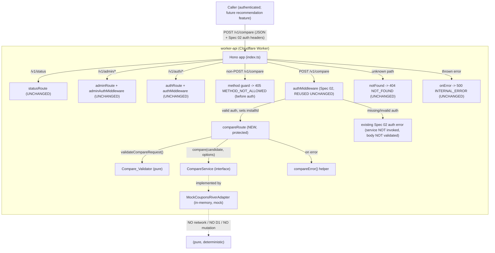

# Design Document: CouponsRiver Compare API Foundation (Spec 04)

## Overview

Spec 04 adds a **Worker-only** `POST /v1/compare` endpoint to the existing Hono application. The endpoint accepts a `Compare_Request` (a candidate product/merchant/coupon plus optional `max_results`), validates and normalizes it, asks a replaceable `CompareService` to find matching coupon/offer records, and returns a `Compare_Response` containing the normalized candidate echo, a `match_count`, and an ordered `matches` array.

The data source in Spec 04 is a **clearly-marked mock / in-memory adapter** (`MockCouponsRiverAdapter`) that satisfies the `CompareService` interface. It performs no network calls, reads no database, mutates no input, and is deterministic. A real CouponsRiver adapter can replace it later without changing the request/response contract or the route.

This design integrates with — and explicitly preserves — Spec 01 (`GET /v1/status`), Spec 02 (auth middleware + token lifecycle), and Spec 03 (compliance onboarding). The `POST /v1/compare` endpoint is **PROTECTED**: it is guarded by the existing Spec 02 `authMiddleware`, applied **without modifying** `authMiddleware`, the token lifecycle, or `/v1/status`. It is **worker-only**: no Extension UI and no Extension client method are added, because no Extension feature consumes compare yet (Req 11.5 only requires a thin client *when* one is needed, and none is in Spec 04).

### Key Design Decisions

| # | Decision | Rationale |
|---|----------|-----------|
| D1 | Mount the compare endpoint under `/v1` for `POST /v1/compare`, with a non-POST `405 METHOD_NOT_ALLOWED` method guard registered in `index.ts` **before** auth so a non-POST request is rejected even without credentials. | Mirrors the existing `/v1/auth/verify` precedent (an explicit method guard registered before `app.use('/v1/auth/*', authMiddleware)`); adds the route without touching status/admin/auth mounting or the catch-all 404 / `onError` 500. |
| D2 | In Spec 04, `/v1/compare` is **PROTECTED** by the existing Spec 02 `authMiddleware`, reused **UNCHANGED**. | Satisfies Requirement 6 (6.1–6.6): the endpoint reuses the established bearer-token auth without inventing a new mechanism. Auth runs **after** the non-POST method guard (Req 1.6) and **before** body validation and the `CompareService` (Req 6.3, 6.4); `authMiddleware`, the token lifecycle, and `/v1/status` are not modified (Req 6.5, 11.3). |
| D3 | Define a `CompareService` interface; the route depends only on it via a module-level default instance (`compareService`). | Dependency inversion (Req 7.1, 7.2, 7.6): a real adapter replaces the mock with no route change. |
| D4 | `validateCompareRequest(raw: unknown)` is a **pure** function returning a discriminated union. | Enables property-based testing of validation/normalization in isolation; guarantees the service is never invoked on invalid input (Req 2.9). |
| D5 | Matching is deterministic and pure: case-insensitive merchant match required; optional fields raise the score; results ordered by descending score with a stable tie-break; bounded by effective `max_results`. | Satisfies Req 3.5, 3.6, 8.2; makes results reproducible and testable. |
| D6 | Extend `ErrorResponse.error` **additively** with optional `error_id?` and `timestamp?`; add `VALIDATION_ERROR` to `ErrorCode`. | Backward compatible (Req 5.3, 5.7, 5.8): existing Spec 01/02/03 error bodies remain valid; compare errors may carry safe debug metadata. |
| D7 | The route assembles the `CompareResponse`; `CompareService.compare(...)` returns `Match[]`. | Centralizes the `match_count === matches.length` invariant (Property 4) and the normalized candidate echo at a single boundary, so no adapter can violate the response envelope. |

## Architecture

### High-Level Component View



### Request Flow (POST /v1/compare)

```mermaid
sequenceDiagram
    participant C as Caller
    participant G as index.ts method guard
    participant M as authMiddleware (Spec 02, unchanged)
    participant R as compareRoute (compare.ts)
    participant V as validateCompareRequest (pure)
    participant S as compareService (MockCouponsRiverAdapter)

    C->>G: HTTP request to /v1/compare
    alt non-POST method
        G-->>C: 405 METHOD_NOT_ALLOWED  [before auth; NO auth headers required]
    else POST
        G->>M: pass through to authMiddleware
        alt missing / invalid auth (MISSING_AUTH_HEADERS, INVALID_TOKEN, INSTALL_NOT_FOUND, TOKEN_REVOKED, TIMESTAMP_EXPIRED, NONCE_REUSED, RATE_LIMITED)
            M-->>C: existing Spec 02 auth error (401/403/429)  [service NOT invoked, body NOT validated]
        else valid auth (sets c.set('installId', ...))
            M->>R: next() -> POST /compare handler
            R->>R: await c.req.json()
            alt body is not valid JSON (throws)
                R-->>C: 400 VALIDATION_ERROR (+error_id,+timestamp)
            else parsed
                R->>V: validateCompareRequest(raw)
                alt invalid (missing/empty merchant, wrong type, length, max_results)
                    V-->>R: { ok: false, message }
                    R-->>C: 400 VALIDATION_ERROR (+error_id,+timestamp)  [service NOT invoked]
                else valid
                    V-->>R: { ok: true, request: NormalizedCompareRequest }
                    R->>S: compare(candidate, { maxResults })
                    S-->>R: Match[] (scored, ordered, bounded)
                    R->>R: assemble CompareResponse {candidate, match_count, matches}
                    R-->>C: 200 CompareResponse (match_count == matches.length)
                end
            end
        end
    end
    Note over R: The handler MAY read c.get('installId') (set by authMiddleware) but MUST NOT change how it is set; installId is never included in the CompareResponse.
    Note over R: Any unexpected throw in handler -> 500 INTERNAL_ERROR (+error_id,+timestamp), generic message
```

### Module / File Plan

| File | Status | Responsibility |
|------|--------|----------------|
| `worker-api/src/routes/compare.ts` | **NEW** | `compareRoute` Hono sub-app: `POST /compare` handler, `.all('/compare')` 405 method guard, JSON-parse handling, `validateCompareRequest` (exported pure validator), `compareError` helper, response assembly, defensive 500. |
| `worker-api/src/routes/compare.test.ts` | **NEW** | Vitest suite using `app.request(...)` for endpoint behavior + `fast-check` property tests for pure logic. |
| `worker-api/src/services/compare-service.ts` | **NEW** | `CompareService` interface, `CompareOptions`, `MockCouponsRiverAdapter` (clearly marked mock), in-memory dataset, scoring/ordering/bounding logic, and the module-level default `compareService` instance + `MOCK_SOURCE` constant. |
| `worker-api/src/types/index.ts` | **MODIFIED (additive)** | Add `Candidate`, `CompareRequest`, `NormalizedCandidate`, `NormalizedCompareRequest`, `Match`, `CompareResponse`; add `VALIDATION_ERROR` to `ErrorCode`; add optional `error_id?`/`timestamp?` to `ErrorResponse.error`. |
| `worker-api/src/index.ts` | **MODIFIED (one import + method guard + auth + mount)** | `import { compareRoute }` (the existing `authMiddleware` import is reused as-is); register the non-POST `/v1/compare` 405 method guard **before** `app.use('/v1/compare', authMiddleware)`, then `app.route('/v1', compareRoute)`. No other changes; status/admin/auth/notFound/onError untouched. |
| `worker-api/package.json` | **MODIFIED (devDependency)** | Add `fast-check` (`3.23.2`, matching the Extension's Spec 03 usage) to `devDependencies` for property-based tests. |

**No Extension files change.** Spec 04 is worker-only; adding an Extension compare client method is an explicit Non-Goal (no Extension feature consumes compare yet, so Req 11.5's "thin client *when* needed" does not apply). The endpoint is protected by the existing Spec 02 `authMiddleware`, reused unchanged.

### Routing & Mounting

`index.ts` gains exactly one import plus three wiring lines for compare. The `authMiddleware` import already exists in `index.ts` (Spec 02) and is reused **unchanged**. The wiring mirrors the existing `/v1/auth/verify` precedent, where an explicit method guard is registered **before** `app.use('/v1/auth/*', authMiddleware)` so the method check runs before authentication.

The existing auth precedent in `index.ts` looks like this (unchanged by Spec 04):

```typescript
// Auth verification route method guard must run before auth middleware.
app.get('/v1/auth/verify', (c) =>
  c.json({ error: { code: 'METHOD_NOT_ALLOWED', message: 'Only POST is allowed on this endpoint.' } }, 405)
);

// Authenticated routes (protected by bearer-token auth middleware)
app.use('/v1/auth/*', authMiddleware);
app.route('/v1/auth', authRoute);
```

Spec 04 adds the following, following that exact precedent. These are the concrete lines to add to `index.ts`:

```typescript
import { compareRoute } from './routes/compare';   // NEW import (authMiddleware already imported above)

// ... after the existing auth mount, before notFound/onError ...

// Compare method guard must run BEFORE auth (mirrors the /v1/auth/verify precedent),
// so any non-POST request returns 405 even when valid auth headers are absent (Req 1.6, 10.5).
// We list the non-POST methods (rather than .all) so POST is NOT shadowed and falls through to auth.
app.on(['GET', 'PUT', 'PATCH', 'DELETE', 'OPTIONS', 'HEAD'], '/v1/compare', (c) =>
  c.json(
    { error: { code: 'METHOD_NOT_ALLOWED', message: 'Only POST is allowed on this endpoint.' } },
    405
  )
);

// Protect POST /v1/compare with the EXISTING Spec 02 authMiddleware, reused UNCHANGED (Req 6.1).
app.use('/v1/compare', authMiddleware);

// Mount the compare POST handler; it runs only AFTER authMiddleware passes (Req 6.3, 6.4).
app.route('/v1', compareRoute);
```

**Ordering rationale (Req 1.6, 6.3, 6.4):**

1. The non-POST method guard is registered first, so a `GET`/`PUT`/`PATCH`/`DELETE`/`OPTIONS`/`HEAD` request to `/v1/compare` returns `405 METHOD_NOT_ALLOWED` **before** `authMiddleware` runs — exactly mirroring `/v1/auth/verify`. This guard does **not** match `POST`, so a `POST` is never shadowed.
2. `app.use('/v1/compare', authMiddleware)` is registered before the mount, so every `POST /v1/compare` passes through the existing Spec 02 middleware. Missing/invalid auth is rejected here (with Spec 02's own codes/statuses), and neither the request body nor the `CompareService` is touched.
3. `app.route('/v1', compareRoute)` mounts the `POST /compare` handler, which executes only after auth succeeds. On success, `authMiddleware` has already called `c.set('installId', ...)`, which the handler MAY read via `c.get('installId')` but MUST NOT alter; `installId` is never echoed in the response.

`statusRoute`, `adminRoute`, `authRoute`, `notFound` (404), and `onError` (500) registrations are **unchanged**; mount order among the disjoint `/status`, `/admin/*`, `/auth/*`, and `/compare` paths is otherwise irrelevant.

### Authentication via Existing Middleware (Requirement 6 — active in Spec 04)

The Compare_Endpoint is protected by the existing Spec 02 `authMiddleware`, applied via `app.use('/v1/compare', authMiddleware)` as shown above. Spec 04 makes **no** change to `authMiddleware`, its validation order, its error responses, the token lifecycle, or `/v1/auth/*` and `/v1/admin/*` routing (Req 6.5, 11.3). Concretely:

- **Missing/invalid auth → existing Spec 02 error (Req 6.2, 6.3).** `authMiddleware` returns its already-defined codes and statuses (`MISSING_AUTH_HEADERS`, `INVALID_TOKEN`, `INSTALL_NOT_FOUND`, `TOKEN_REVOKED`, `TIMESTAMP_EXPIRED`, `NONCE_REUSED`, `RATE_LIMITED`) and short-circuits the request, so the compare handler never runs — the body is not parsed/validated and the `CompareService` is not invoked. Compare does **not** reshape these error bodies; they remain exactly what Spec 02 already returns.
- **Valid auth → proceed (Req 6.4).** Authentication is enforced before request validation; the only thing that precedes auth is the non-POST method guard (Req 1.6).
- **Install identity (Req 6.6).** `authMiddleware` sets `c.set('installId', installId)`; the compare handler MAY read it via `c.get('installId')` without changing how it is set, and it is never included in the `CompareResponse`.

## Components and Interfaces

### 1. `compare.ts` — Route, Method Guard, Validator, Error Helper

```typescript
import { Hono } from 'hono';
import type { Context } from 'hono';
import type {
  AppEnv,
  ErrorCode,
  ErrorResponse,
  CompareRequest,
  CompareResponse,
  NormalizedCandidate,
  NormalizedCompareRequest,
} from '../types';
import { compareService } from '../services/compare-service';

// --- Validation bounds (Requirement 2) ---
const MERCHANT_MAX = 128;
const PRODUCT_MAX = 256;
const COUPON_CODE_MAX = 64;
const CATEGORY_MAX = 64;
const MAX_RESULTS_MIN = 1;
const MAX_RESULTS_MAX = 50;
const DEFAULT_MAX_RESULTS = 10; // effective cap applied when max_results is omitted

/** Result of validating + normalizing a raw compare request body. */
export type ValidationResult =
  | { ok: true; request: NormalizedCompareRequest }
  | { ok: false; message: string };

/**
 * PURE validation + normalization. No I/O, no throwing on bad input
 * (errors are returned as data). Unrecognized fields are ignored.
 */
export function validateCompareRequest(raw: unknown): ValidationResult { /* see below */ }

/** Builds a safe compare ErrorResponse body with optional debug metadata. */
function compareError(
  c: Context<AppEnv>,
  status: 400 | 500,
  code: ErrorCode,
  message: string
): Response {
  const body: ErrorResponse = {
    error: {
      code,
      message,
      error_id: crypto.randomUUID(),     // opaque, NOT derived from any secret
      timestamp: new Date().toISOString(),
    },
  };
  return c.json(body, status);
}

const compareRoute = new Hono<AppEnv>();

// Runs ONLY after the non-POST method guard and authMiddleware (both registered in index.ts)
// have passed. authMiddleware has already validated Spec 02 credentials and called
// c.set('installId', ...). The handler MAY read c.get('installId') for diagnostics but MUST NOT
// change how it is set, and installId is never included in the CompareResponse.
compareRoute.post('/compare', async (c) => {
  try {
    let raw: unknown;
    try {
      raw = await c.req.json();
    } catch {
      return compareError(c, 400, 'VALIDATION_ERROR', 'Request body must be valid JSON.');
    }

    const result = validateCompareRequest(raw);
    if (!result.ok) {
      return compareError(c, 400, 'VALIDATION_ERROR', result.message);
    }

    const matches = compareService.compare(result.request.candidate, {
      maxResults: result.request.max_results,
    });

    const response: CompareResponse = {
      candidate: result.request.candidate,
      match_count: matches.length,
      matches,
    };
    return c.json(response, 200);
  } catch {
    // Defensive: compare logic is pure/deterministic and should not throw,
    // but never leak internals if it does.
    return compareError(c, 500, 'INTERNAL_ERROR', 'An unexpected error occurred.');
  }
});

// Non-POST methods on /v1/compare -> 405. The AUTHORITATIVE method guard lives in index.ts and
// is registered BEFORE app.use('/v1/compare', authMiddleware) so non-POST is rejected without
// auth (Req 1.6). This in-sub-app guard remains as a self-contained fallback (e.g. when
// compareRoute is mounted/tested in isolation) and uses the plain ErrorResponse shape (debug
// fields are optional), consistent with the existing auth.ts / status.ts guards.
compareRoute.all('/compare', (c) =>
  c.json(
    { error: { code: 'METHOD_NOT_ALLOWED', message: 'Only POST is allowed on this endpoint.' } },
    405
  )
);

export { compareRoute };
```

**`validateCompareRequest` algorithm (pure, deterministic):**

1. If `raw` is not a non-null object (or is an array) → `{ ok: false, message: 'Request body must be a JSON object.' }`.
2. `merchant`: must be present and `typeof === 'string'`; trim; if empty after trim → invalid; if `length > MERCHANT_MAX` (after trim) → invalid.
3. `product`, `coupon_code`, `category`: if present and not `undefined`, must be `typeof === 'string'`; trim; enforce `PRODUCT_MAX` / `COUPON_CODE_MAX` / `CATEGORY_MAX` (after trim). Omitted optional fields stay omitted (not set to empty string).
4. `max_results`: if present and not `undefined`, must be an integer (`Number.isInteger`) within `[MAX_RESULTS_MIN, MAX_RESULTS_MAX]`; else invalid. If omitted → effective value `DEFAULT_MAX_RESULTS`.
5. Unrecognized fields are ignored (only defined fields are read).
6. On success, return `{ ok: true, request: { candidate: <trimmed NormalizedCandidate>, max_results: <effective integer> } }`. Trimming twice yields the same result (normalization idempotence, Property 2).

Each invalid branch returns a generic, non-sensitive `message` (e.g., `'merchant is required and must be a non-empty string.'`) that never echoes secret state.

### 2. `compare-service.ts` — Service Interface + Mock Adapter

```typescript
import type { NormalizedCandidate, Match } from '../types';

/** Options that influence a compare operation. */
export interface CompareOptions {
  /** Effective, already-validated upper bound on returned matches (1..50). */
  maxResults: number;
}

/**
 * Replaceable compare data source. The route depends ONLY on this interface
 * (Requirements 7.1, 7.2). A real CouponsRiver adapter can implement this
 * later with no route or contract change (Requirement 7.6).
 *
 * Returns the ordered, bounded matches for the candidate. The route assembles
 * the CompareResponse envelope (candidate echo + match_count) so the
 * match_count invariant is enforced at a single boundary (Property 4).
 */
export interface CompareService {
  compare(candidate: NormalizedCandidate, options: CompareOptions): Match[];
}

/** Identifies matches as originating from the Spec 04 mock adapter. */
export const MOCK_SOURCE = 'mock-couponsriver';

/** Internal dataset record shape (mock only; not part of the public contract). */
interface CouponRecord {
  merchant: string;
  coupon_code?: string;
  description: string;
  category?: string;
  product_keywords?: string[];
  base_score: number;
}

/**
 * !!! MOCK / PLACEHOLDER IMPLEMENTATION — NOT A REAL DATA SOURCE !!!
 * In-memory adapter for Spec 04. Performs NO network request, NO D1/DB access,
 * and does NOT mutate the supplied candidate. Deterministic. To be replaced by
 * a real CouponsRiver adapter implementing CompareService.
 */
export class MockCouponsRiverAdapter implements CompareService {
  private readonly dataset: ReadonlyArray<CouponRecord>;

  constructor(dataset: ReadonlyArray<CouponRecord> = DEFAULT_MOCK_DATASET) {
    this.dataset = dataset;
  }

  compare(candidate: NormalizedCandidate, options: CompareOptions): Match[] {
    const merchantKey = candidate.merchant.toLowerCase();

    const scored: Match[] = this.dataset
      .filter((rec) => rec.merchant.toLowerCase() === merchantKey) // case-insensitive merchant match required
      .map((rec) => ({
        merchant: rec.merchant,
        ...(rec.coupon_code !== undefined ? { coupon_code: rec.coupon_code } : {}),
        description: rec.description,
        score: scoreRecord(rec, candidate),
        source: MOCK_SOURCE,
      }));

    scored.sort(compareMatches); // descending score, then stable deterministic tie-break
    return scored.slice(0, options.maxResults);
  }
}

/** Module-level default instance the route depends on (dependency injection seam). */
export const compareService: CompareService = new MockCouponsRiverAdapter();
```

**Scoring (`scoreRecord`, pure):** starts from `rec.base_score` (merchant already matched) and adds fixed, deterministic increments for optional candidate fields:

| Candidate field present & matches record | Increment |
|------------------------------------------|-----------|
| `coupon_code` equals `rec.coupon_code` (case-insensitive) | +3 |
| `product` is a case-insensitive substring of any `rec.product_keywords` entry or of `rec.description` | +2 |
| `category` equals `rec.category` (case-insensitive) | +1 |

**Tie-break (`compareMatches`, pure, total order):** sort by `score` descending; for equal scores break ties by `merchant` ascending, then `coupon_code` ascending (treating `undefined` as the empty string), then `description` ascending. This yields a stable, deterministic ordering independent of dataset insertion order (Property 5).

**Purity guarantees (Requirement 8 / Properties 7, 8):** `compare` reads only `candidate` (never writes it), constructs brand-new `Match` objects, touches no `Env`/`DB` binding (the adapter is constructed without any binding), and issues no `fetch`. The same candidate against the same dataset always yields a deep-equal result.

### 3. Compare_Validator (logical component)

Implemented as the exported pure function `validateCompareRequest` in `compare.ts` (see §1). It is the only place that decides validity; the route maps `{ ok: false }` to a `400 VALIDATION_ERROR` and never calls `compareService` on invalid input (Requirement 2.9, Property 1).

### 4. Error helper (`compareError`)

A small module-local helper in `compare.ts` that builds the canonical compare `ErrorResponse` body `{ error: { code, message, error_id?, timestamp? } }`. `error_id` is `crypto.randomUUID()` (opaque, not secret-derived); `timestamp` is `new Date().toISOString()`. It never includes stack traces, exception messages, file paths, env values, `INSTALL_TOKEN_PEPPER`, `ADMIN_BOOTSTRAP_SECRET`, DB/SQL text, upstream raw responses, adapter internals, or auth tokens (Requirement 5.4, 5.7; Property 9). The 405 method guard intentionally uses the plain shape (no debug fields) to stay consistent with the existing `auth.ts`/`status.ts` guards; the optional fields keep that shape valid.

## Data Models

All new types are added **additively** to `worker-api/src/types/index.ts` under TypeScript strict mode (Requirement 9).

```typescript
// --- Compare Types (Spec 04) ---

/** The subject of a comparison (Requirement 9.2). */
export interface Candidate {
  merchant: string;       // required
  product?: string;       // optional
  coupon_code?: string;   // optional
  category?: string;      // optional
}

/** Request body for POST /v1/compare (Candidate fields + optional max_results). */
export interface CompareRequest extends Candidate {
  max_results?: number;   // optional integer 1..50
}

/** A Candidate after validation + normalization (trimmed string fields). */
export interface NormalizedCandidate {
  merchant: string;
  product?: string;
  coupon_code?: string;
  category?: string;
}

/** A fully validated + normalized request with an effective max_results. */
export interface NormalizedCompareRequest {
  candidate: NormalizedCandidate;
  max_results: number;    // effective value (default applied when omitted)
}

/** A single coupon/offer match (Requirement 9.4). */
export interface Match {
  merchant: string;
  coupon_code?: string;   // optional
  description: string;
  score: number;          // numeric relevance score
  source: string;         // 'mock-couponsriver' in Spec 04
}

/** Success body for POST /v1/compare (Requirement 9.3). */
export interface CompareResponse {
  candidate: NormalizedCandidate;  // normalized echo of the query
  match_count: number;             // invariant: === matches.length
  matches: Match[];
}
```

**`ErrorResponse` (additive change — Requirement 5.7, 5.8):**

```typescript
export interface ErrorResponse {
  error: {
    code: ErrorCode;
    message: string;
    error_id?: string;            // NEW: optional opaque correlation id (safe to expose)
    timestamp?: string;           // NEW: optional ISO 8601 timestamp
    retry_after_seconds?: number; // existing
  };
}
```

Both new fields are optional, so every existing Spec 01/02/03 error body remains a valid `ErrorResponse`.

**`ErrorCode` (additive change — Requirement 5.3):**

```typescript
export type ErrorCode =
  | 'NOT_FOUND'
  | 'METHOD_NOT_ALLOWED'
  | 'INTERNAL_ERROR'
  | 'MISSING_AUTH_HEADERS'
  | 'INSTALL_NOT_FOUND'
  | 'TOKEN_REVOKED'
  | 'INVALID_TOKEN'
  | 'TIMESTAMP_EXPIRED'
  | 'NONCE_REUSED'
  | 'RATE_LIMITED'
  | 'UNAUTHORIZED'
  | 'VALIDATION_ERROR'; // NEW (Spec 04); no existing code removed or repurposed
```

`StatusResponse` is **unchanged**, including `compare_enabled: false` (Requirement 11.1, 11.2).


## Correctness Properties

*A property is a characteristic or behavior that should hold true across all valid executions of a system — essentially, a formal statement about what the system should do. Properties serve as the bridge between human-readable specifications and machine-verifiable correctness guarantees.*

These twelve properties are consistent with the Correctness Properties enumerated in `requirements.md`. Each property derives from the prework classification above and is annotated with the requirements it validates.

### Property 1: Validation Soundness and Completeness

*For any* JSON value supplied as a compare request body, `POST /v1/compare` SHALL return HTTP 200 with a `CompareResponse` if and only if the value passes every validation rule; any value that violates a rule (non-object/non-JSON body, missing/empty/whitespace `merchant`, a non-string candidate field, an over-length field after trim, or a `max_results` that is not an integer in 1..50) SHALL receive HTTP 400 with code `VALIDATION_ERROR`, the `CompareService` SHALL NOT be invoked, and unrecognized fields SHALL NOT affect the outcome.

**Validates: Requirements 2.1, 2.2, 2.3, 2.4, 2.5, 2.6, 2.8, 2.9, 5.2**

### Property 2: Normalization Idempotence

*For any* candidate, applying `validateCompareRequest` normalization twice SHALL produce the same normalized candidate as applying it once (trimming is idempotent and the second pass changes nothing).

**Validates: Requirements 2.7**

### Property 3: No-Match Is Success

*For any* valid compare request whose merchant matches no record, `POST /v1/compare` SHALL respond with HTTP 200, `match_count` equal to 0, and an empty `matches` array, and SHALL NEVER represent this outcome as HTTP 404 or any `ErrorResponse`.

**Validates: Requirements 4.1, 4.2, 4.3**

### Property 4: Match Count Invariant

*For any* `CompareResponse` produced for a valid request, `match_count` SHALL equal `matches.length` and SHALL be greater than or equal to 0.

**Validates: Requirements 3.2, 4.1, 4.4**

### Property 5: Result Bound and Deterministic Ordering

*For any* valid compare request, the number of returned `Match` objects SHALL not exceed the effective `max_results`, and the `matches` array SHALL be ordered by non-increasing `score` with a stable, deterministic tie-break (merchant, then coupon_code, then description), such that repeated evaluations of the same request produce the identical ordering.

**Validates: Requirements 3.5, 3.6, 8.2**

### Property 6: Match Provenance and Shape

*For any* `Match` returned by the Worker, the match SHALL include a `merchant` string, a `description` string, a numeric `score`, and a `source` equal to `'mock-couponsriver'` identifying the mock adapter (and `coupon_code`, when present, SHALL be a string).

**Validates: Requirements 3.4, 7.5, 9.4**

### Property 7: Adapter Purity and No External IO

*For any* compare request, the `MockCouponsRiverAdapter` SHALL compute its result without performing any outbound network request, without reading or writing the D1 database, and without mutating the supplied normalized candidate.

**Validates: Requirements 8.1, 8.3, 8.5**

### Property 8: Determinism

*For any* valid compare request evaluated against the same adapter dataset, repeated invocations SHALL return deep-equal `CompareResponse` values.

**Validates: Requirements 8.2**

### Property 9: Errors Never Leak Internals (and Responses Carry No Secrets)

*For any* compare response, the JSON body SHALL conform to its contract — error bodies use `{ error: { code, message, error_id?, timestamp?, retry_after_seconds? } }` with `code` drawn only from the `ErrorCode` union and a non-empty human-readable `message`; when present, `error_id` SHALL be an opaque string not derived from any secret and `timestamp` SHALL be an ISO 8601 string — and NO response (success or error) SHALL contain a stack trace, exception text, file path, secret, credential, environment value, `INSTALL_TOKEN_PEPPER`, `ADMIN_BOOTSTRAP_SECRET`, database/SQL text, upstream raw response, adapter internal detail, or authentication token.

**Validates: Requirements 5.1, 5.4, 5.6, 5.7, 5.8, 8.4, 11.6**

### Property 10: Method Guard

*For any* HTTP method other than POST sent to `/v1/compare`, the Worker SHALL respond with HTTP 405 and an `ErrorResponse` whose `code` is `METHOD_NOT_ALLOWED`.

**Validates: Requirements 1.3**

### Property 11: Active Auth Enforcement

*For any* request to the protected Compare_Endpoint that lacks valid Spec 02 authentication, the existing `authMiddleware` SHALL reject the request with its already-defined error code and HTTP status **before** the `CompareService` is invoked and **before** the request body is parsed or validated; *for any* non-POST method sent to `/v1/compare`, the Worker SHALL still respond with HTTP 405 `METHOD_NOT_ALLOWED` via the method guard that precedes authentication (so a non-POST request is rejected even without credentials).

**Validates: Requirements 6.1, 6.2, 6.3, 6.4, 6.5, 1.3, 1.6**

### Property 12: Preserved Status, Auth, and Onboarding

*For any* sequence of compare requests, `GET /v1/status` SHALL continue to return the exact Spec 01 status JSON (including `compare_enabled: false`), and the Spec 02 authentication/token lifecycle and Spec 03 compliance onboarding behavior SHALL remain unchanged.

**Validates: Requirements 11.1, 11.2, 11.3, 11.4, 11.7, 11.8**

## Error Handling

All compare errors use the standard `ErrorResponse` shape. Compare-route errors (`VALIDATION_ERROR`, compare `INTERNAL_ERROR`) carry the optional safe debug fields `error_id` (opaque `crypto.randomUUID()`) and `timestamp` (`new Date().toISOString()`). The 405 method guard and the global 404/500 handlers retain the plain shape (optional fields omitted), which remains valid under the additive type change.

| Scenario | Source | HTTP | `code` | `error_id` / `timestamp` | Notes |
|----------|--------|------|--------|--------------------------|-------|
| Body is not valid JSON (`c.req.json()` throws) | `compare.ts` | 400 | `VALIDATION_ERROR` | yes | Generic message; service not invoked. |
| Missing / empty / whitespace `merchant` | `compare.ts` (validator) | 400 | `VALIDATION_ERROR` | yes | Service not invoked. |
| Candidate field wrong type (non-string) | `compare.ts` (validator) | 400 | `VALIDATION_ERROR` | yes | Service not invoked. |
| Field exceeds length bound (after trim) | `compare.ts` (validator) | 400 | `VALIDATION_ERROR` | yes | Service not invoked. |
| `max_results` not integer in 1..50 | `compare.ts` (validator) | 400 | `VALIDATION_ERROR` | yes | Service not invoked. |
| Valid request, zero matches | `compare.ts` | 200 | — (success) | — | `match_count: 0`, `matches: []` — NOT an error, NOT 404. |
| Valid request, ≥1 match | `compare.ts` | 200 | — (success) | — | Ordered, bounded matches. |
| Non-POST method on `/v1/compare` | `index.ts` method guard (before auth) | 405 | `METHOD_NOT_ALLOWED` | no (plain shape) | Runs BEFORE `authMiddleware`, so a non-POST is rejected without credentials (Req 1.6). `compare.ts` `.all('/compare')` is a self-contained fallback. |
| Unknown `/v1` path | `index.ts` `notFound` (unchanged) | 404 | `NOT_FOUND` | no | Existing catch-all preserved. |
| Unexpected throw inside compare handler | `compare.ts` try/catch | 500 | `INTERNAL_ERROR` | yes | Generic, non-revealing message. |
| Missing/invalid auth on `POST /v1/compare` | `authMiddleware` (Spec 02, UNCHANGED) | 401/403/429 | `MISSING_AUTH_HEADERS`, `INVALID_TOKEN`, `INSTALL_NOT_FOUND`, `TOKEN_REVOKED`, `TIMESTAMP_EXPIRED`, `NONCE_REUSED`, `RATE_LIMITED` | per Spec 02 | Rejected BEFORE compare logic: body not parsed/validated, `CompareService` not invoked (Req 6.2, 6.3). Compare does NOT reshape these bodies — they are exactly what Spec 02 already returns. |

**Leak prevention:** error messages are fixed, generic strings authored in `compare.ts`; no exception object, env value, secret, DB text, or adapter internal is ever interpolated into a response. This is enforced by Property 9.

## Testing Strategy

**Framework:** Vitest (existing; `environment: 'node'`, no default Worker bindings — confirmed by the existing `auth.test.ts` / `admin.test.ts`). Integration-style tests call the default-exported Hono app via `app.request(path, init, env)`, exactly like `status.test.ts` / `auth.test.ts`. Property-based tests use **`fast-check`**, added to `worker-api/devDependencies` at version `3.23.2` (matching the Extension's Spec 03 usage).

**Dual approach:**
- **Property tests** (≥100 iterations each) verify universal invariants over generated inputs. They exercise the **pure logic directly** — the exported `validateCompareRequest` and a directly-constructed `MockCouponsRiverAdapter` — so they do **not** require authentication (they never pass through `authMiddleware`). Each is tagged `// Feature: couponsriver-compare-api, Property {n}: {text}` and references its design property.
- **Example / integration tests** verify the mandated endpoint behaviors (Requirement 10) through `app.request('/v1/compare', ...)`. Because the endpoint is now **protected**, these tests attach **valid Spec 02 auth** (see below), except the non-POST 405 test and the missing-auth test, which deliberately omit credentials.

### Constructing valid Spec 02 auth in compare tests

`authMiddleware` validates credentials against the `DB` binding, computes the token hash with `hashToken(rawToken, INSTALL_TOKEN_PEPPER)` (from `worker-api/src/lib/crypto.ts`), enforces a ±5-minute timestamp window, a per-install rate limit, and nonce single-use. The existing suite runs under `environment: 'node'` and calls `app.request(...)` **without** an `env`, so it only exercises the pre-DB paths (`MISSING_AUTH_HEADERS`, the 405 method guard). To drive a **valid** authenticated compare request, the compare test seeds a test `env` (the third argument to `app.request`) with an in-memory D1 double, computing the token hash the same way `authMiddleware` expects:

```typescript
import app from '../index';
import { hashToken } from '../lib/crypto';

const PEPPER = 'test-pepper';
const INSTALL_ID = 'install-abc';
const RAW_TOKEN = 'raw-test-token';

// Minimal in-memory D1 double covering exactly the queries authMiddleware + its services use:
//   - SELECT token_hash, status FROM install_tokens WHERE install_id = ?  -> seeded active row
//   - rate_limit_events COUNT(*) ...                                      -> { cnt: 0 }
//   - INSERT INTO rate_limit_events ...                                   -> no-op
//   - SELECT 1 FROM nonce_log WHERE nonce = ?                             -> null (unused nonce)
//   - INSERT INTO nonce_log ...                                          -> no-op
function makeTestEnv(tokenHash: string) {
  const db = {
    prepare(sql: string) {
      return {
        bind(..._args: unknown[]) {
          return {
            async first<T>() {
              if (sql.includes('FROM install_tokens')) {
                return { token_hash: tokenHash, status: 'active' } as unknown as T;
              }
              if (sql.includes('COUNT(*)')) {
                return { cnt: 0 } as unknown as T;
              }
              return null; // nonce not used, etc.
            },
            async run() { return { success: true }; },
          };
        },
      };
    },
  };
  return { DB: db, INSTALL_TOKEN_PEPPER: PEPPER, ADMIN_BOOTSTRAP_SECRET: 'unused' };
}

async function authHeaders() {
  const tokenHash = await hashToken(RAW_TOKEN, PEPPER); // SAME hashing authMiddleware uses
  return {
    headers: {
      'Authorization': `Bearer ${RAW_TOKEN}`,
      'X-Install-Id': INSTALL_ID,
      'X-Timestamp': new Date().toISOString(),     // within the ±5-minute window
      'X-Nonce': crypto.randomUUID(),               // unique per request
      'Content-Type': 'application/json',
    },
    env: makeTestEnv(tokenHash),
  };
}

// Usage: const a = await authHeaders();
//        await app.request('/v1/compare', { method: 'POST', headers: a.headers, body }, a.env);
```

This reuses `authMiddleware` and `hashToken` **unchanged** — the only test-side construct is the in-memory D1 double seeded with an `active` install token whose `token_hash` equals `hashToken(RAW_TOKEN, PEPPER)`, so `constantTimeEqual` succeeds. (Alternatively, the suite may provision a token through the real `POST /v1/admin/provision-token` path against a miniflare D1 if one is later configured; the field names and hashing are identical.)

**Service injection for tests:** because the route depends on the `CompareService` interface (D3/D7), the pure-logic property tests import the exported `validateCompareRequest` and construct `MockCouponsRiverAdapter` directly (no auth, no HTTP). A counting/stub `CompareService` asserts the service is never invoked on invalid input (P1) and that the route depends only on the interface (Req 7.2); to assert the service is **not** invoked when auth fails (Req 6.3), the missing-auth test omits credentials so `authMiddleware` short-circuits before the handler runs.

### Property → Test Mapping (all 12)

| Property | Test type | Test approach |
|----------|-----------|---------------|
| **P1** Validation soundness/completeness | Property-based + examples | Property layer (no auth): generate valid and each class of invalid request and assert the pure `validateCompareRequest` returns `ok` iff valid, and that a counting stub `CompareService` is NOT called on invalid input. Endpoint examples (valid auth attached): missing `merchant` → 400 `VALIDATION_ERROR` (Req 10.2) and non-JSON body → 400 `VALIDATION_ERROR` (Req 10.3). |
| **P2** Normalization idempotence | Property-based | Generate candidates with surrounding whitespace; assert `normalize(normalize(x)) === normalize(x)` and fields are trimmed. |
| **P3** No-match is success | Property-based + example | Property layer (no auth): generate merchants absent from the dataset and assert the adapter returns `[]`. Endpoint example (valid auth attached): no-match request → 200, `match_count 0`, `matches: []`, no error body (Req 10.4); contrast a no-match (200) with an unknown route (404, no auth needed). |
| **P4** Match count invariant | Property-based | For any valid request, assert `match_count === matches.length` and `>= 0`. |
| **P5** Result bound + deterministic ordering | Property-based | Assert `matches.length <= effective max_results`; assert scores non-increasing with stable tie-break; assert two evaluations produce identical ordering. |
| **P6** Match provenance/shape | Property-based | For each returned match assert `merchant`/`description` strings, numeric `score`, `source === 'mock-couponsriver'`, and `coupon_code` is a string when present. |
| **P7** Adapter purity & no IO + no mutation | Property-based | Spy global `fetch` and assert never called; construct adapter with no DB binding; deep-freeze / snapshot the candidate and assert it is unchanged after `compare`. |
| **P8** Determinism | Property-based | Invoke the pure adapter twice with the same input and assert deep-equal results (no auth). One endpoint example (valid auth attached) confirms two identical authenticated requests yield deep-equal `CompareResponse`. |
| **P9** Errors never leak / no secrets | Property-based | For any invalid input, assert error body keys ⊆ `{code, message, error_id, timestamp, retry_after_seconds}`, `code` ∈ `ErrorCode`, `message` non-empty; assert `error_id` opaque and `timestamp` ISO 8601; assert serialized success and error bodies contain none of the forbidden substrings/secret values, stack markers, or file paths. |
| **P10** Method guard | Example-based | `app.request('/v1/compare', { method })` for GET/PUT/DELETE/PATCH → 405 `METHOD_NOT_ALLOWED` **without** auth headers, proving the guard precedes auth (Req 1.3, 1.6, 10.5). |
| **P11** Active auth enforcement | Example-based | (1) `POST /v1/compare` with an otherwise-valid body but **no** `Authorization` header → `authMiddleware` error (e.g. `MISSING_AUTH_HEADERS`) and a counting stub `CompareService` is NOT invoked (Req 6.2, 6.3, 10.6). (2) `POST` with **valid** auth (seeded env, see above) + valid body → 200 (Req 6.4, 10.1). (3) Non-POST → 405 without auth (shared with P10, Req 1.6). `authMiddleware` and `/v1/auth/*` remain unchanged (verified by existing `auth.test.ts`). |
| **P12** Preserved status/auth/onboarding | Example-based | Assert `GET /v1/status` returns the exact Spec 01 body incl. `compare_enabled: false` after compare is mounted and protected; rely on unchanged Spec 02 worker tests and unchanged Spec 03 extension tests (no edits to those modules). |

**Mandated Requirement 10 example tests (explicitly included in `compare.test.ts`):**

a. **Valid auth + valid body** → 200 with `match_count === matches.length` (Req 10.1).
b. **Valid auth + missing `merchant`** → 400 `VALIDATION_ERROR` (Req 10.2).
c. **Valid auth + non-JSON body** → 400 `VALIDATION_ERROR` (Req 10.3).
d. **Valid auth + no-match request** → 200, `match_count 0`, empty `matches` (Req 10.4).
e. **Non-POST method** (e.g. GET) → 405 `METHOD_NOT_ALLOWED` **WITHOUT** auth headers, proving the guard precedes auth (Req 10.5, 1.6).
f. **Missing `Authorization`** (no auth) on an otherwise-valid POST → `authMiddleware` error (e.g. `MISSING_AUTH_HEADERS`) and the `CompareService` is NOT invoked (Req 10.6, 6.2, 6.3).
g. **`GET /v1/status` unchanged** → 200 with the exact Spec 01 body including `compare_enabled: false` (Req 11.1).

All endpoint tests use `app.request(...)` against the default-exported app; tests (a)–(d) attach valid Spec 02 auth via the seeded test `env` and headers described above, while (e), (f), and (g) deliberately send no compare credentials (Req 10.7).

**Type-level / smoke coverage:** `tsc --noEmit` confirms the additive `ErrorCode`/`ErrorResponse` changes and the new compare types compile under strict mode (Req 5.3, 5.8, 9.1–9.5), and that existing error bodies remain valid `ErrorResponse` values.

## Non-Goals

Spec 04 explicitly does **not** include the following (preserving Spec 01/02/03 behavior and the product's compliance posture):

- **No Extension UI and no Extension code changes.** No Extension feature consumes compare yet, so no thin Extension client method is added (Req 11.5 requires one only *when* needed). No file under `extension/` is modified.
- **No change to `GET /v1/status`,** including keeping `compare_enabled: false` (Req 11.1, 11.2).
- **No change to Spec 02 auth/token lifecycle or `authMiddleware`** (validation order, errors, `/v1/admin/*`, `/v1/auth/*` all unchanged). Spec 04 **reuses** `authMiddleware` to protect `POST /v1/compare` by applying it via `app.use('/v1/compare', authMiddleware)` — without editing the middleware itself (Req 6.1, 6.5).
- **No change to Spec 03 compliance onboarding,** acknowledgement records, or Extension auth credential behavior.
- **No external network calls of any kind** — no CouponsRiver API, no scraping, no third-party HTTP. The adapter is in-memory only.
- **No D1 / database access** for the compare operation.
- **No Reddit features:** no Reddit scanning, discovery, or API calls; no AI drafting or OpenAI integration; no subreddit risk scoring, health tracking, or promotional scoring.
- **No automation** of Reddit posting, voting, messaging, joining, following, or form submission.
- **No secret exposure:** no third-party API secrets in source; no secret reaches the Extension or any compare response.
- **Preserved build/dev behavior:** the Extension build still copies `manifest.json` and icon assets into the build output, and `http://localhost` / `http://127.0.0.1` (incl. `:8787`) remain accepted by URL validation — unaffected because no Extension files change.
