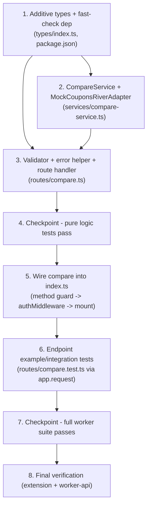

# Implementation Plan: CouponsRiver Compare API Foundation (Spec 04)

## Overview

This plan implements the **Worker-only** `POST /v1/compare` endpoint defined in `requirements.md` and `design.md`. Work proceeds in dependency order matching the design's Module/File Plan:

1. Additive types + dependency (`worker-api/src/types/index.ts`, `worker-api/package.json`)
2. Replaceable `CompareService` + clearly-marked mock adapter (`worker-api/src/services/compare-service.ts`)
3. Pure validator, safe error helper, and the protected route handler (`worker-api/src/routes/compare.ts`)
4. Wiring into the Hono app (`worker-api/src/index.ts`) — method guard **before** the existing Spec 02 `authMiddleware`
5. Vitest example/integration + `fast-check` property tests (`worker-api/src/routes/compare.test.ts`)
6. Final verification across the Extension and Worker projects

This is **WORKER-ONLY**. No file under `extension/` is created or modified. All twelve correctness properties from the design are mapped to test sub-tasks. Test sub-tasks are marked optional with `*`; core implementation tasks are not optional.

## Hard Constraints (from design Non-Goals — must hold for every task)

- **No Extension changes** — no Extension UI and no Extension client method (Req 11.5 does not apply; nothing consumes compare yet).
- **No change to `GET /v1/status`** — body stays exactly the Spec 01 JSON, including `compare_enabled: false` (Req 11.1, 11.2).
- **No change to Spec 02 `authMiddleware`, token lifecycle, or `/v1/auth/*` and `/v1/admin/*` routing** — `authMiddleware` is reused **unchanged** (Req 6.1, 6.5, 11.3).
- **No change to Spec 03 compliance onboarding** behavior, acknowledgement records, or Extension auth credentials (Req 11.4).
- **No external network calls** (no CouponsRiver API, no scraping, no third-party HTTP) and **no D1/DB access** for compare (Req 8.1, 8.3).
- **No candidate/request mutation**; compare logic is pure and deterministic (Req 8.2, 8.5).
- **No Reddit/AI/automation** — no Reddit scanning/API, no OpenAI/drafting, no subreddit/health/promotional scoring, no posting/voting/messaging/joining/following/form submission (Req 11.7, 11.8).
- **No secret exposure** — no secrets in source and none reachable through any compare response (Req 5.4, 11.6).
- **Additive only** — existing `ErrorCode` values and the existing `ErrorResponse` shape stay valid; existing Spec 01/02/03 error bodies are unaffected (Req 5.3, 5.7, 5.8).

## Task Dependency Graph

## Tasks

- [x] 1. Add compare types and the `fast-check` dev dependency (additive only)
  - [x] 1.1 Add the compare domain types to `worker-api/src/types/index.ts`
    - Add `Candidate` (`merchant: string` required; optional `product?`, `coupon_code?`, `category?` strings).
    - Add `CompareRequest extends Candidate` with optional `max_results?: number`.
    - Add `NormalizedCandidate` (trimmed `merchant: string`; optional trimmed `product?`/`coupon_code?`/`category?`).
    - Add `NormalizedCompareRequest` (`candidate: NormalizedCandidate`, `max_results: number` effective value).
    - Add `Match` (`merchant: string`, optional `coupon_code?: string`, `description: string`, `score: number`, `source: string`).
    - Add `CompareResponse` (`candidate: NormalizedCandidate`, `match_count: number`, `matches: Match[]`).
    - Do NOT modify `StatusResponse` (keep `compare_enabled: false`).
    - _Requirements: 9.1, 9.2, 9.3, 9.4, 9.5, 3.3, 3.4_

  - [x] 1.2 Extend `ErrorCode` and `ErrorResponse` additively in `worker-api/src/types/index.ts`
    - Append `'VALIDATION_ERROR'` to the `ErrorCode` union; do not remove, reorder semantics, or repurpose any existing code.
    - Add optional `error_id?: string` and `timestamp?: string` to `ErrorResponse.error`, leaving `code`, `message`, and `retry_after_seconds?` intact so existing Spec 01/02/03 error bodies remain valid.
    - _Requirements: 5.3, 5.7, 5.8, 9.5_

  - [x] 1.3 Add `fast-check` to `worker-api/package.json` devDependencies
    - Add `"fast-check": "3.23.2"` (matching the Extension's Spec 03 usage) under `devDependencies`; change nothing else in the file.
    - _Requirements: 10.7_

- [x] 2. Implement the replaceable `CompareService` and the mock CouponsRiver adapter
  - [x] 2.1 Create the service interface and in-memory dataset in `worker-api/src/services/compare-service.ts`
    - Define `CompareOptions` (`maxResults: number`, the already-validated effective bound).
    - Define the `CompareService` interface declaring `compare(candidate: NormalizedCandidate, options: CompareOptions): Match[]` (route depends only on this interface).
    - Export `MOCK_SOURCE = 'mock-couponsriver'`.
    - Define the internal `CouponRecord` shape and a `DEFAULT_MOCK_DATASET` of in-memory records (mock only; not part of the public contract).
    - _Requirements: 7.1, 7.2, 7.5, 7.6_

  - [x] 2.2 Implement `MockCouponsRiverAdapter` with pure deterministic matching
    - Add a file-top comment clearly marking the class as a MOCK / PLACEHOLDER to be replaced by a real adapter implementing the same interface.
    - Implement `compare`: case-insensitive required `merchant` match; build brand-new `Match` objects (never mutate the candidate); set `source = MOCK_SOURCE`.
    - Implement pure `scoreRecord` (start from `base_score`; +3 coupon_code match, +2 product substring match, +1 category match — all case-insensitive).
    - Implement pure `compareMatches` total order: descending `score`, then stable tie-break by `merchant` → `coupon_code` (treat `undefined` as `''`) → `description` ascending.
    - Bound the result by `options.maxResults` via `slice`.
    - Export the module-level default instance `export const compareService: CompareService = new MockCouponsRiverAdapter()`.
    - Perform NO `fetch`, NO `DB`/`Env` access, and NO candidate mutation.
    - _Requirements: 3.5, 3.6, 7.3, 7.4, 7.5, 7.6, 8.1, 8.2, 8.3, 8.5_

  - [x]* 2.3 Write property test for match provenance and shape
    - **Property 6: Match Provenance and Shape**
    - Generate matching candidates; assert every returned `Match` has `merchant`/`description` strings, numeric `score`, `source === 'mock-couponsriver'`, and `coupon_code` is a string when present.
    - Tag: `// Feature: couponsriver-compare-api, Property 6: Match provenance and shape`; ≥100 iterations.
    - **Validates: Requirements 3.4, 7.5, 9.4**

  - [x]* 2.4 Write property test for result bound and deterministic ordering
    - **Property 5: Result Bound and Deterministic Ordering**
    - Assert `matches.length <= effective max_results`; scores non-increasing; tie-break order (merchant→coupon_code→description); two evaluations of the same input produce identical ordering.
    - Tag: `// Feature: couponsriver-compare-api, Property 5: Result bound and deterministic ordering`; ≥100 iterations.
    - **Validates: Requirements 3.5, 3.6, 8.2**

  - [x]* 2.5 Write property test for adapter purity and no external IO
    - **Property 7: Adapter Purity and No External IO**
    - Spy global `fetch` and assert it is never called; construct the adapter with no DB binding; deep-freeze/snapshot the candidate and assert it is unchanged after `compare`.
    - Tag: `// Feature: couponsriver-compare-api, Property 7: Adapter purity and no external IO`; ≥100 iterations.
    - **Validates: Requirements 8.1, 8.3, 8.5**

  - [x]* 2.6 Write property test for adapter determinism
    - **Property 8: Determinism**
    - Invoke the pure adapter twice with the same input/dataset and assert deep-equal results.
    - Tag: `// Feature: couponsriver-compare-api, Property 8: Determinism`; ≥100 iterations.
    - **Validates: Requirements 8.2**

  - [x]* 2.7 Write property test for no-match adapter behavior
    - **Property 3 (adapter layer): No-Match Is Success**
    - Generate merchants absent from the dataset; assert the adapter returns an empty `Match[]` (no throw, no error sentinel). The endpoint-level No_Match assertion is covered in Task 6.5.
    - Tag: `// Feature: couponsriver-compare-api, Property 3: No-match is success (adapter)`; ≥100 iterations.
    - **Validates: Requirements 4.1, 4.2, 4.3**

- [x] 3. Implement the validator, the safe error helper, and the protected route handler
  - [x] 3.1 Implement the pure `validateCompareRequest(raw: unknown)` in `worker-api/src/routes/compare.ts`
    - Return a discriminated union `{ ok: true; request: NormalizedCompareRequest } | { ok: false; message: string }`; no I/O, no throwing on bad input.
    - Reject non-object/array/null bodies; require `merchant` string, non-empty after trim, `<= 128` after trim.
    - Validate optional `product`/`coupon_code`/`category` as strings when present, bounded `256`/`64`/`64` after trim; keep omitted optionals omitted.
    - Validate optional `max_results` as integer in `1..50`; apply `DEFAULT_MAX_RESULTS` when omitted.
    - Trim all string fields (idempotent normalization); ignore unrecognized fields.
    - Use fixed generic, non-sensitive messages per invalid branch.
    - _Requirements: 2.1, 2.3, 2.4, 2.5, 2.6, 2.7, 2.8_

  - [x] 3.2 Implement the `compareError` helper in `worker-api/src/routes/compare.ts`
    - Build the canonical `ErrorResponse` body `{ error: { code, message, error_id, timestamp } }` for `400`/`500` compare errors.
    - Set `error_id = crypto.randomUUID()` (opaque, not secret-derived) and `timestamp = new Date().toISOString()`.
    - Never interpolate exception objects, stack traces, file paths, env values, `INSTALL_TOKEN_PEPPER`/`ADMIN_BOOTSTRAP_SECRET`, DB/SQL text, upstream raw responses, adapter internals, or auth tokens.
    - _Requirements: 5.1, 5.4, 5.5, 5.6, 5.7, 5.8_

  - [x] 3.3 Implement the `POST /compare` handler, the in-sub-app 405 fallback, and export `compareRoute`
    - Create `const compareRoute = new Hono<AppEnv>()`.
    - In `compareRoute.post('/compare', ...)`: parse JSON in a try/catch (non-JSON → `400 VALIDATION_ERROR`); call `validateCompareRequest` (invalid → `400 VALIDATION_ERROR`, and do NOT invoke the service); call `compareService.compare(candidate, { maxResults })`; assemble `CompareResponse` with `match_count === matches.length`; wrap the handler body in a defensive try/catch returning `500 INTERNAL_ERROR` with a generic message.
    - The handler MAY read `c.get('installId')` but MUST NOT change how it is set, and MUST NOT echo it in the response.
    - Add `compareRoute.all('/compare', ...)` returning `405 METHOD_NOT_ALLOWED` (plain shape) as a self-contained fallback for isolated mounting/testing.
    - _Requirements: 1.1, 1.2, 2.2, 2.9, 3.1, 3.2, 4.1, 4.4, 5.2, 6.6, 8.4_

  - [x]* 3.4 Write property test for validation soundness and completeness
    - **Property 1: Validation Soundness and Completeness**
    - Generate valid requests and each class of invalid request (non-object, missing/empty/whitespace `merchant`, non-string field, over-length field, bad `max_results`); assert `validateCompareRequest` returns `ok` iff valid; assert a counting stub `CompareService` is NOT invoked on invalid input; assert unrecognized fields do not change the outcome.
    - Tag: `// Feature: couponsriver-compare-api, Property 1: Validation soundness and completeness`; ≥100 iterations.
    - **Validates: Requirements 2.1, 2.2, 2.3, 2.4, 2.5, 2.6, 2.8, 2.9, 5.2**

  - [x]* 3.5 Write property test for normalization idempotence
    - **Property 2: Normalization Idempotence**
    - Generate candidates with surrounding whitespace; assert `normalize(normalize(x)) === normalize(x)` and all string fields are trimmed.
    - Tag: `// Feature: couponsriver-compare-api, Property 2: Normalization idempotence`; ≥100 iterations.
    - **Validates: Requirements 2.7**

  - [x]* 3.6 Write property test that errors never leak internals
    - **Property 9: Errors Never Leak Internals**
    - For any invalid input, assert error body keys are a subset of `{code, message, error_id, timestamp, retry_after_seconds}`, `code` is in the `ErrorCode` union, `message` is non-empty, `error_id` is opaque, and `timestamp` is ISO 8601; assert serialized success and error bodies contain none of the forbidden substrings/secret values, stack markers, or file paths.
    - Tag: `// Feature: couponsriver-compare-api, Property 9: Errors never leak internals`; ≥100 iterations.
    - **Validates: Requirements 5.1, 5.4, 5.6, 5.7, 5.8, 8.4, 11.6**

  - [x]* 3.7 Write property test for the match-count invariant
    - **Property 4: Match Count Invariant**
    - For any valid request, assemble the response (adapter + route assembly) and assert `match_count === matches.length` and `match_count >= 0`.
    - Tag: `// Feature: couponsriver-compare-api, Property 4: Match count invariant`; ≥100 iterations.
    - **Validates: Requirements 3.2, 4.1, 4.4**

- [x] 4. Checkpoint - pure logic and adapter tests pass
  - Ensure all tests pass, ask the user if questions arise.

- [x] 5. Wire the compare endpoint into `worker-api/src/index.ts` (protected)
  - Add `import { compareRoute } from './routes/compare';` (the existing `authMiddleware` import is reused as-is).
  - Register a non-POST method guard `app.on(['GET','PUT','PATCH','DELETE','OPTIONS','HEAD'], '/v1/compare', ...)` returning `405 METHOD_NOT_ALLOWED` **BEFORE** `app.use('/v1/compare', authMiddleware)`, mirroring the existing `/v1/auth/verify` precedent so non-POST is rejected without credentials and POST is not shadowed.
  - Then register `app.use('/v1/compare', authMiddleware);` followed by `app.route('/v1', compareRoute);`.
  - Do NOT change the `statusRoute`, `adminRoute`/`adminAuthMiddleware`, `authRoute`/`authMiddleware` mounts, the `notFound` 404 catch-all, or the `onError` 500 handler.
  - _Requirements: 1.3, 1.4, 1.5, 1.6, 6.1, 6.3, 6.4, 6.5_

- [x] 6. Write the Vitest endpoint example/integration tests in `worker-api/src/routes/compare.test.ts`
  - [x]* 6.1 Add the seeded-env + `hashToken` valid-auth helper
    - Implement `makeTestEnv(tokenHash)` (in-memory D1 double for the exact queries `authMiddleware` uses) and an `authHeaders()` helper that computes `hashToken(RAW_TOKEN, PEPPER)` and supplies `Authorization`/`X-Install-Id`/`X-Timestamp`/`X-Nonce`/`Content-Type`, passing the seeded `env` as the third arg to `app.request`. Reuse `authMiddleware` and `hashToken` unchanged.
    - _Requirements: 6.1, 10.7_

  - [x]* 6.2 Test (a): valid auth + valid body → 200 success
    - With valid Spec 02 auth, POST a valid Compare_Request; assert HTTP 200 and `match_count === matches.length`.
    - **Property 11 / Property 4**
    - **Validates: Requirements 10.1, 6.4, 1.1, 3.2**

  - [x]* 6.3 Test (b): valid auth + missing `merchant` → 400 `VALIDATION_ERROR`
    - With valid Spec 02 auth, POST a body without `merchant`; assert HTTP 400 ErrorResponse with `code` `VALIDATION_ERROR`.
    - **Property 1**
    - **Validates: Requirements 10.2, 2.3, 5.2**

  - [x]* 6.4 Test (c): valid auth + non-JSON body → 400 `VALIDATION_ERROR`
    - With valid Spec 02 auth, POST a malformed (non-JSON) body; assert HTTP 400 ErrorResponse with `code` `VALIDATION_ERROR` and that the service is not invoked.
    - **Property 1**
    - **Validates: Requirements 10.3, 2.2, 2.9, 5.2**

  - [x]* 6.5 Test (d): valid auth + no-match request → 200 empty result
    - With valid Spec 02 auth, POST a valid request whose merchant matches nothing; assert HTTP 200, `match_count` `0`, empty `matches`, and no error body / no 404.
    - **Property 3**
    - **Validates: Requirements 10.4, 4.1, 4.2, 4.4**

  - [x]* 6.6 Test (e): non-POST method → 405 WITHOUT auth headers
    - Send GET (and/or other non-POST) to `/v1/compare` with no auth headers; assert HTTP 405 ErrorResponse with `code` `METHOD_NOT_ALLOWED`, proving the guard precedes authentication.
    - **Property 10**
    - **Validates: Requirements 10.5, 1.3, 1.6**

  - [x]* 6.7 Test (f): missing `Authorization` → authMiddleware error, service NOT invoked
    - POST an otherwise-valid body with the `Authorization` header omitted; assert the existing `authMiddleware` error (e.g. `MISSING_AUTH_HEADERS`) and assert (via a counting stub `CompareService`) that the service is NOT invoked and the body is not validated.
    - **Property 11**
    - **Validates: Requirements 10.6, 6.2, 6.3**

  - [x]* 6.8 Test (g): `GET /v1/status` unchanged
    - After compare is mounted and protected, GET `/v1/status`; assert HTTP 200 with the exact Spec 01 body including `compare_enabled: false`.
    - **Property 12**
    - **Validates: Requirements 11.1, 11.2**

  - [x]* 6.9 Test: endpoint determinism with valid auth
    - With valid Spec 02 auth, send two identical valid requests; assert the two `CompareResponse` bodies are deep-equal.
    - **Property 8**
    - **Validates: Requirements 8.2**

- [x] 7. Checkpoint - full Worker suite passes
  - Ensure all tests pass, ask the user if questions arise.

- [x] 8. Final verification across Extension and Worker projects
  - Run `cd /projects/sandbox/reddit_Agent/extension && npm run typecheck && npm run test && npm run build`.
  - Run `cd /projects/sandbox/reddit_Agent/worker-api && npm install && npm run typecheck && npm run test && npm run build`.
  - Confirm: the new compare tests pass; all Spec 01/02 worker tests still pass; Spec 03 extension tests still pass; `GET /v1/status` body is unchanged (incl. `compare_enabled: false`); `authMiddleware`/token lifecycle are unchanged; localhost (`http://localhost:8787`/`http://127.0.0.1`) acceptance and the manifest/icons `copy-static` build step are preserved; and no Reddit/AI/automation was added.
  - _Requirements: 9.5, 11.1, 11.2, 11.3, 11.4, 11.6, 11.7, 11.8, 11.9_

## Notes

- Sub-tasks marked with `*` are optional test tasks and can be skipped for a faster MVP; core implementation sub-tasks and top-level tasks are never optional.
- Every property in the design (Properties 1–12) is mapped: P1 (3.4, 6.3, 6.4), P2 (3.5), P3 (2.7, 6.5), P4 (3.7, 6.2), P5 (2.4), P6 (2.3), P7 (2.5), P8 (2.6, 6.9), P9 (3.6), P10 (6.6), P11 (6.2, 6.7), P12 (6.8).
- Property tests use `fast-check` (≥100 iterations) against the pure `validateCompareRequest` and a directly-constructed `MockCouponsRiverAdapter` (auth-free); endpoint behaviors use `app.request(...)` against the default-exported Hono app.
- All work is Worker-only on branch `spec-04-couponsriver-compare-api`; no `extension/` files are touched.
