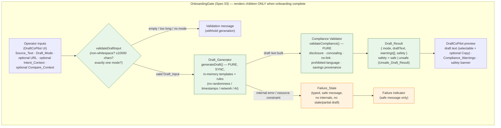

# Design Document — Spec 06: Draft Co-Pilot (Local, Deterministic, Extension-UI-Only)

## 1. Overview

The Draft_Co_Pilot is a **local, deterministic, Extension-UI-only** feature inside the existing
Chrome Manifest V3 popup. The Operator manually supplies context — pasted Reddit Source_Text, an
optional Spec 05 Intent_Context, an optional Spec 04 Compare_Context, an optional Operator-supplied
CouponsRiver URL, and a selected Draft_Mode — and the Extension produces one or more **deterministic
local draft suggestions** computed **entirely in-memory** with **no network call** and **no AI
provider**. The Operator reviews, edits, and manually posts the result outside the Extension.

For the MVP, draft generation is a **pure, synchronous, deterministic function** in the extension
(`generateDraft`). There is **no** Web Worker, **no** MV3 background/service-worker drafting path,
and **no** asynchronous drafting in this design. (Requirement 12.4 *permits* a local in-package
Web Worker / MV3 service worker for deterministic template processing, but the MVP deliberately does
not use one — see Section 13, Future Options.)

The feature is composed of two pure logic modules (`draft-generator`, `draft-compliance`), a small
set of fixed templates, and one React panel (`DraftCoPilot`) rendered inside the existing
`OnboardingGate` as a section distinct from the Spec 05 `IntentScanner`.

This design builds on **Spec 01** (MVP Foundation), **Spec 02** (Worker Auth & `authenticatedFetch`),
**Spec 03** (Compliance Onboarding Gate), **Spec 04** (`POST /v1/compare` Foundation), and **Spec 05**
(Intent Scanner), **reusing all of them without modification**. It addresses Requirements 1–13 of
`requirements.md` and implements Correctness Properties 1–13 (including 4a and 9a).

### Key Design Decisions

| Decision | Rationale |
| --- | --- |
| Draft generation is a **pure synchronous function** `generateDraft(input): DraftResult \| FailureState` | Determinism (Req 3.1–3.5) and PBT are first-class; a synchronous pure function contains no `Date.now`/`Math.random`/network and is directly property-testable. MVP simplicity (steer: prefer synchronous local generation). |
| **No Worker / background drafting path** in the MVP | Req 12.3 forbids any Worker draft endpoint; Req 12.7 forbids Operator-independent background generation. Synchronous in-memory generation is sufficient for popup-scale text (≤10000 chars). |
| Split **generation** (`draft-generator.ts`) from **compliance/safety** (`draft-compliance.ts`) | Generation builds mode templates; the validator independently enforces disclosure, concealing-language, no-link, and prohibited-language rules and marks `Unsafe_Draft_Result`. Pure separation keeps both property-testable. |
| Reuse **Spec 05** (`Classification`, `DetectedCandidate`, `IntentCategory`) and **Spec 04** (`CompareResponse`, `CompareMatch`, `CompareCandidate`) types verbatim for the optional context | Req 1.2, 1.3, 13.4, 13.5 — consume existing shapes without modifying Specs 04/05. |
| Discriminated-union result (`DraftResult \| FailureState`) and `safety: 'safe' \| 'unsafe'` flag | Matches existing conventions (`StatusResult`, `CompareOutcome`, `GateResult`); enables typed failure with no leaked internals (Req 3.6–3.8) and unsafe marking (Req 7.5, 7.6). |
| Render inside `OnboardingGate`, as a section separate from `IntentScanner` | Compliance-first: the panel does not mount or run any logic until Compliance_Onboarding is complete (Req 11). |
| Copy-to-clipboard via `navigator.clipboard.writeText` (no manifest change) | `navigator.clipboard` write needs **no** `clipboardWrite` manifest permission in an extension popup (user-gesture context), so a copy control is included within existing permissions (Req 10.4); selection is always available as a fallback (Req 10.2, 10.5). |

### Non-Goals (Explicitly Out of Scope — restating the boundaries)

The Draft_Co_Pilot **MUST NOT** introduce, imply, or depend on any of the following (Req 12, Non-Goals):

- Any OpenAI, LLM, generative-AI, or other AI-provider call of any kind.
- Any Worker draft endpoint, `/v1/draft` route, or any new Worker route.
- Any network request whatsoever as part of draft generation (zero network in drafting).
- Any Reddit API access, DOM scraping, content script, crawling, Firecrawl, or IP rotation.
- Any `reddit.com` / `old.reddit.com` host permission, or any manifest permission expansion.
- Any automated Reddit action (posting, commenting, upvoting, downvoting, messaging, joining,
  following, form submission) and any auto-post / auto-submit / one-click-publish control.
- Any `chrome.alarms`, scheduled task, Operator-independent background drafting, or
  `chrome.notifications`.
- Any hidden, obscured, or omitted affiliation disclosure for promotional drafts.
- Any spammy urgency, manipulation, guaranteed-savings (unsupported), impersonation, or
  fabricated-experience language.
- Any draft UI mounted, rendered, or executed before Compliance_Onboarding completion.

## 2. Architecture

The entire flow is local, synchronous, and in-memory. There is no network edge anywhere in the
draft path. The only data source is the Operator-populated UI; everything runs inside `OnboardingGate`.



- **Every** node is local, in-memory, no-network (Req 3.3, 12.11; Property 2). There is no orange
  "network" node anywhere — unlike Spec 05, the Draft_Co_Pilot has **no** optional network branch.
- Nothing inside `GATE` mounts or runs while onboarding is incomplete or in `read_error` (Req 11.2;
  Property — gate behavior in Section 9).

**Module placement** (all within the existing extension; no new directories, no new permissions):

| Module | Location | Kind |
| --- | --- | --- |
| `generateDraft`, `validateDraftInput`, templates | `extension/src/lib/draft-generator.ts` | pure synchronous functions |
| `validateCompliance`, prohibited/concealing tables | `extension/src/lib/draft-compliance.ts` | pure functions |
| Draft Co-Pilot types | `extension/src/types/index.ts` (new "Draft Co-Pilot Types (Spec 06)" section) | shared type additions |
| `DraftCoPilot` | `extension/src/components/DraftCoPilot.tsx` | React panel rendered in `Popup` under `OnboardingGate` |

> All file paths above are **design illustration** of intended placement. This design phase creates
> only `design.md`; no source files are created or modified here.

## 3. Components and Interfaces

TypeScript signatures below are **design illustration**, following the codebase's existing
discriminated-union and categorized-result conventions (e.g. `CompareOutcome`, `GateResult`).

```ts
// extension/src/lib/draft-generator.ts (design illustration)

/** Max Source_Text length (Req 1.7, 1.8). Mirrors Spec 05 MAX_INPUT_LENGTH = 10000. */
export const MAX_SOURCE_LENGTH = 10000;

/** Validate Operator-supplied Source_Text + mode before generation (Req 1.6, 1.7, 1.8, 2.2). */
export function validateDraftInput(input: DraftInput): DraftInputValidation;

/**
 * Pure, synchronous, deterministic draft generation (Req 3.1–3.5, 3.9–3.11).
 * Returns a Draft_Result on success or a typed Failure_State on internal failure
 * (Req 3.6). Performs NO network call, NO AI call, uses NO randomness/timestamps.
 * Never throws: any internal error is mapped to a Failure_State.
 */
export function generateDraft(input: DraftInput): DraftResult | FailureState;

// extension/src/lib/draft-compliance.ts (design illustration)

/**
 * Pure compliance/safety validation over a built draft (Req 7, 8, 9).
 * Computes the Compliance_Warning list and the safety verdict; a Promotional_Draft
 * is `safe` iff it includes a Disclosure AND contains no Concealing_Language (Req 7.4–7.6).
 */
export function validateCompliance(
  mode: DraftMode,
  draftText: string,
  context: DraftInput
): { warnings: ComplianceWarning[]; safety: 'safe' | 'unsafe' };

/** True if text contains any Concealing_Language phrase (Req 7.4). */
export function containsConcealingLanguage(text: string): boolean;

/** True if text contains any Prohibited_Language (Req 8.1, 8.3). */
export function containsProhibitedLanguage(text: string): boolean;

/** Strip any URL / external link from a string (used to enforce No_Link_Authority, Req 4.2). */
export function stripUrls(text: string): string;
```

The `DraftCoPilot` panel holds input and the latest result in local React state, fed **solely** from
its own controls (Req 1.5). It calls `generateDraft` synchronously on the Generate action and renders
the `DraftResult` (or `FailureState`), the `ComplianceWarning` list, and the safety banner. It never
calls `fetch`/`authenticatedFetch`.

## 4. Data Models

A new **"Draft Co-Pilot Types (Spec 06)"** section is added to `extension/src/types/index.ts`. It
**reuses** the existing Spec 05 intent types and Spec 04 compare types for the optional context and
adds the new draft types. (Design illustration — not implemented in this phase.)

```ts
// --- Draft Co-Pilot Types (Spec 06) ---

/** The three Reply_Modes, exactly as enumerated in the Glossary (Req 2.1). */
export type DraftMode = 'no-link-authority' | 'soft-cta-with-disclosure' | 'disclosed-link';

/**
 * Optional Spec 05 intent analysis carried over by the Operator (Req 1.2).
 * Reuses Spec 05 types verbatim — no modification to Spec 05.
 */
export interface IntentContext {
  classification: Classification;          // Spec 05: { category: IntentCategory; confidence }
  candidates: DetectedCandidate[];         // Spec 05: { type: CandidateType; value }
}

/**
 * Optional Spec 04 compare result carried over by the Operator (Req 1.3).
 * Reuses the Spec 04 CompareResponse shape verbatim — no modification to Spec 04.
 */
export type CompareContext = CompareResponse; // { candidate, match_count, matches[] }

/** The full Operator-supplied drafting context (Req 1). */
export interface DraftInput {
  sourceText: string;                      // Source_Text (Req 1.1) — only mandatory field
  mode: DraftMode;                         // selected Draft_Mode (Req 2)
  couponsRiverUrl?: string;                // optional Operator-supplied URL (Req 1.4, 6.2)
  intentContext?: IntentContext;           // optional (Req 1.2, 3.9)
  compareContext?: CompareContext;         // optional (Req 1.3, 3.10)
}

/** Validation outcome before generation (Req 1.6, 1.7, 1.8, 2.2). */
export type DraftInputValidation =
  | { kind: 'valid' }
  | { kind: 'empty' }                      // zero non-whitespace chars (Req 1.6)
  | { kind: 'too_long'; max: 10000 }       // exceeds 10000 chars (Req 1.8)
  | { kind: 'no_mode' };                   // no Draft_Mode selected (Req 2.2)

/** Stable identifiers for each Compliance_Warning (Req 9). */
export type ComplianceWarningId =
  | 'manual_review'          // Req 9.1 — operator must review & edit before posting
  | 'subreddit_rules'        // Req 9.2 — review subreddit rules
  | 'no_automated_action'    // Req 9.3 — extension performs no automated Reddit action
  | 'disclosure_required'    // Req 7.3 / 9.4 — promotional disclosure required
  | 'missing_link'           // Req 6.3 / 9.5 — disclosed-link mode with no supplied URL
  | 'add_link_manually'      // Req 5.4 — operator may add a specific link after review
  | 'unsafe_concealing'      // Req 7.5 — concealing language detected
  | 'unsafe_no_disclosure';  // Req 7.6 — promotional draft missing disclosure

/** A single plain-language warning attached to a Draft_Result (Req 9). */
export interface ComplianceWarning {
  id: ComplianceWarningId;
  message: string;
}

/** Successful generator output (Req 3.1). `safety: 'unsafe'` ⇒ an Unsafe_Draft_Result (Req 7.5, 7.6). */
export interface DraftResult {
  kind: 'draft';
  mode: DraftMode;
  draftText: string;
  warnings: ComplianceWarning[];
  safety: 'safe' | 'unsafe';
}

/**
 * Typed Failure_State (Req 3.6–3.8). Contains a stable code + safe, human-readable
 * message ONLY — never a stack trace, file path, secret, environment value, or any
 * internal implementation detail, and never any draft text.
 */
export interface FailureState {
  kind: 'failure';
  code: 'generation_error' | 'resource_limit';
  message: string; // e.g. "Draft generation failed. Please try again." (safe, fixed strings)
}
```

> **`Unsafe_Draft_Result`** is modeled as a `DraftResult` carrying `safety: 'unsafe'` plus the
> relevant `unsafe_*` warning(s), rather than a separate type — so the UI can still display the text
> for the Operator's awareness while clearly marking it as not ready (Req 7.5, 7.6).

## 5. Deterministic Template Generator (`draft-generator.ts`)

`generateDraft` is a **pure synchronous function** of its `DraftInput` argument with **no hidden
inputs**. It MUST NOT read `Date.now()`, `Date`, `performance.now()`, `Math.random()`,
`crypto.randomUUID()`, `chrome.storage`, or any global mutable state, and MUST NOT call `fetch`,
`authenticatedFetch`, or any AI provider (Req 3.3, 3.4, 3.5; Properties 1, 2).

### 5.1 Generation pipeline (deterministic)

1. **Validate** via `validateDraftInput` (Req 1.6–1.8, 2.2). Invalid input never reaches generation;
   the panel shows the validation message and withholds generation.
2. **Derive deterministic facets** from the validated input using fixed rules only:
   - a short topic summary from `sourceText` (e.g. fixed truncation/first-sentence extraction — no
     randomness),
   - optional intent emphasis from `intentContext.classification.category` (a fixed phrase per
     category) and `candidates` (Req 3.9),
   - optional savings facts strictly from `compareContext.matches` (Req 3.10, 8.2, 8.5).
3. **Select the fixed template** for `input.mode` and fill it deterministically (Section 6).
4. **Insert the Disclosure** for promotional modes (Req 5.1, 6.1, 7.1).
5. **Sanitize**: run `stripUrls` for No_Link_Authority/Soft_CTA, omit any Prohibited_Language and any
   Concealing_Language from generated text (Req 4.2, 4.3, 5.3, 7.4, 8.1–8.4).
6. **Validate compliance** via `validateCompliance` to attach warnings + safety (Section 7).
7. Return `{ kind: 'draft', ... }`, or — if any internal step fails — a `FailureState` (Section 8).

### 5.2 Determinism guarantees

- **No hidden inputs / no randomness / no timestamps** (Req 3.5): every output character is a fixed
  function of the input. Identical valid `DraftInput` ⇒ byte-identical `draftText` and an equal
  `warnings`/`safety` (Property 1). A static test asserts the draft modules reference none of
  `Date`, `Date.now`, `performance.now`, `Math.random`, `crypto`, `fetch`.
- **Deterministic context incorporation** (Req 3.9, 3.10): Intent_Context and Compare_Context are
  folded in by fixed mapping tables (category → phrase; match → "{merchant}: {description}"), never
  by ranking that depends on iteration timing or randomness.
- **Safe fallback** (Req 3.11; Property 9): when neither optional context is present, generation uses
  the `sourceText` + `mode` template path only and still produces a complete, mode-conformant
  `DraftResult` with no error and no missing required content.

## 6. Reply Modes (templates, required/forbidden content, warnings)

Each mode has one fixed template. The table states what each mode **must include**, **must exclude**,
and which `ComplianceWarning`s it emits. Promotional modes are `soft-cta-with-disclosure` and
`disclosed-link` (a `Promotional_Draft`).

| Mode | Template shape | MUST include | MUST exclude | Warnings emitted |
| --- | --- | --- | --- | --- |
| **No_Link_Authority** (`no-link-authority`) | Helpful answer derived from Source_Text + optional non-linked general advice | Non-empty helpful answer (Req 4.1); general advice only when expressible without a link (Req 4.4) | **Any** URL/external link (Req 4.2); **any** CouponsRiver promotion/CTA (Req 4.3); advice requiring a URL is omitted or rewritten as non-linked guidance (Req 4.5) | `manual_review`, `subreddit_rules`, `no_automated_action` (Req 9.1–9.3) |
| **Soft_CTA_With_Disclosure** (`soft-cta-with-disclosure`) | Helpful answer + affiliation Disclosure + general "you might check CouponsRiver" suggestion | Affiliation Disclosure (Req 5.1); general CouponsRiver suggestion (Req 5.2) | **Any** direct coupon link / URL (Req 5.3) | `manual_review`, `subreddit_rules`, `no_automated_action`, `disclosure_required` (Req 7.3/9.4), `add_link_manually` (Req 5.4) |
| **Disclosed_Link** (`disclosed-link`) | Helpful answer + affiliation Disclosure + the Operator-supplied URL (if any) | Affiliation Disclosure (Req 6.1); the Operator-supplied URL **only** when provided (Req 6.2) | Any **generated/invented** CouponsRiver URL — only the Operator URL may appear (Req 6.4); no URL at all when none supplied (Req 6.3) | `manual_review`, `subreddit_rules`, `no_automated_action`, `disclosure_required`; **plus** `missing_link` when no URL supplied (Req 6.3/9.5) |

**Disclosure** is a fixed plain-language statement (e.g. "Full disclosure: I'm affiliated with
CouponsRiver."). The No_Link_Authority no-URL guarantee takes priority over advice: `stripUrls`
removes any URL that would otherwise appear, so advice is included only when it survives without a
link (Req 4.4, 4.5; Property 3).

## 7. Compliance / Safety Validator (`draft-compliance.ts`)

`validateCompliance` is pure logic over the built draft text + the input context. It computes the
`ComplianceWarning[]` and the `safety` verdict, and underpins the `Unsafe_Draft_Result` marking.

- **Disclosure enforcement (Req 7.1–7.3):** for any `Promotional_Draft`, require an affiliation
  Disclosure and emit `disclosure_required`. A promotional draft missing a Disclosure ⇒
  `safety: 'unsafe'` + `unsafe_no_disclosure` (Req 7.6).
- **Concealing_Language detection (Req 7.4, 7.5):** detect phrases that conceal, obscure, or
  contradict the Disclosure — e.g. *"not affiliated"*, *"I just found this"*, *"randomly came
  across"*, *"no connection to them"*, and *"not sponsored"* in a draft that promotes CouponsRiver.
  The generator never emits these; if any are nonetheless present in a promotional draft, the result
  is `safety: 'unsafe'` + `unsafe_concealing`, **even when a Disclosure is present** (Req 7.5).
  Formally: a `Promotional_Draft` is **safe iff** it includes a Disclosure **AND** contains no
  Concealing_Language (Property 4a).
- **No-link enforcement (Req 4.2, 5.3):** No_Link_Authority and Soft_CTA drafts must contain no URL;
  `stripUrls` + a final URL scan guarantee this. Disclosed_Link may contain only the Operator URL.
- **Missing-link warning (Req 6.3, 9.5):** a Disclosed_Link draft with no Operator URL emits
  `missing_link` and contains no URL.
- **Prohibited_Language avoidance (Req 8):** a fixed table flags spammy urgency, manipulation,
  guaranteed-savings claims **unsupported by Compare_Context**, impersonation, and fabricated
  personal experience. The generator omits such language even when present in `sourceText` (Req 8.4),
  and every factual savings statement is derived **solely** from `compareContext` (Req 8.2, 8.5).
- **Always-on warnings (Req 9.1–9.3):** every displayed `DraftResult` carries `manual_review`,
  `subreddit_rules`, and `no_automated_action`.

## 8. Failure State Handling

`generateDraft` **never throws**: any internal error or resource constraint is caught and mapped to a
typed `FailureState` (Req 3.6). The `FailureState.message` is drawn from a small set of fixed, safe
strings and contains **no** stack trace, file path, secret, environment value, or internal
implementation detail (Req 3.7). 

UI behavior on failure (Req 3.8): the `DraftCoPilot` clears any previously displayed draft when a new
generation begins and, on failure, renders only the safe failure indicator — it shows **no stale and
no partial draft text** from a prior or in-progress run. Determinism applies to **successful**
generation only; failures legitimately return a `FailureState` instead of a draft.

| Condition | Handling | Requirement |
| --- | --- | --- |
| Empty / whitespace-only Source_Text | `validateDraftInput` → `{ kind: 'empty' }`; inline message; withhold generation | Req 1.6 |
| Source_Text > 10000 chars | `{ kind: 'too_long', max: 10000 }`; max-length message; withhold | Req 1.8 |
| No Draft_Mode selected | `{ kind: 'no_mode' }`; prompt to select a mode; withhold | Req 2.2 |
| Internal generation error / resource constraint | catch → `FailureState`; safe message only; clear prior draft | Req 3.6, 3.7, 3.8 |
| Promotional draft missing disclosure | `DraftResult` with `safety: 'unsafe'` + `unsafe_no_disclosure` | Req 7.6 |
| Promotional draft with concealing language | `DraftResult` with `safety: 'unsafe'` + `unsafe_concealing` | Req 7.5 |
| Onboarding incomplete / `read_error` | `OnboardingGate` renders Onboarding/error UI; `DraftCoPilot` not mounted | Req 11.2 |

## 9. Draft Co-Pilot UI Component (`DraftCoPilot.tsx`)

The panel lives inside the existing popup (`w-80`, Tailwind), within `OnboardingGate`, as a section
**distinct** from `IntentScanner` (Req 11.1, 11.4). It holds input and the latest result in local
React state fed solely from its own controls (Req 1.5).

- **Inputs (Req 1):**
  - a multi-line `<textarea>` for **Source_Text**, max 10000 chars, with a live character counter
    (Req 1.1, 1.7);
  - an optional **CouponsRiver URL** field (Req 1.4);
  - optional **Intent_Context** and **Compare_Context** inputs (the Operator pastes/loads the Spec 05
    / Spec 04 result shapes), validated structurally before use (Req 1.2, 1.3);
  - a **Draft_Mode selector** offering exactly the three Reply_Modes, with the current selection
    displayed (Req 2.1, 2.4).
- **Generate action (Req 2.3, 3.1):** on click, clears any prior result, then calls `generateDraft`
  **synchronously**.
- **Validation states (Req 1.6, 1.8, 2.2):** empty/whitespace → "Enter the Reddit context to draft
  from."; over limit → "Source text exceeds the 10,000-character maximum. Please shorten it."; no mode
  → "Select a reply mode."; result withheld in all three.
- **Draft preview (Req 10.1, 10.2):** the generated `draftText` shown in a **selectable** control
  (read-only `<textarea>`/region) so the Operator can manually select and copy it.
- **Copy-to-clipboard (Req 10.4, 10.5):** a **Copy** button using `navigator.clipboard.writeText`,
  which requires **no** additional manifest permission in the popup's user-gesture context. Because no
  new permission is required, a copy control **is included**; manual selection remains available as a
  fallback. (If a future browser made this require a new permission, the control would be removed and
  selection-only used — Req 10.5.)
- **Compliance warnings + safety (Req 9, 7.5, 7.6):** the `ComplianceWarning` list is always shown
  with a result; an `Unsafe_Draft_Result` shows a prominent "not ready — needs fixing" banner.
- **No posting controls (Req 10.3, 12.8, 12.9):** the panel renders **no** post/submit/comment/
  publish/auto-post button of any kind.
- **Failure (Req 3.8):** renders a safe failure indicator and no draft text.
- **Accessibility:** validation and failure messages use `role="alert"`/`aria-live`, consistent with
  `OnboardingGate`, `ConnectionBadge`, and `IntentScanner`.

### Popup integration & gate behavior (Req 11)

`DraftCoPilot` is added to `Popup.tsx` inside the existing `<OnboardingGate>`, **below** the existing
`<IntentScanner />`, as a separate section. Because `OnboardingGate` renders `children` **only** when
`status === 'complete'` (Spec 03, fail-closed on `read_error`), the Draft_Co_Pilot:

- does **not** mount, render any input/control/preview, or run any draft logic while onboarding is
  incomplete or in `read_error` (Req 11.2);
- mounts and renders its input, controls, and preview only when onboarding is complete (Req 11.3);
- preserves the existing `IntentScanner` and connection-status rendering/behavior unchanged
  (Req 11.5, 13.5).

## 10. Security & Compliance Boundaries

- **No manifest expansion (Req 12.1, 12.6, 13.6; Property 12):** the feature uses only the existing
  `permissions: ["storage"]` and the three existing `host_permissions`
  (`https://*.workers.dev/*`, `http://localhost/*`, `http://127.0.0.1/*`). The existing
  `extension/src/security-boundary.test.ts` is **extended** with a manifest-permission-preservation
  assertion that these arrays are byte-for-byte unchanged and `content_scripts` remains undefined.
- **No network / no AI in drafting (Req 3.3, 3.4, 12.10, 12.11; Property 2):** `generateDraft` and
  `validateCompliance` never call `fetch`/`authenticatedFetch` or any AI provider. A property test
  spies on `globalThis.fetch` and asserts **0** calls across random inputs.
- **No Worker draft endpoint / no `/v1/draft` (Req 12.3):** the worker-api is **not modified**; a
  static check asserts no `/v1/draft` (or any new route) is referenced by Spec 06 source and that the
  worker route set is unchanged.
- **No MVP worker/background drafting (Req 12.4, 12.7):** the MVP uses synchronous in-extension
  generation only. The forbidden-scope token set is extended (e.g. `/v1/draft`, `openai`, `llm`,
  `chrome.alarms`, `chrome.notifications`, `content_scripts`, `reddit.com`, `firecrawl`, `scraping`)
  and asserted absent from Spec 06 source and the manifest, following the Spec 05 pattern.
- **No automated discovery / Reddit actions (Req 12.2, 12.5, 12.8, 12.9; Properties 10, 11):** the
  only data source is Operator-typed input; there are no posting/submit controls and no automated
  Reddit action anywhere.

## 11. Correctness Properties

*A property is a characteristic or behavior that should hold true across all valid executions of a
system — essentially, a formal statement about what the system should do. Properties serve as the
bridge between human-readable specifications and machine-verifiable correctness guarantees.*

These properties are derived from the prework classification of every acceptance criterion and are
identical to those approved in `requirements.md`. Universal (`for any`) statements below are
implemented as property-based tests (≥100 iterations); scope/manifest/regression properties are
static smoke or integration checks (see Section 12).

### Property 1: Successful Draft Generation Determinism

*For any* valid Draft_Input, when draft generation succeeds, the Draft_Generator SHALL produce an
identical Draft_Result on every invocation, computed using only local, in-memory templates and rules
with no randomness and no timestamps.

**Validates: Requirements 3.1, 3.2, 3.3, 3.4, 3.5**

### Property 2: No Network and No AI in Draft Generation

*For any* draft generation, the Draft_Generator SHALL perform zero network requests and SHALL invoke
no OpenAI service, no LLM, and no other AI provider.

**Validates: Requirements 3.3, 3.4, 12.10, 12.11**

### Property 3: No-Link Authority Excludes Promotion

*For any* No_Link_Authority Draft_Result, the draft text SHALL contain no CouponsRiver URL and no
CouponsRiver promotion or call to action.

**Validates: Requirements 4.2, 4.3**

### Property 4: Promotional Drafts Always Disclose

*For any* Promotional_Draft produced under Soft_CTA_With_Disclosure or Disclosed_Link, the draft text
SHALL include an affiliation Disclosure, and no Promotional_Draft SHALL omit that Disclosure.

**Validates: Requirements 5.1, 6.1, 7.1, 7.2, 7.3**

### Property 4a: Concealing Language Makes a Promotional Draft Unsafe

*For any* Promotional_Draft, the Draft_Co_Pilot SHALL treat the Draft_Result as safe if and only if it
includes an affiliation Disclosure AND contains no Concealing_Language; a Promotional_Draft that
contains Concealing_Language SHALL be marked unsafe and warned even when a Disclosure is present, and a
Promotional_Draft that omits a Disclosure SHALL be marked unsafe and warned.

**Validates: Requirements 7.4, 7.5, 7.6**

### Property 5: Disclosed Link URL Provenance

*For any* Disclosed_Link Draft_Result, the draft SHALL include a CouponsRiver URL if and only if the
Operator supplied one; when the Operator supplies no URL, the draft SHALL contain no CouponsRiver URL
and the Draft_Co_Pilot SHALL display the missing-link Compliance_Warning, and the Draft_Generator SHALL
never generate a CouponsRiver URL on its own.

**Validates: Requirements 6.2, 6.3, 6.4, 9.5**

### Property 6: Soft CTA Excludes Direct Links

*For any* Soft_CTA_With_Disclosure Draft_Result, the draft text SHALL include a general CouponsRiver
suggestion and an affiliation Disclosure and SHALL contain no direct coupon link.

**Validates: Requirements 5.2, 5.3**

### Property 7: Prohibited Language Is Never Produced

*For any* Draft_Result, the draft text SHALL contain no spammy urgency language, no manipulation
language, no impersonation language, and no fabricated personal-experience language, and SHALL contain
no guaranteed-savings claim unless the Compare_Context explicitly supports that claim.

**Validates: Requirements 8.1, 8.2, 8.3, 8.4, 8.5**

### Property 8: Compliance Warnings Always Present

*For any* displayed Draft_Result, the Draft_Co_Pilot SHALL display the manual-review warning, the
subreddit-rules reminder, and the no-automated-action warning; additionally, every Promotional_Draft
SHALL display the disclosure-required warning, and every Disclosed_Link Draft_Result lacking an
Operator-supplied URL SHALL display the missing-link warning.

**Validates: Requirements 9.1, 9.2, 9.3, 9.4, 9.5**

### Property 9: Safe Fallback Without Optional Context

*For any* Draft_Input that contains no Intent_Context and no Compare_Context, the Draft_Generator SHALL
produce a valid Draft_Result derived from the Source_Text and the selected Draft_Mode alone, with no
error and no missing required content for that mode.

**Validates: Requirements 3.9, 3.10, 3.11**

### Property 9a: Safe Failure State

*For any* draft generation that fails due to an internal error or a resource constraint, the
Draft_Generator SHALL return a typed Failure_State containing no draft text, and the Draft_Co_Pilot
SHALL display no stack trace, file path, secret, environment value, internal implementation detail, and
no stale or partial draft text.

**Validates: Requirements 3.6, 3.7, 3.8**

### Property 10: No Posting Controls

*For any* execution, the Draft_Co_Pilot SHALL provide no control that posts, comments, submits,
upvotes, downvotes, or otherwise publishes content to Reddit or any platform, and SHALL provide no
auto-post, auto-submit, auto-comment, or one-click-publish control.

**Validates: Requirements 10.3, 12.8, 12.9**

### Property 11: Manual-Input-Only Scope

*For any* execution, the Draft_Co_Pilot SHALL obtain drafting context only from Operator-supplied input
and SHALL perform no automated discovery, no Reddit API access, no DOM scraping, no content-script
execution, no crawling, no Operator-independent background generation, no notification, and no
AI-provider call.

**Validates: Requirements 1.5, 12.2, 12.4, 12.5, 12.7, 12.10**

### Property 12: Permission Containment

*For any* execution, the Draft_Co_Pilot SHALL operate within the Extension's existing manifest
permissions and SHALL request no additional manifest permission and no additional host permission,
leaving `permissions` and `host_permissions` byte-for-byte unchanged.

**Validates: Requirements 10.5, 12.1, 12.6, 13.6**

### Property 13: Preserved Specs 01–05 Behavior

*For any* sequence of Draft_Co_Pilot operations, the Spec 01 status behavior, the Spec 02
authentication, the Spec 03 onboarding gate, the Spec 04 compare endpoint and contract, and the Spec 05
Intent_Scanner behavior SHALL remain unchanged, and the existing Spec 01 through Spec 05 test suites
SHALL be executed and SHALL continue to pass.

**Validates: Requirements 13.1, 13.2, 13.3, 13.4, 13.5, 13.7, 13.8**

## 12. Testing Strategy

A **dual approach**: property-based tests for the pure logic (generation determinism, no-network,
disclosure, no-link, prohibited/concealing language, fallback, failure) plus example/component/smoke
tests for UI, gate wiring, manifest preservation, and Specs 01–05 regression.

PBT **is** appropriate here: `generateDraft`, `validateCompliance`, and their helpers are pure
functions with universal properties over a large input space (arbitrary Source_Text, modes, URLs,
intent/compare contexts). PBT is **not** appropriate for UI rendering (use RTL example tests), gate
mounting (component tests), or manifest/scope guarantees (static smoke tests).

**Tooling & conventions:**

- Test runner: existing **Vitest** + **React Testing Library** (as used across the extension).
- Property library: **fast-check `3.23.2`** (already used in `worker-api`; added to the extension's
  dev tooling) — PBT is not implemented from scratch.
- Each property test runs a **minimum of 100 iterations** (`{ numRuns: 100 }` or more).
- Each property test is tagged: `// Feature: draft-co-pilot, Property {n}: {property text}`.
- No-network properties spy on `globalThis.fetch` and assert it is never reached.

**Planned test files (design illustration):**

- `extension/src/lib/draft-generator.test.ts` — Properties 1, 2, 3, 5, 6, 7, 9, 9a (+ unit: validation
  edge cases at 0/1/10000/10001 chars, empty-vs-whitespace, no-mode).
- `extension/src/lib/draft-compliance.test.ts` — Properties 4, 4a, 7, 8 (+ unit: each Concealing_Language
  example phrase; promo-with-disclosure-only passes; promo+concealing rejected; promo-without-disclosure
  rejected).
- `extension/src/components/DraftCoPilot.test.tsx` — example/component tests for Req 1.x inputs, 2.x mode
  selector, 9.x warnings display, 10.1/10.2/10.4 preview+copy, 10.3 no posting controls, 3.8 no
  stale/partial draft on failure, and gate behavior (Req 11.2 incomplete + `read_error` do not render
  and `generateDraft` is not invoked; Req 11.3 complete renders).
- `extension/src/popup/Popup.test.tsx` (extend) — Draft_Co_Pilot renders as a section distinct from
  `IntentScanner` and preserves its behavior (Req 11.4, 11.5).
- `extension/src/security-boundary.test.ts` (extend) — manifest-permission-preservation (Property 12)
  and Spec 06 forbidden-scope tokens incl. `/v1/draft`, `openai`, `llm` (Properties 10, 11).

### Correctness Properties → Test Mapping

The 13 Correctness Properties (incl. 4a, 9a) are defined verbatim in Section 11. Each maps to concrete
tests:

| Property | Validates (Req) | Classification | Planned test(s) |
| --- | --- | --- | --- |
| **P1 — Successful Draft Determinism** | 3.1–3.5 | PROPERTY | `draft-generator.test.ts`: for any valid `DraftInput`, `generateDraft(x)` deep-equals `generateDraft(x)`; static no-`Date`/`Math.random` check (≥100) |
| **P2 — No Network & No AI** | 3.3, 3.4, 12.10, 12.11 | PROPERTY | `draft-generator.test.ts`/`draft-compliance.test.ts`: fetch spy = 0 across random inputs (≥100) |
| **P3 — No-Link Authority Excludes Promotion** | 4.2, 4.3 | PROPERTY | `draft-generator.test.ts`: for any input in no-link mode, draft has no URL and no CouponsRiver CTA (≥100) |
| **P4 — Promotional Drafts Always Disclose** | 5.1, 6.1, 7.1, 7.2, 7.3 | PROPERTY | `draft-compliance.test.ts`: for any promo-mode input, Disclosure present; none omits it (≥100) |
| **P4a — Concealing Language ⇒ Unsafe** | 7.4, 7.5, 7.6 | PROPERTY | `draft-compliance.test.ts`: promo safe iff Disclosure ∧ no Concealing_Language; concealing (even w/ disclosure) ⇒ unsafe; missing disclosure ⇒ unsafe (≥100 + per-phrase unit) |
| **P5 — Disclosed Link URL Provenance** | 6.2, 6.3, 6.4, 9.5 | PROPERTY | `draft-generator.test.ts`: URL in draft iff Operator supplied one; else no URL + `missing_link`; generator never invents a URL (≥100) |
| **P6 — Soft CTA Excludes Direct Links** | 5.2, 5.3 | PROPERTY | `draft-generator.test.ts`: soft-cta draft has general suggestion + Disclosure + no URL (≥100) |
| **P7 — Prohibited Language Never Produced** | 8.1–8.5 | PROPERTY | `draft-generator.test.ts`: inject prohibited phrases in Source_Text; assert absent; no unsupported guaranteed-savings (≥100) |
| **P8 — Compliance Warnings Always Present** | 9.1–9.5 | PROPERTY | `draft-compliance.test.ts`: every result has manual-review/subreddit/no-automated; promo ⇒ disclosure-required; disclosed-link w/o URL ⇒ missing-link (≥100) |
| **P9 — Safe Fallback Without Optional Context** | 3.9, 3.10, 3.11 | PROPERTY | `draft-generator.test.ts`: for any valid Source_Text + mode w/o optional context, success + mode-conformant result (≥100) |
| **P9a — Safe Failure State** | 3.6, 3.7, 3.8 | PROPERTY | `draft-generator.test.ts`: inject failing dependency ⇒ typed `FailureState`, no draft text, no forbidden internal patterns; `DraftCoPilot.test.tsx`: no stale/partial draft (≥100 + component) |
| **P10 — No Posting Controls** | 10.3, 12.8, 12.9 | SMOKE | `DraftCoPilot.test.tsx` + `security-boundary.test.ts`: no post/submit/publish/auto-post control or token |
| **P11 — Manual-Input-Only Scope** | 1.5, 12.2, 12.4, 12.5, 12.7, 12.10 | SMOKE | `security-boundary.test.ts`: Spec 06 source/manifest contain none of the forbidden scope tokens; only Operator input is read |
| **P12 — Permission Containment** | 10.5, 12.1, 12.6, 13.6 | SMOKE | `security-boundary.test.ts`: `permissions === ['storage']` and `host_permissions` equals the three approved entries (unchanged) |
| **P13 — Preserved Specs 01–05 Behavior** | 13.1–13.5, 13.7, 13.8 | INTEGRATION | Run existing extension + worker-api suites unchanged; assert pass (Section 13 validation) |

**Unit-test balance:** property tests cover the broad input space; example/component tests cover
specific UI renders, the gate mount/unmount behavior, the copy control, and each Concealing_Language
phrase. Avoid redundant per-keyword unit tests where a property already generalizes the behavior.

## 13. Validation Commands (Requirement 13)

Per Requirement 13.7–13.11, Spec 06 validation MUST be **executed** (not merely deemed passable) and
MUST pass, ensuring no regression of Specs 01–05. During the implementation phase the following will
be run, and a validation report will state the final Extension and Worker_API **test counts** and the
**build results**:

```bash
cd extension && npm run typecheck && npm run test && npm run build
cd ../worker-api && npm run typecheck && npm run test && npm run build
```

- Existing extension tests must be executed and pass; the extension build must pass (Req 13.7, 13.9).
- Existing worker-api tests must be executed and pass; the worker-api build must pass (Req 13.8, 13.10).
- The manifest `permissions`/`host_permissions` remain byte-for-byte unchanged (Req 13.6).
- The validation report records final test counts and build outcomes (Req 13.11).

> **Note:** Long-running watch modes must not be used; tests run once (e.g. `npm run test` configured
> for a single run). These commands are executed during implementation, not during this design phase.

## 14. Future Options (Non-MVP)

Requirement 12.4 permits a **local, in-package** Web Worker or the existing MV3 service worker to be
used **solely** for local deterministic template processing **if** popup responsiveness ever becomes a
problem with very large Source_Text. This is explicitly **out of scope for the MVP** and is recorded
here only as a future option. Any such mechanism would have to: make **no** network call, access
**no** Reddit, perform **no** automated Reddit action, require **no** new host permission, add **no**
content script, stay inside the extension package, and **preserve deterministic output** for
successful generation. The MVP deliberately uses simple synchronous local generation instead.
