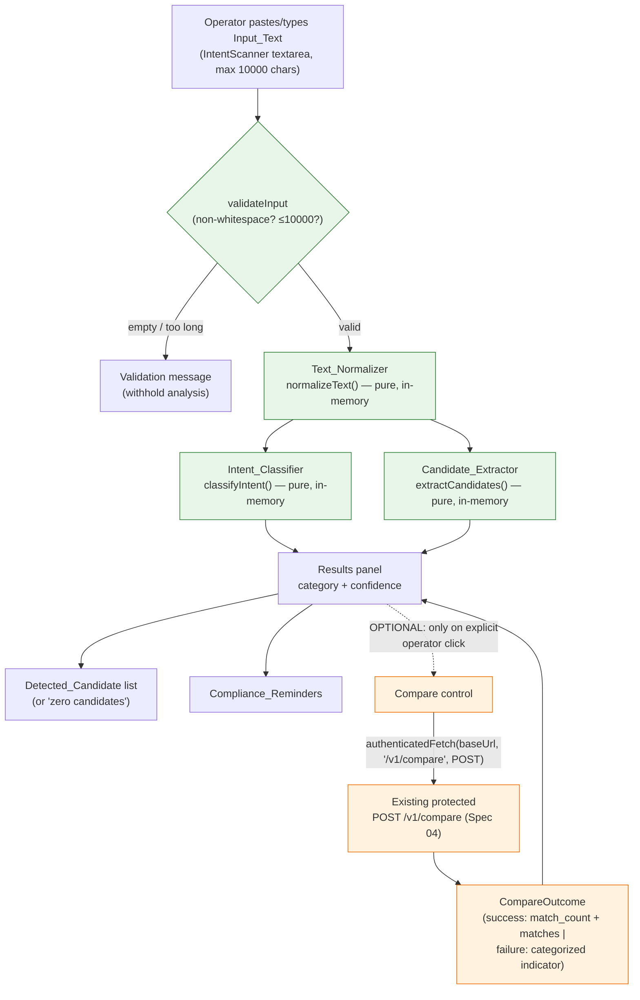

# Design Document — Spec 05: Intent Scanner (Manual Input Only)

## 1. Overview

The Intent_Scanner is a **local, deterministic, Extension-UI-only** feature inside the existing
Chrome Manifest V3 popup. The Operator manually pastes or types Reddit post/thread text into a panel;
the Extension analyzes that text **entirely in-memory** with **no network calls** and displays:

- the assigned **Intent_Category** and a **Confidence_Value** in `[0.0, 1.0]`,
- a stable, deduplicated list of **Detected_Candidate** signals,
- an **optional** Compare_Outcome — produced only when the Operator explicitly triggers a single
  lookup against the **existing** protected `POST /v1/compare` endpoint via the **existing**
  `authenticatedFetch` client, and
- the **Compliance_Reminders**.

The feature is composed of three pure functions (`normalizeText`, `classifyIntent`, `extractCandidates`)
and one React panel (`IntentScanner`) rendered inside the existing `OnboardingGate`. It adds **no**
manifest permission, **no** new endpoint, **no** new credential store, and performs **no** automated
discovery of any kind.

This design builds on Spec 01 (MVP Foundation), Spec 02 (Worker Auth & `authenticatedFetch`),
Spec 03 (Compliance Onboarding Gate), and Spec 04 (`/v1/compare` Foundation), reusing all of them
without modification. It addresses Requirements 1–8 of `requirements.md`.

### Key Design Decisions

| Decision | Rationale |
| --- | --- |
| Three **pure** functions in `extension/src/lib/` for normalize/classify/extract | Determinism + idempotence are first-class requirements (Req 2, 3, 4); pure functions are directly property-testable and contain no `Date.now`/`Math.random`/network. |
| Reuse `authenticatedFetch(baseUrl, path, options)` verbatim for Compare | Req 5.3, 5.4 forbid a new endpoint/credential store/permission; the existing client already attaches `Authorization`, `X-Install-Id`, `X-Timestamp`, `X-Nonce`. |
| Discriminated-union result types (`AnalyzeResult`, `CompareOutcome`) | Matches existing conventions (`StatusResult`, `VerifyAuthResult`, `GateResult`) and categorized `ApiError`. |
| Render inside `OnboardingGate` | Compliance-first: analysis UI stays unavailable until Compliance_Onboarding completes (Spec 03), consistent with `Popup.tsx`. |
| Compare failure preserves local results | Req 5.6 — local analysis is the primary value; the network lookup is strictly additive. |

## 2. Scope & Non-Goals

### In Scope

- **Text_Normalizer** — pure, deterministic, idempotent normalization of Input_Text (Req 2).
- **Intent_Classifier** — pure, deterministic classification to exactly one Intent_Category +
  Confidence_Value (Req 3).
- **Candidate_Extractor** — pure, deterministic, stable-ordered, deduplicated Detected_Candidate
  list (Req 4).
- **Compare integration** — optional, operator-triggered, single `POST /v1/compare` call reusing
  `authenticatedFetch` (Req 5).
- **IntentScanner UI panel** — manual input, result display, candidate list, optional compare
  result, compliance reminders, empty + validation states (Req 1, 6, 7).
- **Tests** — unit + property-based tests for the three pure modules, UI tests, and a
  **manifest-permission-preservation** test (Req 8).

### Non-Goals (explicitly excluded — restating the corrected Spec 05 boundaries)

The Intent_Scanner **MUST NOT** introduce, imply, or depend on any of the following (Req 8.2–8.11):

- any Worker `/v1/scan` endpoint or any scan endpoint;
- any Reddit API access;
- any RSS feed or RSS fallback;
- `chrome.alarms` or any scheduled / background scanning;
- `chrome.notifications` or notifications of any kind;
- any background scanner or background discovery process;
- any content script;
- any `reddit.com` / `old.reddit.com` host permission;
- **any manifest permission expansion** — the feature works strictly within the existing
  `permissions: ["storage"]` and `host_permissions: ["https://*.workers.dev/*", "http://localhost/*", "http://127.0.0.1/*"]`;
- any scraping, crawling, Firecrawl, or IP rotation;
- any automated Reddit action (posting, voting, messaging, following, form submission);
- any draft generation;
- any OpenAI / LLM / other AI-provider call.

**Manifest preservation is a tested invariant** (Section 10, Property 10): `manifest.json`
`permissions` and `host_permissions` must remain byte-for-byte equivalent to their current values.

## 3. Architecture

The analysis path is entirely local. The only optional, operator-triggered branch is the Compare
lookup. No background context, alarm, content script, or scheduled task exists.



- **Green** nodes are pure, in-memory, no-network (the default path; Req 2.5, 3.4, 4.6, 5.7).
- **Orange** nodes execute **only** when the Operator clicks the Compare control (Req 5.1, 5.2);
  this is the single permitted network request (Req 5.8, 8.11).

**Module placement** (all within the existing extension; no new directories or permissions):

| Module | Location | Kind |
| --- | --- | --- |
| `normalizeText` | `extension/src/lib/intent-normalizer.ts` | pure function |
| `classifyIntent` | `extension/src/lib/intent-classifier.ts` | pure function |
| `extractCandidates` | `extension/src/lib/intent-extractor.ts` | pure function |
| `runCompareLookup` | `extension/src/lib/intent-compare.ts` | thin wrapper over existing `authenticatedFetch` |
| `IntentScanner` | `extension/src/components/IntentScanner.tsx` | React panel rendered in `Popup` under `OnboardingGate` |
| Intent types | `extension/src/types/index.ts` | shared type additions |

> All file paths above are **design illustration** of intended placement. This design phase creates
> only `design.md`; no source files are created or modified.

## 4. Components and Interfaces

TypeScript signatures below are **design illustration**, not implemented files. They follow the
codebase's existing discriminated-union and categorized-error conventions.

### 4.1 Text_Normalizer (Req 2)

Pure, deterministic, idempotent. No `Date`, no `Math.random`, no network.

```ts
/**
 * Transforms raw Input_Text into Normalized_Text using only local, in-memory ops:
 * lower-cases, collapses each run of whitespace into a single space, trims ends.
 * Deterministic (Req 2.2) and idempotent: normalizeText(normalizeText(x)) === normalizeText(x) (Req 2.3).
 */
export function normalizeText(input: string): string;
```

### 4.2 Input validation (Req 1)

```ts
export type InputValidation =
  | { kind: 'valid'; text: string }
  | { kind: 'empty' }          // zero non-whitespace characters (Req 1.4)
  | { kind: 'too_long'; max: 10000 }; // length > 10000 (Req 1.5)

/** Pure predicate; the UI maps each non-'valid' kind to a specific validation message. */
export function validateInput(input: string): InputValidation;
```

### 4.3 Intent_Classifier (Req 3)

Pure, deterministic. Derives the result **solely** from Normalized_Text.

```ts
export interface Classification {
  category: IntentCategory;     // exactly one enum member (Req 3.1)
  confidence: Confidence;       // 0.0 .. 1.0 inclusive (Req 3.2)
}

/**
 * Assigns exactly one Intent_Category and a Confidence_Value via deterministic
 * keyword/signal scoring over Normalized_Text. When no signal matches, returns
 * { category: 'irrelevant', confidence: 0.0 } (Req 3.5). No network (Req 3.4).
 */
export function classifyIntent(normalized: string): Classification;
```

### 4.4 Candidate_Extractor (Req 4)

Pure, deterministic, stable-ordered, deduplicated.

```ts
/**
 * Produces zero or more Detected_Candidate items from Normalized_Text.
 * - Each item has a `type` from the CandidateType enum and a string `value` (Req 4.2).
 * - Duplicates (equal type AND value) are removed (Req 4.5).
 * - Output is sorted by a stable, documented rule — by `type`, then by `value`
 *   (UTF-16 code-unit order) — so identical input yields an identical, identically
 *   ordered list every time (Req 4.3, 4.4). No network (Req 4.6).
 */
export function extractCandidates(normalized: string): DetectedCandidate[];
```

### 4.5 Local analysis orchestration

```ts
export type AnalyzeResult =
  | { kind: 'invalid'; reason: 'empty' | 'too_long' }
  | {
      kind: 'analyzed';
      normalized: string;
      classification: Classification;
      candidates: DetectedCandidate[];
    };

/** Pure composition: validate -> normalize -> (classify, extract). No network. */
export function analyzeInput(input: string): AnalyzeResult;
```

### 4.6 Compare integration (Req 5) — reuses existing `authenticatedFetch`

The Compare wrapper builds a Spec 04 `CompareRequest` body from the analyzed input and delegates the
network call to the **existing** `authenticatedFetch(baseUrl, path, options)` in
`extension/src/lib/api-client.ts`. It adds **no** new endpoint, credential store, or permission
(Req 5.4). It returns a categorized discriminated union mirroring `ApiError` (Req 5.6).

```ts
/**
 * Operator-triggered ONLY (Req 5.2). Sends POST /v1/compare via the existing
 * Authenticated_API_Client. Reuses its credential + request-signing behavior unchanged (Req 5.3, 5.4).
 */
export async function runCompareLookup(
  baseUrl: string,
  request: CompareRequestBody
): Promise<CompareOutcome>;
```

Reference to the existing client (unchanged):

```ts
// extension/src/lib/api-client.ts (EXISTING — not modified by this spec)
export async function authenticatedFetch(
  baseUrl: string,
  path: string,
  options?: RequestInit
): Promise<Response>;
```

`runCompareLookup` calls `authenticatedFetch(baseUrl, '/v1/compare', { method: 'POST', body: JSON.stringify(request) })`,
then maps the outcome:

- HTTP 200 + valid `CompareResponse` → `{ status: 'success', data }` (Req 5.5);
- thrown error (incl. "No credentials configured" / network) → `{ status: 'failure', error: { type: 'network', ... } }`;
- abort/timeout → `{ status: 'failure', error: { type: 'timeout', ... } }`;
- non-200 → `{ status: 'failure', error: { type: 'server', status, ... } }`;
- unparseable body → `{ status: 'failure', error: { type: 'parse', ... } }` (Req 5.6).

### 4.7 IntentScanner UI panel (Req 1, 6, 7)

```tsx
/**
 * Manual-input analysis panel rendered inside Popup, under the existing OnboardingGate.
 * Holds local React state only; feeds analysis solely from the textarea value (Req 1.6).
 */
export function IntentScanner(): JSX.Element;
```

Rendered inside `Popup.tsx`'s existing `<OnboardingGate>` body, alongside the connection status,
so analysis stays unavailable until Compliance_Onboarding is complete (Spec 03 convention).

## 5. Data Models / Types

Intended additions to `extension/src/types/index.ts` (Spec 05 section). These mirror the Worker's
Spec 04 Compare contract so the request/response data model is accurate.

```ts
// --- Intent Scanner Types (Spec 05) ---

/** Exactly one of these is assigned per classification (Req 3.1). */
export type IntentCategory =
  | 'coupon-seeking'
  | 'deal-seeking'
  | 'product-comparison'
  | 'generic-discussion'
  | 'irrelevant';

/** Confidence in the inclusive range 0.0..1.0 (Req 3.2). Branded for clarity. */
export type Confidence = number; // invariant enforced in code/tests: 0 <= c <= 1

/** Detected signal type (Req 4.2). */
export type CandidateType = 'keyword' | 'tool_mention' | 'merchant_mention' | 'coupon_signal';

/** A single extracted signal (Req 4.2). */
export interface DetectedCandidate {
  type: CandidateType;
  value: string;
}

// --- Compare request/response (mirrors worker-api Spec 04 contract) ---

/** Body POSTed to /v1/compare. merchant is required; others optional. max_results in 1..50. */
export interface CompareRequestBody {
  merchant: string;
  product?: string;
  coupon_code?: string;
  category?: string;
  max_results?: number;
}

/** Echoed normalized candidate in the success response. */
export interface CompareCandidate {
  merchant: string;
  product?: string;
  coupon_code?: string;
  category?: string;
}

/** A single coupon/offer match (worker-api Match shape). */
export interface CompareMatch {
  merchant: string;
  coupon_code?: string;
  description: string;
  score: number;
  source: string; // e.g. 'mock-couponsriver'
}

/** HTTP 200 success body for POST /v1/compare. Invariant: match_count === matches.length. */
export interface CompareResponse {
  candidate: CompareCandidate;
  match_count: number;
  matches: CompareMatch[];
}

/**
 * Result of a Compare_Lookup as observed by the Intent_Scanner. Discriminated union,
 * consistent with StatusResult / VerifyAuthResult. Reuses the existing ApiError categories.
 */
export type CompareOutcome =
  | { status: 'idle' }
  | { status: 'loading' }
  | { status: 'success'; data: CompareResponse }
  | { status: 'failure'; error: ApiError }; // ApiError: 'network' | 'timeout' | 'server' | 'parse'
```

> The Worker error body shape (`{ error: { code, message, error_id?, timestamp? } }`) is mapped down
> to the existing extension-side `ApiError` (`type` + optional `status` + `message`) so the UI can show
> a categorized failure indicator without leaking internals (Req 5.6).

## 6. Determinism Design

Determinism and idempotence are explicit requirements (Req 2.2, 2.3, 3.3, 4.3) and the basis of
Properties 1–5. Each analysis-path module guarantees them as follows:

- **No hidden inputs.** `normalizeText`, `classifyIntent`, and `extractCandidates` take a single
  string argument and depend on nothing else. They MUST NOT read `Date.now()`, `Date`, `performance.now()`,
  `Math.random()`, `crypto.randomUUID()`, `chrome.storage`, or any global mutable state.
- **No network in the analysis path.** None of the three functions (nor `analyzeInput`) calls `fetch`
  or `authenticatedFetch`. The single permitted `fetch` lives behind `runCompareLookup`, invoked only
  by an explicit operator click (Req 5.2, 5.7, 5.8).
- **Normalizer idempotence (Req 2.3).** Because normalization lower-cases, collapses whitespace runs,
  and trims, applying it to already-normalized text is a no-op: `normalizeText(normalizeText(x)) === normalizeText(x)`.
- **Classifier determinism (Req 3.3, 3.6).** Scoring is a pure fold over fixed signal tables; the same
  Normalized_Text always yields the same `{ category, confidence }`. Confidence is computed by a
  deterministic, bounded formula (e.g. clamped ratio) guaranteeing `0 <= confidence <= 1` (Req 3.2).
- **Extractor determinism + ordering (Req 4.3, 4.4).** Candidates are collected, deduplicated by
  `(type, value)`, then sorted by a fixed total order (`type` then `value`, UTF-16 code-unit order),
  so the list is identical and identically ordered on every invocation.
- **Compare echo is observational only.** The Worker's `/v1/compare` is itself deterministic (Spec 04),
  but its result is never fed back into local classification/extraction, so triggering Compare cannot
  change the local analysis result.

This section directly supports Property 1 (normalization determinism/idempotence), Property 2
(classification determinism), Property 5 (extraction determinism/ordering), and Property 7 (no network
on the local path).

## 7. UI/UX

The panel lives inside the existing popup (`w-80`, Tailwind), within `OnboardingGate`.

- **Input control (Req 1.1, 1.2):** a multi-line `<textarea>` accepting up to 10000 characters, with a
  live character counter and an **Analyze** button.
- **Validation states (Req 1.4, 1.5):**
  - empty / whitespace-only → inline message "Enter some text to analyze." and no result shown;
  - over 10000 chars → inline message "Text exceeds the 10,000-character maximum. Please shorten it."
    and analysis withheld until shortened.
- **Result display (Req 6.1, 6.2):** the Intent_Category (human-readable label) and the
  Confidence_Value (e.g. a percentage and/or bar).
- **Candidate list (Req 6.3, 6.4):** each Detected_Candidate rendered as `type: value`; when the list
  is empty, an explicit "No candidates detected" indicator.
- **Compare control + result (Req 5.1, 6.5):** a **Compare with CouponsRiver** button shown after a
  successful local analysis. While loading, a spinner; on success, the match count and each match
  (merchant, description, coupon code, score/source); on failure, a categorized message that does not
  remove the local results.
- **Compliance reminders (Req 6.6, 7):** always rendered alongside results — see Section 9.
- **Empty / initial state:** before any analysis, only the input control and a short helper line are
  shown; no result, candidate, or compare area.

Accessibility: validation and failure messages use `role="alert"`/`aria-live` consistent with the
existing `OnboardingGate` and `ConnectionBadge` patterns.

## 8. Error Handling

| Condition | Handling | Requirement |
| --- | --- | --- |
| Empty / whitespace-only input | `validateInput` → `{ kind: 'empty' }`; show validation message; withhold Intent_Category | Req 1.4 |
| Input > 10000 chars | `validateInput` → `{ kind: 'too_long' }`; show max-length message; withhold analysis | Req 1.5 |
| Compare network error / thrown error (incl. no credentials) | `runCompareLookup` → `{ status: 'failure', error: { type: 'network' } }`; categorized indicator; **local results preserved** | Req 5.6 |
| Compare timeout (abort) | `{ status: 'failure', error: { type: 'timeout' } }`; categorized indicator; local results preserved | Req 5.6 |
| Compare non-200 (e.g. 400/401/429/500) | `{ status: 'failure', error: { type: 'server', status } }`; categorized indicator; local results preserved | Req 5.6 |
| Compare unparseable / unexpected body | `{ status: 'failure', error: { type: 'parse' } }`; categorized indicator; local results preserved | Req 5.6 |
| Onboarding incomplete | `OnboardingGate` renders the Onboarding screen; IntentScanner (and any Compare action) stays unavailable | Spec 03 |

**Invariant (Req 5.6):** a Compare failure never discards the locally computed Intent_Category,
Confidence_Value, or Detected_Candidate list — the network lookup is strictly additive.

Error messages never include secrets or the install token (consistent with `api-client.ts` and the
Worker's safe error shape).

## 9. Security & Compliance Boundaries

- **No manifest expansion (Req 8.1, 8.11; Property 10):** the feature uses only the existing
  `permissions: ["storage"]` and the three existing `host_permissions`. A test asserts these are
  unchanged (Section 10), extending the existing `extension/src/security-boundary.test.ts` approach.
- **No automated discovery / Reddit actions (Req 8.2–8.10; Property 9):** the only data source is the
  Operator-typed textarea (Req 1.6). No `/v1/scan`, Reddit API, RSS, `chrome.alarms`,
  `chrome.notifications`, background scanner, content script, `reddit.com` host, scraping/crawling/
  Firecrawl/IP rotation, automated posting/voting/messaging/following/form submission, draft
  generation, or AI-provider call is added.
- **Network limited to operator-triggered Compare (Req 5.7, 5.8, 8.11; Properties 7, 8):** the single
  permitted `fetch` is the `/v1/compare` call via `authenticatedFetch`, fired only on explicit click.
- **Compliance reminders (Req 7), shown alongside every results view (Req 6.6, 7.5):**
  1. the Extension performs **no automated Reddit action** (Req 7.1);
  2. the Operator is responsible for **reviewing subreddit rules** before posting (Req 7.2);
  3. the Operator is responsible for **disclosing any commercial/affiliate connection** to CouponsRiver (Req 7.3);
  4. the analysis is **advisory**; the Operator manually decides whether and how to participate (Req 7.4).

## 10. Testing Strategy

A **dual approach**: property-based tests for the pure logic + no-network invariant, and example/
integration/smoke tests for UI, wiring, and scope/manifest guarantees. PBT **is** appropriate here
because `normalizeText`, `classifyIntent`, and `extractCandidates` are pure functions with universal
properties over a large input space. PBT is **not** appropriate for UI rendering (use RTL example
tests), Compare wiring (use a mocked `authenticatedFetch`), or manifest/scope guarantees (use static
smoke tests).

**Tooling & conventions:**

- Test runner: existing **Vitest** (+ React Testing Library), as already used across the extension.
- Property library: **fast-check** (already used in `worker-api`), to be added to the extension's
  dev tooling — PBT is not implemented from scratch.
- Each property test runs a **minimum of 100 iterations** (`{ numRuns: 100 }` or more).
- Each property test is tagged: `// Feature: intent-scanner, Property {n}: {property text}`.
- No-network properties spy on `globalThis.fetch` (and assert `authenticatedFetch` is not reached).

**Planned test files (design illustration):**

- `extension/src/lib/intent-normalizer.test.ts` — Properties 1, 7 (+ unit: case/whitespace/trim edge cases).
- `extension/src/lib/intent-classifier.test.ts` — Properties 2, 3, 4, 7 (+ unit: `irrelevant`/0.0 no-signal case, Req 3.5).
- `extension/src/lib/intent-extractor.test.ts` — Properties 5, 6, 7 (+ unit: dedupe, ordering, each candidate type).
- `extension/src/lib/intent-compare.test.ts` — Property 8 (mock `authenticatedFetch`: asserts path `/v1/compare`,
  POST, JSON body; success→outcome; each failure category; local results preserved — Req 5.5, 5.6).
- `extension/src/components/IntentScanner.test.tsx` — example tests for Req 1.1, 5.1, 6.1–6.6, 7.1–7.5,
  and validation states (Req 1.4, 1.5).
- `extension/src/security-boundary.test.ts` (extend existing) — **manifest-permission-preservation**
  test (Property 10) asserting `manifest.permissions === ['storage']` and `manifest.host_permissions`
  equals the three approved entries, plus scope-exclusion static checks (Property 9): no `/v1/scan`,
  RSS, `chrome.alarms`, `chrome.notifications`, `content_scripts`, `reddit.com`, Firecrawl, or
  OpenAI/LLM references in Spec 05 source.

**Unit-test balance:** property tests cover the broad input space; example tests cover the no-signal
`irrelevant` case, specific UI renders, and each Compare failure category. Avoid redundant per-keyword unit
tests where a property already generalizes the behavior.

## 11. Correctness Properties → Test Mapping

The 10 Correctness Properties are defined in `requirements.md`. The table maps each to the planned
test(s) and the classification established in prework.

| Property (requirements.md) | Validates (Req) | Classification | Planned test(s) |
| --- | --- | --- | --- |
| **P1 — Normalization Determinism & Idempotence** | 2.2, 2.3 | PROPERTY | `intent-normalizer.test.ts`: for any string, `normalize(s)===normalize(s)` and `normalize(normalize(s))===normalize(s)` (≥100 runs) |
| **P2 — Classification Determinism** | 3.3, 3.4, 3.6 | PROPERTY | `intent-classifier.test.ts`: for any Normalized_Text, `classify(x)` deep-equals `classify(x)`; fetch spy = 0 calls (≥100 runs) |
| **P3 — Single Category Invariant** | 3.1, 3.5 | PROPERTY | `intent-classifier.test.ts`: result category ∈ `IntentCategory` enum; no-signal input ⇒ `irrelevant`/0.0 (≥100 runs + unit edge case) |
| **P4 — Confidence Bound Invariant** | 3.2, 3.5 | PROPERTY | `intent-classifier.test.ts`: `0.0 <= confidence <= 1.0` for any input (≥100 runs) |
| **P5 — Candidate Extraction Determinism & Ordering** | 4.3, 4.4 | PROPERTY | `intent-extractor.test.ts`: identical, identically ordered list on repeat; list equals its re-sort by (type,value) (≥100 runs) |
| **P6 — Candidate Uniqueness Invariant** | 4.2, 4.5 | PROPERTY | `intent-extractor.test.ts`: no two items share (type,value); every `type` ∈ `CandidateType` enum (≥100 runs) |
| **P7 — No Network Without Operator Compare Trigger** | 2.1, 2.5, 3.4, 4.6, 5.7, 5.8 | PROPERTY | `intent-normalizer/classifier/extractor.test.ts` + `IntentScanner.test.tsx`: fetch spy asserts 0 calls across analyze for any input when Compare is never clicked (≥100 runs on the pure path) |
| **P8 — Compare Reuses Existing Client & Contract** | 5.2, 5.3, 5.4, 5.8 | INTEGRATION | `intent-compare.test.ts`: mock `authenticatedFetch`; assert it is the call path, with `'/v1/compare'`, POST, JSON `CompareRequestBody`; exactly one call only after trigger; no new endpoint/cred/permission |
| **P9 — Manual-Input-Only Scope** | 1.6, 8.2–8.10 | SMOKE | `security-boundary.test.ts` (extended): static checks that Spec 05 source/manifest contain none of `/v1/scan`, Reddit API, RSS, `chrome.alarms`, `chrome.notifications`, content scripts, `reddit.com`, scraping/Firecrawl, automated actions, drafts, AI providers |
| **P10 — Permission Containment** | 8.1, 8.11 | SMOKE | `security-boundary.test.ts` (extended): `manifest.permissions === ['storage']` and `host_permissions` equals the three approved entries exactly (unchanged) |

Properties 1–7 are property-based (pure logic + the no-network invariant). Property 8 is an
integration/wiring test against a mocked existing client. Properties 9–10 are static scope/manifest
smoke tests. UI rendering (Req 6.x, 7.x) and presence criteria (Req 1.1, 5.1) are example-based unit
tests that complement, but are not, property tests.
