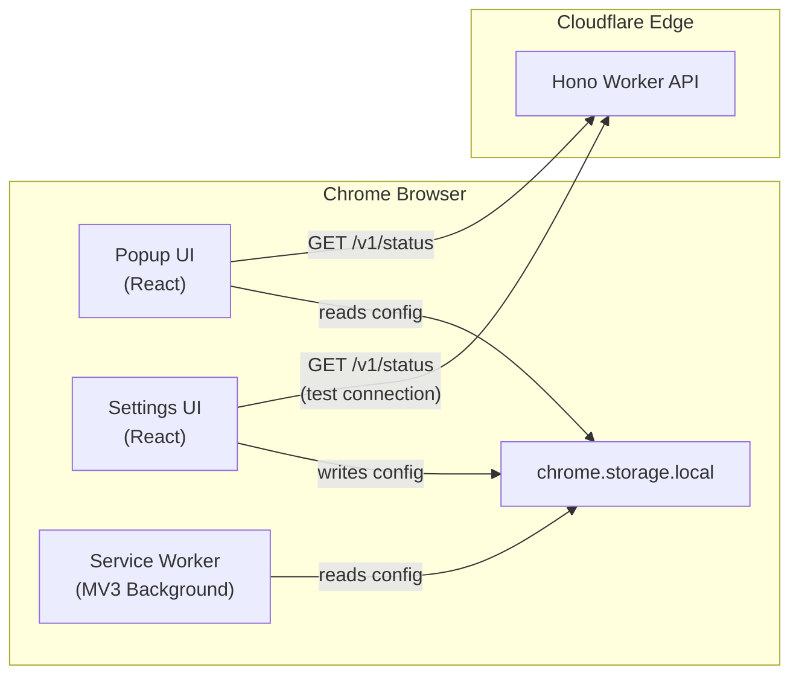
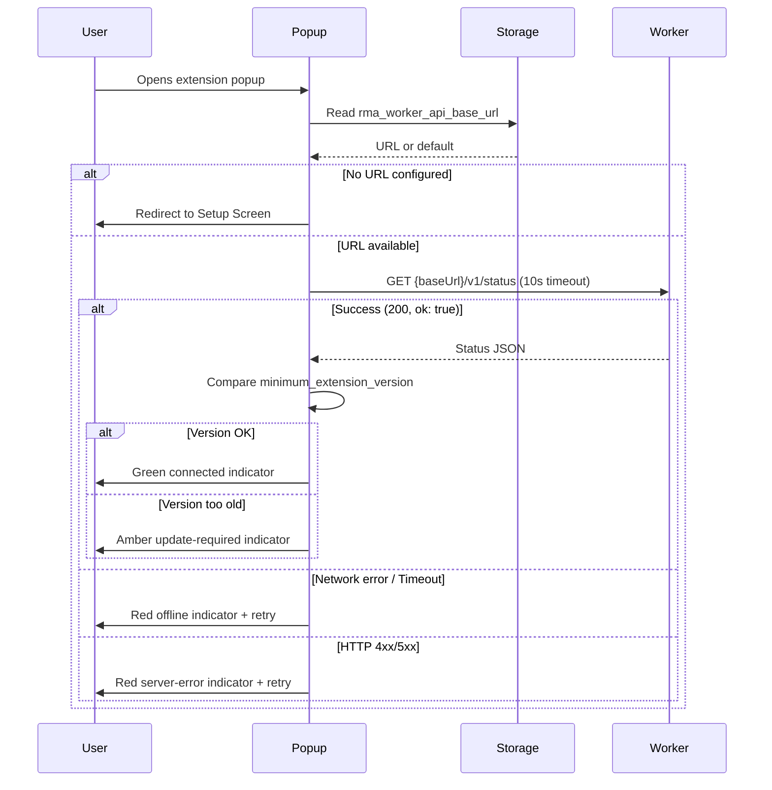

# Technical Design Document

## Overview

This document describes the technical design for the Reddit Marketing Agent MVP Foundation (Spec 01). The scope is deliberately narrow: a Chrome Extension shell and a Cloudflare Worker API shell connected by a single public health-check endpoint. This foundation provides the build pipelines, project structures, communication patterns, and security boundaries upon which all subsequent specs will build.

**Key Technologies:**
- **Extension**: Chrome Manifest V3, React 18, TypeScript (strict), Vite, Tailwind CSS
- **Worker API**: Cloudflare Workers, Hono framework, TypeScript (strict), Wrangler CLI
- **Communication**: HTTP fetch with AbortController timeout
- **Storage**: chrome.storage.local for extension config persistence

**Design Rationale:**
- Manual Vite multi-page build (no CRXJS) for full control over build output and simpler debugging
- Hono chosen for Cloudflare Workers due to zero-config compatibility, minimal bundle size, and ergonomic routing API ([Hono docs](https://hono.dev/docs/getting-started/cloudflare-workers))
- No third-party dependencies for semver comparison — a simple ~20-line utility suffices for major.minor.patch comparison
- Storage key prefix `rma_` to avoid collisions with other extensions sharing chrome.storage.local

---

## Architecture

### High-Level System Diagram



### Data Flow: Status Check



### Project Structure

```
reddit-marketing-agent/
├── extension/
│   ├── src/
│   │   ├── popup/                # React popup entry point
│   │   │   ├── Popup.tsx         # Main popup component
│   │   │   ├── main.tsx          # React DOM render entry
│   │   │   └── index.html        # Popup HTML shell
│   │   ├── settings/             # React settings entry point
│   │   │   ├── Settings.tsx      # Settings/setup component
│   │   │   ├── main.tsx          # React DOM render entry
│   │   │   └── index.html        # Settings HTML shell
│   │   ├── service-worker/       # MV3 background service worker
│   │   │   └── index.ts          # SW entry (minimal in Spec 01)
│   │   ├── components/           # Shared React components
│   │   │   ├── StatusIndicator.tsx
│   │   │   └── ConnectionBadge.tsx
│   │   ├── lib/                  # Shared utilities
│   │   │   ├── storage.ts        # chrome.storage.local wrapper
│   │   │   ├── api-client.ts     # Worker API fetch client
│   │   │   ├── semver.ts         # Semver comparison utility
│   │   │   └── url-validator.ts  # HTTPS URL validation
│   │   └── types/                # TypeScript type definitions
│   │       └── index.ts          # Shared types
│   ├── public/
│   │   └── icons/                # Extension icons (16, 48, 128px)
│   ├── manifest.json
│   ├── vite.config.ts
│   ├── tailwind.config.ts
│   ├── tsconfig.json
│   ├── postcss.config.js
│   ├── .eslintrc.cjs
│   └── package.json
├── worker-api/
│   ├── src/
│   │   ├── index.ts              # Hono app entry point
│   │   ├── routes/
│   │   │   └── status.ts         # GET /v1/status route handler
│   │   └── types/
│   │       └── index.ts          # Response type definitions
│   ├── wrangler.toml
│   ├── tsconfig.json
│   ├── .eslintrc.cjs
│   └── package.json
├── docs/
│   └── architecture.md
└── README.md
```

---

## Components and Interfaces

### Extension Components

#### 1. Storage Module (`src/lib/storage.ts`)

Provides typed get/set wrappers around `chrome.storage.local`.

```typescript
interface StorageModule {
  getWorkerApiBaseUrl(): Promise<string>;
  setWorkerApiBaseUrl(url: string): Promise<void>;
}
```

- **Key**: `rma_worker_api_base_url`
- **Default**: Hardcoded constant `DEFAULT_WORKER_API_URL` (the production workers.dev URL)
- **Behavior**:
  - `getWorkerApiBaseUrl()`: Reads from chrome.storage.local. On read failure or missing key, returns `DEFAULT_WORKER_API_URL`.
  - `setWorkerApiBaseUrl(url)`: Validates URL first (delegates to url-validator), then persists. Throws `StorageError` on write failure.

#### 2. URL Validator (`src/lib/url-validator.ts`)

Pure function for validating Worker API base URLs.

```typescript
type ValidationResult =
  | { valid: true; normalizedUrl: string }
  | { valid: false; error: string };

function validateWorkerApiUrl(input: string): ValidationResult;
```

- **Rules**:
  1. Must be a well-formed URL (parseable by `new URL()`)
  2. Must use `https:` protocol
  3. Must not exceed 2048 characters
  4. On success, `normalizedUrl` is the input URL with trailing slash removed (if present). The caller should use `normalizedUrl` for storage and API calls.
- **Returns**: `{ valid: true, normalizedUrl: "https://..." }` or `{ valid: false, error: "..." }`

#### 3. API Client (`src/lib/api-client.ts`)

Makes typed fetch requests to the Worker API.

```typescript
interface StatusResponse {
  ok: boolean;
  api_version: string;
  minimum_extension_version: string;
  scanner_enabled: boolean;
  drafting_enabled: boolean;
  compare_enabled: boolean;
  promotional_modes_enabled: boolean;
}

interface ApiError {
  type: 'network' | 'timeout' | 'server' | 'parse';
  status?: number;
  message: string;
}

type StatusResult = 
  | { success: true; data: StatusResponse }
  | { success: false; error: ApiError };

function checkStatus(baseUrl: string): Promise<StatusResult>;
```

- **Timeout**: 10,000ms via `AbortController`
- **Timeout detection**: Uses a `didTimeout` flag set by `setTimeout` before calling `controller.abort()`. This distinguishes intentional timeout from other abort scenarios.
- **Error classification**:
  - `AbortError` with `didTimeout === true` → `{ type: 'timeout' }`
  - `AbortError` with `didTimeout === false` → `{ type: 'network' }` (externally aborted)
  - `TypeError` (no network) → `{ type: 'network' }`
  - HTTP 4xx/5xx → `{ type: 'server', status }`
  - JSON parse failure → `{ type: 'parse' }`

**Code sketch:**

```typescript
async function checkStatus(baseUrl: string): Promise<StatusResult> {
  const controller = new AbortController();
  let didTimeout = false;
  const timer = setTimeout(() => {
    didTimeout = true;
    controller.abort();
  }, 10_000);

  try {
    const res = await fetch(`${baseUrl}/v1/status`, { signal: controller.signal });
    clearTimeout(timer);
    // ... parse response
  } catch (err) {
    clearTimeout(timer);
    if (err instanceof DOMException && err.name === 'AbortError') {
      return { success: false, error: { type: didTimeout ? 'timeout' : 'network', message: '...' } };
    }
    return { success: false, error: { type: 'network', message: '...' } };
  }
}
```

- **Future**: `// TODO: Spec 02 - Worker Auth & Token Lifecycle — Add HMAC signing headers here`

#### 4. Semver Utility (`src/lib/semver.ts`)

Lightweight semver comparison for major.minor.patch versions.

```typescript
/**
 * Compares two semver strings (major.minor.patch only).
 * Returns:  -1 if a < b,  0 if a == b,  1 if a > b
 */
function compareSemver(a: string, b: string): -1 | 0 | 1;

/**
 * Returns true if `current` satisfies `minimum` (current >= minimum).
 */
function satisfiesMinimum(current: string, minimum: string): boolean;
```

- No pre-release or build metadata support needed in Spec 01
- Zero dependencies — implemented as a ~20 line utility

#### 5. Popup Component (`src/popup/Popup.tsx`)

```typescript
type ConnectionState = 
  | 'loading' 
  | 'connected' 
  | 'update-required' 
  | 'offline' 
  | 'server-error' 
  | 'not-configured';

interface PopupProps {}
// Self-contained: reads storage, calls API, manages own state
```

- **On mount**: Read storage → check if URL configured → call status check
- **Deduplication**: Uses a `useRef` flag to prevent concurrent requests
- **Navigation**: Gear icon opens settings via `chrome.runtime.openOptionsPage()` (no `tabs` permission required)

#### 6. Settings Component (`src/settings/Settings.tsx`)

```typescript
interface SettingsProps {}
// Self-contained: manages URL input, validation, test connection
```

- **First-run detection**: If no URL in storage, shows setup wizard mode
- **URL input**: Controlled input, max 256 chars display (2048 validation limit)
- **Save flow**: Validate → persist → test connection → show result
- **Error display**: Inline validation errors below input field

#### 7. Service Worker (`src/service-worker/index.ts`)

Minimal in Spec 01:

```typescript
// Placeholder: registers event listeners for future specs
chrome.runtime.onInstalled.addListener(() => {
  // TODO: Spec 02 - Worker Auth & Token Lifecycle
  console.log('[RMA] Extension installed');
});

// TODO: Spec 02+ - Add chrome.alarms for periodic scanning
```

### Worker API Components

#### 1. Hono App Entry (`src/index.ts`)

```typescript
import { Hono } from 'hono';
import { statusRoute } from './routes/status';

const app = new Hono();

// Mount routes
app.route('/v1', statusRoute);

// 404 catch-all
app.notFound((c) => {
  return c.json({
    error: { code: 'NOT_FOUND', message: 'The requested resource was not found.' }
  }, 404);
});

// TODO: Spec 02 - Worker Auth & Token Lifecycle — Add auth middleware here

export default app;
```

#### 2. Status Route (`src/routes/status.ts`)

```typescript
import { Hono } from 'hono';

const statusRoute = new Hono();

statusRoute.get('/status', (c) => {
  return c.json({
    ok: true,
    api_version: 'v1',
    minimum_extension_version: '1.0.0',
    scanner_enabled: false,
    drafting_enabled: false,
    compare_enabled: false,
    promotional_modes_enabled: false,
  });
});

// 405 for non-GET methods
statusRoute.all('/status', (c) => {
  return c.json({
    error: { code: 'METHOD_NOT_ALLOWED', message: 'Only GET is allowed on this endpoint.' }
  }, 405);
});

export { statusRoute };
```

**Design note**: Hono processes routes in order — the `get` handler matches first; the `all` handler catches POST, PUT, DELETE, PATCH, etc.

### Extension manifest.json

```json
{
  "manifest_version": 3,
  "name": "Reddit Marketing Agent",
  "version": "1.0.0",
  "description": "Internal Reddit research and drafting assistant for CouponsRiver operators.",
  "permissions": ["storage"],
  "host_permissions": ["https://*.workers.dev/*"],
  "options_page": "settings/index.html",
  "action": {
    "default_popup": "popup/index.html",
    "default_icon": {
      "16": "icons/icon-16.png",
      "48": "icons/icon-48.png",
      "128": "icons/icon-128.png"
    }
  },
  "background": {
    "service_worker": "service-worker/index.js"
  },
  "icons": {
    "16": "icons/icon-16.png",
    "48": "icons/icon-48.png",
    "128": "icons/icon-128.png"
  }
}
```

**Absent by design** (enforcing Requirement 7 security boundaries):
- No `content_scripts`
- No `activeTab`, `tabs`, or `scripting` permissions
- No `externally_connectable`

### Worker wrangler.toml

```toml
name = "reddit-marketing-agent-api"
main = "src/index.ts"
compatibility_date = "2024-01-01"

# No bindings in Spec 01
# TODO: Spec 02 - Worker Auth & Token Lifecycle
# [[ d1_databases ]]
# binding = "DB"
# database_name = "..."
# database_id = "..."
```

---

## Data Models

### Extension Storage Schema

| Key | Type | Default | Description |
|-----|------|---------|-------------|
| `rma_worker_api_base_url` | `string` | Production workers.dev URL | The configured Worker API endpoint |

Future keys (Spec 02+) will use the `rma_` prefix convention.

### Status Endpoint Response Model

```typescript
interface StatusResponse {
  ok: boolean;                        // Always true for healthy state
  api_version: string;                // "v1"
  minimum_extension_version: string;  // Semver, e.g. "1.0.0"
  scanner_enabled: boolean;           // false in Spec 01
  drafting_enabled: boolean;          // false in Spec 01
  compare_enabled: boolean;           // false in Spec 01
  promotional_modes_enabled: boolean; // false in Spec 01
}
```

### Error Response Model

```typescript
interface ErrorResponse {
  error: {
    code: string;     // e.g. "NOT_FOUND", "METHOD_NOT_ALLOWED"
    message: string;  // Human-readable description
  };
}
```

### Extension Connection State Model

```typescript
type ConnectionState =
  | { status: 'loading' }
  | { status: 'connected'; data: StatusResponse }
  | { status: 'update-required'; minimumVersion: string }
  | { status: 'offline'; reason: 'network' | 'timeout' }
  | { status: 'server-error'; httpStatus: number }
  | { status: 'not-configured' };
```

---

## Correctness Properties

*A property is a characteristic or behavior that should hold true across all valid executions of a system — essentially, a formal statement about what the system should do. Properties serve as the bridge between human-readable specifications and machine-verifiable correctness guarantees.*

### Property 1: Method Guard on /v1/status

*For any* HTTP method that is not GET (e.g., POST, PUT, DELETE, PATCH, HEAD, OPTIONS), sending a request to `/v1/status` SHALL return HTTP 405 with a JSON body containing `error.code` equal to `"METHOD_NOT_ALLOWED"`.

**Validates: Requirements 3.3**

### Property 2: Route Guard for Unknown Paths

*For any* URL path that does not match `/v1/status`, sending a GET request to the Worker API SHALL return HTTP 404 with a JSON body containing `error.code` equal to `"NOT_FOUND"`.

**Validates: Requirements 3.5**

### Property 3: URL Validation Correctness

*For any* string input, the URL validator SHALL accept the input if and only if: (a) it is parseable as a URL by the `URL` constructor, (b) its protocol is `https:`, and (c) its total length does not exceed 2048 characters. All other inputs SHALL be rejected with a descriptive error message.

**Validates: Requirements 4.3, 4.4, 5.4, 5.5**

### Property 4: Storage Round-Trip Preservation

*For any* valid HTTPS URL (accepted by the URL validator), storing it via `setWorkerApiBaseUrl` and then reading it via `getWorkerApiBaseUrl` SHALL return the exact same string value.

**Validates: Requirements 5.1**

### Property 5: Semver Comparison Correctness

*For any* two valid semver strings `a` (major.minor.patch) and `b` (major.minor.patch), `satisfiesMinimum(a, b)` SHALL return `true` if and only if `a >= b` when compared using semantic versioning precedence (major, then minor, then patch, each compared numerically).

**Validates: Requirements 6.2, 6.3**

---

## Error Handling

### Extension Error Handling Strategy

| Error Source | Detection | User Impact | Recovery |
|-------------|-----------|-------------|----------|
| Network unreachable | `TypeError` on fetch | Red "offline" badge | Retry button |
| Request timeout | AbortController signal | Red "offline" badge | Retry button |
| HTTP 4xx/5xx | Response status check | Red "server error" badge | Retry button |
| JSON parse failure | try/catch on `.json()` | Red "server error" badge | Retry button |
| Storage read failure | try/catch on chrome.storage.local.get | Uses default URL for status checks only | Non-blocking settings warning |
| Storage write failure | try/catch on chrome.storage.local.set | Error toast + stays on form | Retry save |
| Invalid URL input | Synchronous validation | Inline error message | User corrects input |

### Extension Error Principles

1. **Never freeze**: All async operations have timeouts or are non-blocking
2. **Never expose internals**: Error messages are user-friendly; no URLs, stack traces, or config in UI
3. **Always recoverable**: Every error state has a retry action or clear guidance
4. **Scoped fallback**: On storage read failure, use the default Worker URL for status checks only and show a non-blocking settings warning.

### Worker API Error Handling Strategy

| Error Source | HTTP Status | Response Code | Response Message |
|-------------|-------------|---------------|-----------------|
| Unknown route | 404 | `NOT_FOUND` | "The requested resource was not found." |
| Wrong HTTP method | 405 | `METHOD_NOT_ALLOWED` | "Only GET is allowed on this endpoint." |
| Unhandled exception | 500 | `INTERNAL_ERROR` | "An unexpected error occurred." |

### Worker API Error Principles

1. **Consistent shape**: All errors return `{ error: { code, message } }` JSON
2. **No information leakage**: Error messages never include stack traces, internal paths, or configuration
3. **Explicit method handling**: Routes explicitly reject wrong methods rather than relying on framework defaults

---

## Testing Strategy

### Testing Approach

This feature uses a **dual testing strategy**:

1. **Property-based tests** — Verify universal properties for pure utility functions (URL validation, semver comparison) across many generated inputs using [fast-check](https://github.com/dubzzz/fast-check)
2. **Unit tests** — Verify specific examples, edge cases, UI states, API client behavior, storage module, and Worker routes using [Vitest](https://vitest.dev/)
3. **Integration tests** — Verify build output, HTTP responses, and end-to-end status check flow

### Property-Based Testing Configuration

- **Library**: `fast-check` (TypeScript-native, works in both Node and browser environments)
- **Minimum iterations**: 100 per property test
- **Tag format**: `Feature: reddit-marketing-agent, Property {number}: {description}`
- Property-based tests are reserved for **pure utility functions only** (url-validator, semver). UI components, API client, storage module, and Worker routes use standard unit tests.

### Test Matrix

| Component | Test Type | Tool | What's Tested |
|-----------|-----------|------|---------------|
| `url-validator.ts` | Property-based | fast-check + Vitest | Property 3: URL validation correctness |
| `semver.ts` | Property-based | fast-check + Vitest | Property 5: Semver comparison |
| `storage.ts` | Unit | Vitest (mock chrome API) | Storage round-trip, default fallback, error handling |
| Worker routes | Unit | Vitest | Method guard (405), route guard (404), status response body |
| Worker `/v1/status` | Unit | Vitest | Exact response body shape and values |
| `api-client.ts` | Unit | Vitest (mock fetch) | Error classification, didTimeout flag, response parsing |
| Popup component | Unit | Vitest + Testing Library | UI states (loading, connected, offline, etc.) |
| Settings component | Unit | Vitest + Testing Library | Form validation, save flow, error display |
| Extension build | Integration | Script/CI | `npm run build` exits 0, dist/ structure valid |
| Worker build | Integration | Script/CI | `npm run build` exits 0 |
| manifest.json | Unit | Vitest | Permissions, no content_scripts, structure |

### Build Verification Tests

Both projects include scripts that serve as CI gates:

**Extension (`extension/package.json`):**
```json
{
  "scripts": {
    "build": "vite build",
    "dev": "vite",
    "typecheck": "tsc --noEmit",
    "lint": "eslint src/ --ext .ts,.tsx",
    "test": "vitest --run",
    "test:watch": "vitest"
  }
}
```

**Worker API (`worker-api/package.json`):**
```json
{
  "scripts": {
    "build": "wrangler deploy --dry-run --outdir=dist",
    "dev": "wrangler dev",
    "typecheck": "tsc --noEmit",
    "lint": "eslint src/ --ext .ts",
    "test": "vitest --run",
    "test:watch": "vitest",
    "deploy": "wrangler deploy"
  }
}
```

### Security Boundary Verification

Static analysis tests (can be shell scripts or Vitest tests):
- Grep extension source for known secret patterns (API_KEY, SECRET, OPENAI, etc.)
- Verify manifest.json contains no `content_scripts`, `activeTab`, `tabs`, or `scripting`
- Verify wrangler.toml contains no `[[d1_databases]]`, `[[kv_namespaces]]`, or `[vars]` with secrets

---

## Key Design Decisions

| Decision | Choice | Rationale |
|----------|--------|-----------|
| Build tool for extension | Vite (manual multi-page) | Full control over output; CRXJS has compatibility issues with latest Vite versions |
| Worker framework | Hono | Zero-config Cloudflare Workers support, tiny bundle, TypeScript-first |
| Semver comparison | Custom ~20-line utility | Avoids importing `semver` (120KB) for trivial major.minor.patch comparison |
| Storage key prefix | `rma_` | Namespace isolation in chrome.storage.local |
| URL validation | `URL` constructor + protocol check | Uses browser's built-in URL parser; no regex needed |
| API client timeout | 10 seconds via AbortController | Generous enough for cold-start Workers; avoids hanging indefinitely |
| State management | React useState/useEffect | No Redux/Zustand needed for 2-screen app with simple state |
| Error response format | `{ error: { code, message } }` | Consistent, parseable, extensible for future error codes |
| No CRXJS plugin | Manual Vite config | More stable long-term; CRXJS has MV3 compatibility gaps |
| No D1/KV in Spec 01 | Stateless worker | Deferred to Spec 02; keeps initial deployment trivial |

---

## Future Extension Points

These are marked in source code with comments for Spec 02 and beyond:

| Location | TODO Marker | Future Addition |
|----------|-------------|-----------------|
| `extension/src/lib/api-client.ts` | `// TODO: Spec 02 - Worker Auth & Token Lifecycle` | HMAC signing headers on all requests |
| `extension/src/service-worker/index.ts` | `// TODO: Spec 02 - Worker Auth & Token Lifecycle` | chrome.alarms for periodic scanning |
| `extension/manifest.json` | N/A (add permissions when needed) | `alarms`, `notifications` permissions (deferred to scanner spec, not Spec 02) |
| `worker-api/src/index.ts` | `// TODO: Spec 02 - Worker Auth & Token Lifecycle` | Auth middleware, D1 bindings |
| `worker-api/wrangler.toml` | `# TODO: Spec 02` | D1 database bindings, secrets |
| `extension/src/types/index.ts` | `// TODO: Spec 02` | Install token types, auth state types |
