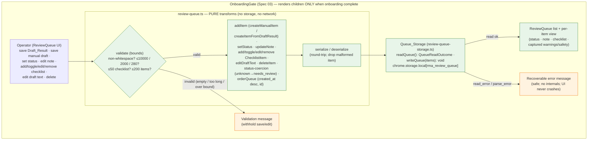

# Design Document — Spec 07: Review Queue (Local, Extension-UI-Only, Operator-Triaged)

## 1. Overview

The Review_Queue is a **local, Extension-UI-only** triage aid inside the existing Chrome Manifest V3
popup. It lets the human Operator **save** reply drafts — either a Spec 06 `DraftResult` or a
manually entered/edited draft — into a queue persisted in `chrome.storage.local`, then manually
**triage** each Queue_Item: set a Review_Status, attach free-text Notes, and manage advisory
Checklist_Items, before deciding whether to copy and post it manually **outside** the Extension.

Every queue operation — save, list, view, status-change, note edit, checklist edit, delete — runs
**entirely locally** with **no network call** and **no AI provider**. The queue transformation logic
is split into **pure functions** (`review-queue.ts`) that never touch storage, and a thin
**storage adapter** (`review-queue-storage.ts`) that reads/writes `chrome.storage.local` using the
same typed, fail-safe pattern as Spec 03's `onboarding-storage.ts`. One React panel
(`ReviewQueue.tsx`) renders inside the existing Spec 03 `OnboardingGate`, as a section distinct from
the Spec 05 `IntentScanner` and the Spec 06 `DraftCoPilot`.

This design builds on **Spec 01** (MVP Foundation), **Spec 02** (Worker Auth & `authenticatedFetch`),
**Spec 03** (Compliance Onboarding Gate), **Spec 04** (`POST /v1/compare` Foundation), **Spec 05**
(Intent Scanner), and **Spec 06** (Draft Co-Pilot), **reusing all of them without modification**. It
addresses Requirements 1–13 of `requirements.md` and implements Correctness Properties 1–14. There
are **no** worker-api changes for the Spec 07 MVP.

### A Note on Identifiers and Timestamps (per requirements)

The Spec 06 Draft_Generator is a **pure, deterministic** function forbidden from using identifiers,
randomness, or timestamps. The Review_Queue is different: a Queue_Item records an **Operator action**
(saving, editing, status-setting), not a deterministic draft computation. Generating a stable `id`,
a `created_at`, and an `updated_at` at the moment of an Operator action is therefore appropriate and
does **not** violate Spec 06's determinism guarantee. Determinism in this spec applies to the **pure
queue transformation functions** (status transition, delete, checklist toggle, serialize/deserialize)
operating over an already-constructed Queue_Item — **not** to id/timestamp creation. To keep the pure
transforms test-deterministic, id and timestamp creation are **injected** (a small `id factory` /
`clock` passed in), so the transforms themselves contain no hidden inputs (Section 5.3).

### Key Design Decisions

| Decision | Rationale |
| --- | --- |
| Split **pure queue logic** (`review-queue.ts`) from the **storage adapter** (`review-queue-storage.ts`) | The transforms (status/delete/checklist/note/edit, validation, status-coercion, serialize/deserialize) are pure and directly property-testable; storage I/O is isolated behind a typed outcome. Mirrors the Spec 06 generator/compliance split and the Spec 03 storage split. |
| **Inject** id + timestamp creation into the pure transforms | Determinism (Properties 3–7) and PBT are first-class. With an injected `id factory`/`clock`, `createManualItem`/`createItemFromDraftResult` are deterministic given their inputs, so tests are reproducible while real callers pass `crypto.randomUUID`/`new Date().toISOString()`. |
| Typed **`QueueReadOutcome`** mirroring `onboarding-storage`'s `read_error` pattern | Req 10 — a read returns either the parsed list or a safe failure state (`read_error`/`parse_error`); missing → empty; unparseable → do not overwrite; malformed individual item dropped. Fail-safe, leak-free, never crashes the UI. |
| **Status-coercion** (unknown → `needs_review`) at the read/normalize boundary | Req 3.6, Property 2 — any stored Review_Status outside the three enumerated values is treated as `needs_review`, so the UI never shows an out-of-range status. |
| New `STORAGE_KEYS.REVIEW_QUEUE = 'rma_review_queue'`, existing entries unchanged | Req 9.1, 9.2 — single source of storage keys, `rma_` prefix convention preserved; no existing key modified. |
| Capture Spec 06 `warnings`/`safety` **verbatim**; never recompute | Req 1.8 — the Review_Queue is a triage aid, not a compliance engine. It stores what Spec 06 recorded and recomputes no verdict. |
| Render inside `OnboardingGate`, as a section separate from `IntentScanner` and `DraftCoPilot` | Compliance-first: the panel does not mount or run any queue read/write/mutation until Compliance_Onboarding is complete and fails closed on `read_error` (Req 11). |
| Manual select/copy only; **no** posting/automation controls | Req 12.7, 12.8 — `approved_for_manual_use` is an Operator review decision only; it publishes, schedules, and transmits nothing. |

### Non-Goals (Explicitly Out of Scope — restating the boundaries)

The Review_Queue **MUST NOT** introduce, imply, or depend on any of the following (Req 12, Non-Goals):

- Any Reddit API access of any kind.
- Any `reddit.com` / `old.reddit.com` host permission, or any manifest permission expansion (the
  existing `permissions` and `host_permissions` arrays remain **byte-for-byte unchanged**).
- Any content script, DOM scraping, crawling, Firecrawl, or IP rotation.
- Any network request for any queue operation (save, list, view, update, delete are purely local).
- Any automated Reddit action: posting, commenting, upvoting, downvoting, direct messaging, joining,
  following, or form submission — and any auto-post / auto-submit / one-click-publish control.
- Any `chrome.alarms`, scheduled task, background automation, or `chrome.notifications`.
- Any OpenAI, LLM, generative-AI, or other AI-provider call.
- Any Cloudflare Worker change, new `/v1` route, or worker-side queue storage (no worker-api changes).
- Any automatic, system-initiated change to a Queue_Item's Review_Status (Operator-controlled only).
- Any transmission of Queue_Items, Notes, or Checklist_Items to the Worker_API or any external service.

## 2. Architecture

The entire flow is local and in-memory apart from the `chrome.storage.local` read/write at the edges.
There is **no network node anywhere**. Everything runs inside `OnboardingGate`.



- **Every** node is local, no-network (Req 9.6, 12.4; Properties 10, 11). There is no network node
  anywhere — unlike Spec 05, the Review_Queue has **no** optional network branch at all.
- Nothing inside `GATE` mounts or runs while onboarding is incomplete or in `read_error` (Req 11.2;
  Property 13).

**Module placement** (all within the existing extension; no new directories, no new permissions):

| Module | Location | Kind |
| --- | --- | --- |
| Queue transforms, validation, status-coercion, ordering, serialize/deserialize | `extension/src/lib/review-queue.ts` | pure functions (no storage) |
| `readQueue` / `writeQueue` storage adapter | `extension/src/lib/review-queue-storage.ts` | `chrome.storage.local` I/O (no network) |
| Review Queue types & constants | `extension/src/types/index.ts` (new "Review Queue Types (Spec 07)" section) | shared type additions |
| `ReviewQueue` | `extension/src/components/ReviewQueue.tsx` | React panel rendered in `Popup` under `OnboardingGate` |

> All file paths above are **design illustration** of intended placement. This design phase creates
> only `design.md`; no source files are created or modified here.

## 3. Components and Interfaces

TypeScript signatures below are **design illustration**, following the codebase's existing
discriminated-union and categorized-result conventions (e.g. `GateResult`, `CompareOutcome`, and the
`onboarding-storage` read variant).

```ts
// extension/src/lib/review-queue.ts (design illustration) — PURE; never touches storage/network.

/** Injected non-determinism so the transforms stay pure & test-deterministic (Section 5.3). */
export interface QueueClock { now(): string; }          // ISO 8601 string at the Operator action
export interface IdFactory { create(): string; }        // stable unique Item_Id / Checklist_Item_Id

/** Validate Operator-supplied draft text before save/edit (Req 1.7, 7.5, 8.1, 8.2). */
export function validateDraftText(text: string): QueueFieldValidation;
/** Validate a Note (Req 8.3, 8.4) and a Checklist_Item text (Req 8.3, 8.4). */
export function validateNote(text: string): QueueFieldValidation;
export function validateChecklistText(text: string): QueueFieldValidation;

/** Create a Queue_Item from a Spec 06 Draft_Result (Req 1.2, 1.3, 1.5, 2.1–2.3). */
export function createItemFromDraftResult(
  result: DraftResult, clock: QueueClock, ids: IdFactory
): QueueItem;
/** Create a Queue_Item from a manual draft (Req 1.4, 1.5, 1.6, 2.1–2.3). */
export function createManualItem(
  draftText: string, clock: QueueClock, ids: IdFactory
): QueueItem;

/** Add a created item to the queue, enforcing the 200-item bound (Req 8.5, 8.6). */
export function addItem(queue: ReviewQueue, item: QueueItem): AddResult;

/** Operator-only mutations — each targets exactly one item / sub-item (Req 3, 4, 5, 7). */
export function setStatus(queue: ReviewQueue, id: string, status: ReviewStatus, clock: QueueClock): ReviewQueue;
export function updateNote(queue: ReviewQueue, id: string, note: string | undefined, clock: QueueClock): MutateResult;
export function addChecklistItem(queue: ReviewQueue, id: string, text: string, clock: QueueClock, ids: IdFactory): MutateResult;
export function toggleChecklistItem(queue: ReviewQueue, id: string, checklistId: string, clock: QueueClock): ReviewQueue;
export function editChecklistItem(queue: ReviewQueue, id: string, checklistId: string, text: string, clock: QueueClock): MutateResult;
export function removeChecklistItem(queue: ReviewQueue, id: string, checklistId: string, clock: QueueClock): ReviewQueue;
export function editDraftText(queue: ReviewQueue, id: string, draftText: string, clock: QueueClock): MutateResult;
export function deleteItem(queue: ReviewQueue, id: string): ReviewQueue;

/** Coerce any out-of-range stored status to `needs_review` (Req 3.6, Property 2). */
export function coerceStatus(value: unknown): ReviewStatus;
/** Stable, deterministic display order: `created_at` desc, then `id` asc (Req 6.3). */
export function orderQueue(queue: ReviewQueue): QueueItem[];

/** chrome.storage.local (de)serialization round-trip; drops malformed items (Req 9.5, 10.6). */
export function serializeQueue(queue: ReviewQueue): unknown;
export function deserializeQueue(raw: unknown): QueueItem[];
```

```ts
// extension/src/lib/review-queue-storage.ts (design illustration) — chrome.storage.local only; NO network.

/** Custom error for queue write failures (parallels OnboardingStorageError / StorageError). */
export class ReviewQueueStorageError extends Error {}

/**
 * Read the Review_Queue. Mirrors onboarding-storage's typed read_error pattern (Req 10):
 *  - missing key            → { ok: true, items: [] }
 *  - read throws            → { ok: false, error: 'read_error', message }  (safe, no internals)
 *  - present but unparseable → { ok: false, error: 'parse_error', message } (does NOT overwrite)
 *  - malformed individual item → dropped; well-formed items retained
 */
export function readQueue(): Promise<QueueReadOutcome>;

/** Persist the queue under STORAGE_KEYS.REVIEW_QUEUE. @throws ReviewQueueStorageError on failure. */
export function writeQueue(items: QueueItem[]): Promise<void>;
```

The `ReviewQueue` panel holds the loaded queue and per-item edit state in local React state. On each
Operator action it calls a pure transform from `review-queue.ts`, then persists via
`writeQueue`. It never calls `fetch`/`authenticatedFetch`.

## 4. Data Models

A new **"Review Queue Types (Spec 07)"** section is added to `extension/src/types/index.ts`. It
**reuses** the existing Spec 06 `DraftMode`, `DraftResult`, and `ComplianceWarning` shapes verbatim
(no modification to Spec 06) and adds the new queue types and bound constants. (Design illustration —
not implemented in this phase.)

```ts
// --- Review Queue Types (Spec 07) ---

/** The three Operator-controlled triage states (Req 3.1). Default on save is `needs_review`. */
export type ReviewStatus = 'needs_review' | 'approved_for_manual_use' | 'rejected';

/** Origin of a saved draft (Req 1.3, 1.4). */
export type DraftSource = 'draft_co_pilot' | 'manual';

/** A single advisory review-checklist entry (Req 5). */
export interface ChecklistItem {
  id: string;        // stable Checklist_Item_Id, unique within its Queue_Item (Req 5.2)
  text: string;      // ≤ MAX_CHECKLIST_TEXT chars (Req 8.3)
  checked: boolean;  // defaults to false on add (Req 5.2)
}

/** A single saved entry in the Review_Queue (Req 1, 2). */
export interface QueueItem {
  id: string;                         // stable Item_Id, unique within the queue (Req 2.1)
  draftText: string;                  // ≤ MAX_QUEUE_DRAFT_TEXT chars (Req 8.1)
  source: DraftSource;                // 'draft_co_pilot' | 'manual' (Req 1.3, 1.4)
  mode?: DraftMode;                    // captured Spec 06 Draft_Mode when from a Draft_Result (Req 1.2)
  warnings?: ComplianceWarning[];      // captured Spec 06 warnings, verbatim (Req 1.2, 1.6, 1.8)
  safety?: 'safe' | 'unsafe';          // captured Spec 06 Safety_Flag (Req 1.2, 1.6)
  status: ReviewStatus;                // Operator-controlled triage state (Req 3)
  note?: string;                       // advisory free-text Note, ≤ MAX_NOTE chars (Req 4)
  checklist: ChecklistItem[];          // advisory checklist, ≤ MAX_CHECKLIST_ITEMS (Req 5)
  created_at: string;                  // ISO 8601, set at save, immutable (Req 2.2, 2.5)
  updated_at: string;                  // ISO 8601, bumped on each Operator modification (Req 2.3, 2.4)
}

/** The Review_Queue is the ordered collection of Queue_Items (Req 6.1). */
export type ReviewQueue = QueueItem[];

/**
 * Typed outcome of reading the Review_Queue from chrome.storage.local (Req 10.1).
 * The failure `message` is a fixed, safe string — never a stack trace, file path,
 * secret, environment value, or internal implementation detail (Req 10.5).
 */
export type QueueReadOutcome =
  | { ok: true; items: QueueItem[] }
  | { ok: false; error: 'read_error' | 'parse_error'; message: string };

/** Result of a bounded field validation (Req 8). */
export type QueueFieldValidation =
  | { kind: 'valid' }
  | { kind: 'empty' }                              // zero non-whitespace chars (Req 1.7, 7.5)
  | { kind: 'too_long'; max: number };             // exceeds the applicable bound (Req 8.2, 8.4)

/** Result of an add (Req 8.5, 8.6) / mutation that may be bound-rejected. */
export type AddResult =
  | { ok: true; queue: ReviewQueue }
  | { ok: false; reason: 'queue_full'; max: number };
export type MutateResult =
  | { ok: true; queue: ReviewQueue }
  | { ok: false; reason: 'empty' | 'too_long' | 'checklist_full' | 'not_found'; max?: number };

/** Storage bounds (Req 8). Single-sourced so transforms, the UI, and tests share them. */
export const MAX_QUEUE_DRAFT_TEXT = 10000; // draft text per Queue_Item (Req 8.1, 8.2)
export const MAX_NOTE = 2000;              // Note length (Req 8.3, 8.4)
export const MAX_CHECKLIST_TEXT = 280;     // Checklist_Item text length (Req 8.3, 8.4)
export const MAX_CHECKLIST_ITEMS = 50;     // checklist items per Queue_Item (Req 8.5, 8.6)
export const MAX_QUEUE_ITEMS = 200;        // total Queue_Items (Req 8.5, 8.6)
```

`STORAGE_KEYS` gains exactly one new entry, leaving the existing entries unchanged (Req 9.1, 9.2):

```ts
export const STORAGE_KEYS = {
  WORKER_API_BASE_URL: 'rma_worker_api_base_url', // Spec 01 (unchanged)
  ONBOARDING: 'rma_onboarding_acknowledgement',   // Spec 03 (unchanged)
  REVIEW_QUEUE: 'rma_review_queue',                // Spec 07 (new) — `rma_` prefix convention
} as const;
```

> **Captured-vs-recomputed:** `mode`, `warnings`, and `safety` are captured **only** when a draft is
> saved from a Spec 06 `DraftResult` and are stored **verbatim**. For a `manual` draft they are
> omitted/absent (Req 1.6). The Review_Queue never recomputes a compliance verdict (Req 1.8).

## 5. Pure Queue Logic (`review-queue.ts`)

`review-queue.ts` contains **pure functions** over a `ReviewQueue` / `QueueItem`. They MUST NOT call
`chrome.storage`, `fetch`, `authenticatedFetch`, or any AI provider, and (apart from the **injected**
`clock`/`ids`) MUST NOT read `Date.now()`, `Math.random()`, or any global mutable state. Each
transform returns a **new** queue/item value and never mutates its argument.

### 5.1 Creation & capture (Req 1, 2)

- **`createItemFromDraftResult(result, clock, ids)`** builds a `QueueItem` capturing
  `result.draftText`, `result.mode` → `mode`, `result.warnings` → `warnings`, `result.safety` →
  `safety`, sets `source = 'draft_co_pilot'`, `status = 'needs_review'`, `checklist = []`, and
  `created_at = updated_at = clock.now()`, `id = ids.create()` (Req 1.2, 1.3, 1.5, 2.1–2.3).
- **`createManualItem(draftText, clock, ids)`** validates non-whitespace (Req 1.7) and bound
  (Req 8.2), sets `source = 'manual'`, omits `mode`/`warnings`/`safety` (Req 1.6), and otherwise
  mirrors the defaults above (Req 1.4, 1.5, 2.1–2.3).
- **`addItem(queue, item)`** appends the item unless the queue already holds `MAX_QUEUE_ITEMS`, in
  which case it returns `{ ok: false, reason: 'queue_full', max: 200 }` and creates no item
  (Req 8.5, 8.6).

### 5.2 Mutations — Operator-only, single-target, advisory (Req 3, 4, 5, 7)

- **`setStatus`** sets only the targeted item's `status` to the given value and bumps its
  `updated_at`; every other item is unchanged (Req 3.3, 3.4; Property 3). Status changes occur only
  in response to an explicit call — there is no scheduled/automatic path (Req 3.4).
- **`updateNote`** validates the Note bound (Req 8.4), sets/clears `note` on only the targeted item,
  bumps `updated_at`, and leaves `status`/`safety` unchanged (Req 4.2–4.4; Property 7).
- **`addChecklistItem`** validates the text bound (Req 8.4) and the 50-item bound (Req 8.6), assigns a
  unique `id = ids.create()`, sets `checked = false`, and appends to only the targeted item
  (Req 5.1, 5.2).
- **`toggleChecklistItem`** inverts `checked` on only the targeted Checklist_Item, leaving every other
  entry's `text` and `checked` unchanged (Req 5.3; Property 6).
- **`editChecklistItem` / `removeChecklistItem`** edit/remove only the targeted entry (Req 5.4, 5.5).
- All note/checklist operations are **advisory**: they never change `status` or captured `safety`
  (Req 4.4, 5.6; Property 7).
- **`editDraftText`** validates non-whitespace (Req 7.5) and the 10000 bound (Req 8.2); on success it
  updates only that item's `draftText`, **preserves `id` and `created_at`**, and bumps `updated_at`
  (Req 7.1, 7.2); on failure it leaves the existing draft text unchanged.
- **`deleteItem`** removes only the item bearing the targeted `id`, retaining every other item,
  reducing the count by exactly one (Req 7.4; Property 5).

### 5.3 Determinism via injected id/clock

The transforms are **pure given their inputs**. The only non-determinism — the new `id`, `created_at`,
and `updated_at` produced on an Operator action — is **injected** via the `QueueClock` and `IdFactory`
parameters. Tests pass deterministic stubs (e.g. a counter `IdFactory` and a fixed `clock`), so
`setStatus`, `deleteItem`, `toggleChecklistItem`, note edits, and serialize/deserialize are fully
reproducible (Properties 3–7). Production callers in the storage/UI layer pass
`crypto.randomUUID()`-style ids and `new Date().toISOString()`. This is exactly the id/timestamp
clarification from the requirements: determinism applies to the **transforms over an existing item**,
not to id/timestamp creation.

### 5.4 Status coercion & ordering

- **`coerceStatus(value)`** returns the value when it is one of the three `ReviewStatus` literals,
  otherwise `needs_review` (Req 3.6; Property 2). It is applied during `deserializeQueue` so the queue
  exposed to the UI never carries an out-of-range status.
- **`orderQueue(queue)`** returns a stable, deterministic ordering — **`created_at` descending, then
  `id` ascending** as a total-order tiebreak — so listing is reproducible and idempotent (Req 6.3).

### 5.5 Serialize / deserialize round-trip (Req 9.5, 10.6)

- **`serializeQueue`** maps the queue to a plain JSON-safe structure for `chrome.storage.local`.
- **`deserializeQueue(raw)`** validates each entry with a runtime shape guard (in the spirit of
  `isAcknowledgementRecord`), applies `coerceStatus`, **drops** any malformed individual item, and
  retains the well-formed items (Req 10.6). For a valid `QueueItem`,
  `deserializeQueue(serializeQueue([x]))[0]` deep-equals `x` across `id`, `draftText`, `mode`,
  `source`, `warnings`, `safety`, `status`, `note`, `checklist`, `created_at`, `updated_at`
  (Req 9.5; Property 4).

## 6. Storage Adapter (`review-queue-storage.ts`)

`review-queue-storage.ts` is the only module that touches `chrome.storage.local` for the queue. It
performs **no network request** (Req 9.6, 12.4). It mirrors `onboarding-storage.ts`'s typed,
fail-safe read pattern.

**`readQueue(): Promise<QueueReadOutcome>`** (Req 10):

1. `await chrome.storage.local.get(STORAGE_KEYS.REVIEW_QUEUE)` inside `try/catch`.
2. **Read throws** → `{ ok: false, error: 'read_error', message }` with a fixed safe message; the UI
   shows a recoverable error (Req 10.2, 10.5).
3. **Key missing / `undefined`** → `{ ok: true, items: [] }` — an absent queue is zero items
   (Req 10.3).
4. **Present but not a valid array / unparseable** → `{ ok: false, error: 'parse_error', message }`
   and the stored value is **not overwritten** (Req 10.4).
5. **Present and array-shaped** → `deserializeQueue` runs: malformed individual items are dropped,
   statuses coerced, well-formed items returned as `{ ok: true, items }` (Req 10.6).

**`writeQueue(items): Promise<void>`** persists `serializeQueue(items)` under
`STORAGE_KEYS.REVIEW_QUEUE`; on failure it throws `ReviewQueueStorageError` (caught by the UI and
surfaced as a recoverable error). No read/parse failure ever overwrites the stored value implicitly —
writes happen only on explicit Operator mutations that started from a successful read.

## 7. Failure-State Handling

The `QueueReadOutcome` failure variants carry a **fixed, safe `message`** drawn from a small set of
constants — never a stack trace, file path, secret, environment value, or internal implementation
detail (Req 10.5; Property 9). The `ReviewQueue` panel renders a **recoverable** error state (with a
Retry affordance) on `read_error`/`parse_error` and **never crashes**; it continues to render the
rest of the popup.

| Condition | Handling | Requirement |
| --- | --- | --- |
| Stored queue missing | `{ ok: true, items: [] }`; render empty-state indicator | Req 10.3, 6.5 |
| `chrome.storage.local` read throws | `{ ok: false, error: 'read_error', message }`; recoverable error UI | Req 10.2, 10.5 |
| Stored value present but unparseable | `{ ok: false, error: 'parse_error', message }`; do **not** overwrite | Req 10.4, 10.5 |
| One stored item malformed (rest valid) | drop that item; return the well-formed items | Req 10.6 |
| Stored status out of range | `coerceStatus` → `needs_review` | Req 3.6 |
| Write fails | `ReviewQueueStorageError` → recoverable error UI; no crash | Req 9.3 |
| Empty / whitespace-only draft on save or edit | validation message; create no item / leave draft unchanged | Req 1.7, 7.5 |
| Over a storage bound | validation message stating the applicable max; withhold the save/edit | Req 8.2, 8.4, 8.6 |
| Onboarding incomplete / `read_error` | `OnboardingGate` renders onboarding/error UI; `ReviewQueue` not mounted | Req 11.2 |

## 8. Review Queue UI Component (`ReviewQueue.tsx`)

The panel lives inside the existing popup (`w-80`, Tailwind), within `OnboardingGate`, as a section
**distinct** from `IntentScanner` and `DraftCoPilot` (Req 11.1, 11.4). It loads the queue via
`readQueue` on mount and holds the queue + per-item edit state in local React state.

- **Save controls (Req 1):**
  - **Save from Draft_Result** — when a Spec 06 `DraftResult` is available, a control saves it as a
    new Queue_Item (capturing `draftText`/`mode`/`warnings`/`safety`, `source = 'draft_co_pilot'`)
    (Req 1.2, 1.3).
  - **Save manual draft** — a multi-line `<textarea>` + Save control creates a `manual` Queue_Item
    from Operator-entered text, with a live character counter against `MAX_QUEUE_DRAFT_TEXT`
    (Req 1.4, 1.7); empty/whitespace → validation message, no item created (Req 1.7).
- **List + empty state (Req 6):** renders all Queue_Items in `orderQueue` order (created_at desc, id),
  each row showing the Review_Status and a representation of the draft text (Req 6.1–6.3); when the
  queue is empty it shows an empty-state indicator (Req 6.5).
- **Per-item view (Req 6.4):** draft text, `mode` when present, captured `warnings` when present,
  captured `safety` when present, current `status`, `note` when present, and the `checklist`.
- **Status selector (Req 3.2, 3.5):** a control offering exactly the three `ReviewStatus` values;
  selecting one calls `setStatus` and persists (Req 3.3).
- **Note editor (Req 4):** add/edit/clear a Note (≤ `MAX_NOTE`), with a max-length validation message
  (Req 8.4); shown when non-empty (Req 4.5).
- **Checklist (Req 5):** add (≤ `MAX_CHECKLIST_TEXT`, ≤ `MAX_CHECKLIST_ITEMS`), toggle, edit text, and
  remove entries, each persisted; over-bound add shows a validation message and creates no item
  (Req 8.4, 8.6).
- **Edit draft text (Req 7.1, 7.2, 7.5):** edit a Queue_Item's draft text; empty/whitespace or over
  `MAX_QUEUE_DRAFT_TEXT` → validation message and the existing draft text is left unchanged.
- **Delete (Req 7.3, 7.4):** remove a single Queue_Item by `id`.
- **Manual copy only (Req 12.7, 12.8):** the Operator may select/copy draft text for manual posting;
  the panel renders **no** post/submit/comment/vote/publish/auto-post control of any kind, and
  `approved_for_manual_use` records a review decision that publishes/schedules/transmits nothing.
- **Deterministic ordering:** the list order is the pure `orderQueue` rule, so the same queue always
  renders in the same order (Req 6.3).
- **Accessibility:** validation and error messages use `role="alert"`/`aria-live`, consistent with
  `OnboardingGate`, `ConnectionBadge`, `IntentScanner`, and `DraftCoPilot`.

### Popup integration & gate behavior (Req 11)

`ReviewQueue` is added to `Popup.tsx` inside the existing `<OnboardingGate>`, **below** the existing
`<IntentScanner />` and `<DraftCoPilot />`, as a separate section. Because `OnboardingGate` renders
`children` **only** when `status === 'complete'` (Spec 03, fail-closed on `read_error`), the
Review_Queue:

- does **not** mount, render any list/control/input, or run any queue read, write, or mutation logic
  while onboarding is incomplete or in `read_error` (Req 11.2; Property 13) — in particular
  `readQueue` is **not invoked** before completion;
- mounts and renders its list, controls, and inputs only when onboarding is complete (Req 11.3);
- preserves the existing `IntentScanner`, `DraftCoPilot`, and connection-status rendering/behavior
  unchanged (Req 11.5, 13.5).

## 9. Security & Compliance Boundaries

The existing `extension/src/security-boundary.test.ts` is **extended** with a Spec 07 block, following
the Spec 05 / Spec 06 patterns already in that file:

- **No manifest expansion (Req 12.1, 13.6; Property 12):** assert `manifest.permissions === ['storage']`,
  `host_permissions` equals the three approved entries **byte-for-byte unchanged**, and
  `manifest.content_scripts` remains `undefined`.
- **No network in queue modules (Req 9.6, 12.4; Properties 10, 11):** scan the queue logic + storage +
  component files (`review-queue.ts`, `review-queue-storage.ts`, `ReviewQueue.tsx`) for the **call
  form** `fetch(` / `authenticatedfetch(` / `xmlhttprequest` and assert none appear. A property test
  additionally spies on `globalThis.fetch` and asserts **0** calls across random queue operations.
- **Forbidden-scope token scan (Req 12.2, 12.3, 12.5, 12.6; Property 11):** assert the Spec 07 source
  files and the manifest contain none of `reddit.com`, `old.reddit.com`, `openai`, `llm`,
  `chrome.alarms`, `chrome.notifications`, `content_scripts`, `firecrawl`, `scraping`, `ip rotation`,
  and `/v1/` (no new Worker route — the queue is storage-only and references no `/v1` endpoint).
- **No posting/automation controls (Req 12.7, 12.8; Property 11):** scan `ReviewQueue.tsx` for
  posting/automation tokens (e.g. `upvote`, `downvote`, `/api/submit`, `/api/comment`, `/api/vote`,
  `submitform`, `autopost`, `auto-post`, `auto_submit`) and assert none appear; the panel's only
  data-egress is the local clipboard for manual copy.
- **No worker-api change (Req 12.4):** the worker-api is not modified; no `/v1` route is added.

## 10. Correctness Properties

*A property is a characteristic or behavior that should hold true across all valid executions of a
system — essentially, a formal statement about what the system should do. Properties serve as the
bridge between human-readable specifications and machine-verifiable correctness guarantees.*

These properties are derived from the prework classification of every acceptance criterion and are
identical to those approved in `requirements.md`. Universal (`for any`) statements are implemented as
property-based tests (≥100 iterations); gate/scope/manifest/regression properties are
example, smoke, or integration checks (see Section 11).

### Property 1: Save Produces a Well-Formed Item with Default Status

*For any* draft saved into the Review_Queue (from a Draft_Result or a manual draft with at least one
non-whitespace character), the resulting Queue_Item SHALL have a non-empty Item_Id unique within the
queue, a Review_Status equal to `needs_review`, equal `created_at` and `updated_at` timestamps, and —
when saved from a Draft_Result — captured `draftText`, Draft_Mode, Compliance_Warnings, and
Safety_Flag equal to the Draft_Result values.

**Validates: Requirements 1.2, 1.3, 1.4, 1.5, 2.1, 2.2, 2.3**

### Property 2: Review Status Is Bounded to the Three Enumerated Values

*For any* Queue_Item exposed by the Review_Queue, its effective Review_Status SHALL be exactly one of
`needs_review`, `approved_for_manual_use`, or `rejected`, and any stored value outside that set SHALL
be treated as `needs_review`.

**Validates: Requirements 3.1, 3.6**

### Property 3: Status Transition Is Operator-Only and Targets Exactly One Item

*For any* Review_Queue and any Operator-set target status, applying the status change to a chosen
Item_Id SHALL set only that Queue_Item's Review_Status to the target value, SHALL leave every other
Queue_Item's Review_Status unchanged, and SHALL never occur without an explicit Operator action.

**Validates: Requirements 3.3, 3.4**

### Property 4: Queue Item Serialize/Deserialize Round-Trip

*For any* valid Queue_Item, serializing it for chrome.storage.local and then deserializing it SHALL
return a Queue_Item equal to the original in its Item_Id, draft text, Draft_Mode, Draft_Source,
captured Compliance_Warnings, captured Safety_Flag, Review_Status, Note, Checklist_Items,
`created_at`, and `updated_at`.

**Validates: Requirements 9.3, 9.4, 9.5**

### Property 5: Delete Removes Exactly the Targeted Item

*For any* Review_Queue containing a Queue_Item with a given Item_Id, deleting that Item_Id SHALL
produce a Review_Queue that contains every other original Queue_Item unchanged and does not contain
the targeted Item_Id, reducing the item count by exactly one.

**Validates: Requirements 7.4**

### Property 6: Checklist Toggle Flips Exactly One Item

*For any* Queue_Item and any Checklist_Item_Id within it, toggling that Checklist_Item SHALL invert
the `checked` boolean of only that Checklist_Item and SHALL leave the `text` and `checked` value of
every other Checklist_Item unchanged.

**Validates: Requirements 5.3**

### Property 7: Notes and Checklist Edits Are Advisory

*For any* Queue_Item, adding, editing, clearing, toggling, or removing a Note or a Checklist_Item
SHALL leave the Queue_Item's Review_Status and captured Safety_Flag unchanged.

**Validates: Requirements 4.4, 5.6**

### Property 8: Storage Bounds Are Enforced

*For any* save or edit, the Review_Queue SHALL reject draft text exceeding 10000 characters, a Note
exceeding 2000 characters, a Checklist_Item text exceeding 280 characters, a Checklist_Item count
exceeding 50 per Queue_Item, and a total Queue_Item count exceeding 200, creating or updating no item
that would breach those bounds.

**Validates: Requirements 8.2, 8.4, 8.6**

### Property 9: Read and Parse Failures Yield a Safe Failure State

*For any* Review_Queue read in which the chrome.storage.local read fails or the stored value cannot be
parsed, the Review_Queue SHALL return a typed safe failure state whose surfaced message contains no
stack trace, file path, secret, environment value, or internal implementation detail, and SHALL not
overwrite the unparsed stored value.

**Validates: Requirements 10.1, 10.2, 10.4, 10.5**

### Property 10: No Network for Any Queue Operation

*For any* queue operation (save, list, view, status-change, edit, delete), the Review_Queue SHALL
perform zero network requests and SHALL transmit no Queue_Item, Note, or Checklist_Item to the
Worker_API or any external service.

**Validates: Requirements 9.6, 9.7, 12.4**

### Property 11: Manual-Input-Only Scope

*For any* execution, the Review_Queue SHALL obtain its content only from Operator-saved drafts and
Operator-supplied notes and checklist items, and SHALL perform no Reddit API access, no content-script
execution, no scraping or crawling, no scheduled or background processing, no notification, no
automated Reddit action, and no AI-provider call.

**Validates: Requirements 12.2, 12.3, 12.5, 12.6, 12.7, 12.8**

### Property 12: Permission Containment

*For any* execution, the Review_Queue SHALL operate within the Extension's existing manifest
permissions, SHALL request no additional manifest permission and no additional host permission, and
SHALL keep the manifest `permissions` and `host_permissions` arrays byte-for-byte unchanged.

**Validates: Requirements 12.1, 13.6**

### Property 13: Gate Containment

*For any* onboarding state that is incomplete or in `read_error`, the Review_Queue SHALL not mount,
render any queue UI, or run any queue read, write, or mutation logic; only when Compliance_Onboarding
is complete SHALL the Review_Queue render and operate.

**Validates: Requirements 11.2, 11.3**

### Property 14: Preserved Behavior of Specs 01–06

*For any* Spec 07 change, the Spec 01 status behavior, Spec 02 auth, Spec 03 onboarding and gating,
Spec 04 `POST /v1/compare` contract, Spec 05 Intent_Scanner, and Spec 06 Draft_Co_Pilot SHALL remain
unchanged, and the executed Extension and Worker_API typecheck, test, and build commands SHALL pass.

**Validates: Requirements 13.1, 13.2, 13.3, 13.4, 13.5, 13.7, 13.8, 13.9, 13.10, 13.11**

## 11. Testing Strategy

A **dual approach**: property-based tests for the pure queue logic (creation defaults, status
bounds/transition, round-trip, delete, checklist toggle, advisory edits, bounds, read/parse-failure
safety, no-network) plus example/component/smoke tests for the UI, gate wiring, manifest preservation,
and Specs 01–06 regression.

PBT **is** appropriate here: `review-queue.ts` is a set of pure functions with universal properties
over a large input space (arbitrary queues, items, statuses, notes, checklists, and serialized blobs),
and round-trip serialize/deserialize is a classic property. PBT is **not** appropriate for UI
rendering (use RTL example tests), gate mounting (component tests), or manifest/scope guarantees
(static smoke tests).

**Tooling & conventions:**

- Test runner: existing **Vitest** + **React Testing Library** (as used across the extension).
- Property library: **fast-check** (already used in the extension's Spec 06 tests) — PBT is not
  implemented from scratch.
- Each property test runs a **minimum of 100 iterations** (`{ numRuns: 100 }` or more).
- Each property test is tagged: `// Feature: review-queue, Property {n}: {property text}`.
- No-network properties spy on `globalThis.fetch` and assert it is never reached.
- Determinism in transforms is achieved by passing a deterministic stub `IdFactory`/`QueueClock`.

**Planned test files (design illustration):**

- `extension/src/lib/review-queue.test.ts` — Properties 1, 2, 3, 4, 5, 6, 7, 8 (+ unit: empty-vs-
  whitespace, boundary lengths at 0/1/280/281/2000/2001/10000/10001, 50/51 checklist items, 200/201
  queue items, status coercion of arbitrary strings).
- `extension/src/lib/review-queue-storage.test.ts` — Properties 4, 9, 10 (+ examples: missing key →
  empty; read throws → `read_error`; unparseable → `parse_error` and no overwrite; malformed item
  dropped while well-formed retained; message leak-free).
- `extension/src/components/ReviewQueue.test.tsx` — example/component tests for save-from-Draft_Result
  and save-manual (Req 1.x), status selector (Req 3.2/3.5), note editor (Req 4), checklist add/toggle/
  edit/remove (Req 5), edit-draft and delete (Req 7), empty state (Req 6.5), recoverable error on
  `read_error`/`parse_error` (Req 10.2), and no posting controls (Req 12.7/12.8).
- `extension/src/popup/Popup.test.tsx` (extend) — Review_Queue renders as a section distinct from
  `IntentScanner` and `DraftCoPilot` and preserves their behavior; incomplete/`read_error` onboarding
  → Review_Queue not mounted and `readQueue` not invoked; complete → rendered (Req 11; Property 13).
- `extension/src/security-boundary.test.ts` (extend) — manifest-permission-preservation (Property 12)
  and Spec 07 forbidden-scope token + no-network + no-posting-control scans (Properties 10, 11).

### Correctness Properties → Test Mapping

The 14 Correctness Properties are defined verbatim in Section 10. Each maps to concrete tests:

| Property | Validates (Req) | Classification | Planned test(s) |
| --- | --- | --- | --- |
| **P1 — Well-Formed Item + Default Status** | 1.2–1.5, 2.1–2.3 | PROPERTY | `review-queue.test.ts`: for any Draft_Result/manual draft, created item has unique id, `needs_review`, `created_at===updated_at`, captured fields equal source (≥100) |
| **P2 — Status Bounded; Unknown ⇒ needs_review** | 3.1, 3.6 | PROPERTY | `review-queue.test.ts`: for any arbitrary stored status string, `coerceStatus` ∈ the three; out-of-set ⇒ `needs_review` (≥100) |
| **P3 — Status Transition Single-Target, Operator-Only** | 3.3, 3.4 | PROPERTY | `review-queue.test.ts`: for any queue+id+target, only that item changes; no automatic path exists (≥100) |
| **P4 — Serialize/Deserialize Round-Trip** | 9.3, 9.4, 9.5 | PROPERTY | `review-queue.test.ts` / `review-queue-storage.test.ts`: `deserialize(serialize(x))` deep-equals `x` on all fields (≥100) |
| **P5 — Delete Removes Exactly Target** | 7.4 | PROPERTY | `review-queue.test.ts`: for any queue containing id, delete removes only it, count−1, others unchanged (≥100) |
| **P6 — Checklist Toggle Flips Exactly One** | 5.3 | PROPERTY | `review-queue.test.ts`: for any item+checklistId, toggle inverts only target; others' text/checked unchanged (≥100) |
| **P7 — Notes & Checklist Edits Advisory** | 4.4, 5.6 | PROPERTY | `review-queue.test.ts`: for any item + any note/checklist op, `status` and `safety` unchanged (≥100) |
| **P8 — Storage Bounds Enforced** | 8.2, 8.4, 8.6 | PROPERTY | `review-queue.test.ts`: over-bound draft/note/checklist-text/checklist-count/queue-count rejected; at-or-under accepted (≥100 + boundary units) |
| **P9 — Read/Parse Failures Safe** | 10.1, 10.2, 10.4, 10.5 | PROPERTY + EXAMPLE | `review-queue-storage.test.ts`: mock storage to throw/return junk ⇒ typed `read_error`/`parse_error`, leak-free message, no overwrite; missing ⇒ empty; malformed item dropped (≥100 message scan + examples) |
| **P10 — No Network for Any Operation** | 9.6, 9.7, 12.4 | PROPERTY | `review-queue.test.ts` / `review-queue-storage.test.ts`: fetch spy = 0 across random ops (≥100) |
| **P11 — Manual-Input-Only Scope** | 12.2, 12.3, 12.5, 12.6, 12.7, 12.8 | SMOKE | `security-boundary.test.ts`: Spec 07 source/manifest contain none of the forbidden scope/posting tokens; only Operator input is read |
| **P12 — Permission Containment** | 12.1, 13.6 | SMOKE | `security-boundary.test.ts`: `permissions === ['storage']`; `host_permissions` equals the three approved entries (unchanged); no `content_scripts` |
| **P13 — Gate Containment** | 11.2, 11.3 | EXAMPLE/SMOKE | `Popup.test.tsx` / `ReviewQueue.test.tsx`: incomplete + `read_error` ⇒ not mounted and `readQueue` not invoked; complete ⇒ rendered |
| **P14 — Preserved Specs 01–06 Behavior** | 13.1–13.5, 13.7–13.11 | INTEGRATION | Run existing extension + worker-api suites unchanged; assert pass (Section 12 validation) |

**Unit-test balance:** property tests cover the broad input space; example/component tests cover
specific UI renders, the gate mount/unmount behavior, the recoverable storage-error state, and the
storage missing/malformed cases. Avoid redundant per-case unit tests where a property already
generalizes the behavior (Property 4's round-trip subsumes per-field persistence checks; Property 9
covers all read/parse failure variants).

## 12. Validation Commands (Requirement 13)

Per Requirement 13.7–13.11, Spec 07 validation MUST be **executed** (not merely deemed passable) and
MUST pass, ensuring no regression of Specs 01–06. During the implementation phase the following will
be run, and a validation report will state the final Extension and Worker_API **test counts** and the
**build results**:

```bash
cd extension && npm run typecheck && npm run test && npm run build
cd ../worker-api && npm run typecheck && npm run test && npm run build
```

- Existing extension tests must be executed and pass; the extension build must pass (Req 13.7, 13.9).
- Existing worker-api tests must be executed and pass; the worker-api build must pass (Req 13.8, 13.10).
- The manifest `permissions`/`host_permissions` remain byte-for-byte unchanged (Req 13.6).
- The validation report records final test counts and build outcomes (Req 13.11).

> **No worker-api changes for Spec 07.** The Review_Queue is storage-only and adds no `/v1` route; the
> worker-api commands above are run solely to confirm Specs 01–04 remain green (Req 12.4, 13.4, 13.8,
> 13.10). Long-running watch modes must not be used; tests run once. These commands are executed
> during implementation, not during this design phase.
